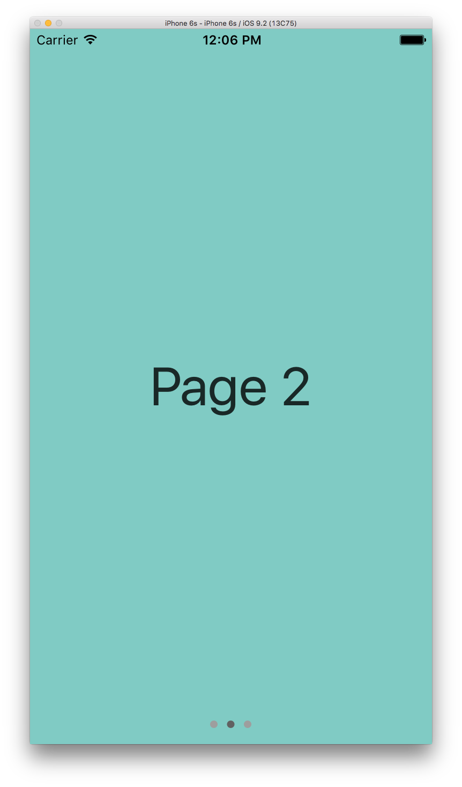

# PageControl

This control is designed to be a drop-in replacement for `UIPageControl`, but adhering to the material design specifications for animation and layout. The API methods are the same as a `UIPageControl`, however with the addition of a few key methods required to achieve the desired animation of the control.

## Requirements

- Xcode 7.0 or higher
- iOS SDK version 7.0 or higher

## Page Control Animation

This page control provides an animation effect that keeps a page indicator in sync with the scrolling of a designated scroll view. This is in contrast to a native `UIPageControl` that simply shows the current page indicator without any animated transitions between changes. As the user scrolls, a track will be drawn with animation from the current indicator position towards the next indicator position that is being scrolled towards. The current indicator will float along this track and position itself based on the percent scrolled between the pages. When the scroll view finishes scrolling, the track will disappear with animation towards the final position of the new page.

#### Example Screenshots

|  | |  |
| ------------ | ------------- | ------------ |
| Page control showing current page in resting state. | Page control showing animated track with current page indicator positioned | along the track.  | Page control showing new current page. |

#### Demo Video

[](docs/MDCPageControl_video.mov)

## Usage

Integrating the page control requires two steps. First, add a page control with companion scroll view, and second, forward the scroll view delegate methods to the page control.

##### Step 1: Add the page control to a view

Add the page control to a view and set the desired page control properties. This step is done similarly to a native `UIPageControl`. In addition, provide a tap gesture handler for the control to to fire off the `UIControlEventValueChanged` events in which the scroll view would typically be notified of page changes.

```objectivec
@interface ViewController () <UIScrollViewDelegate>
@end

@implementation ViewController {
  UIScrollView *_scrollView;
  MDCPageControl *_pageControl;
}

- (void)viewDidLoad {
  [super viewDidLoad];

  // Scroll view configuration
  _scrollView = [[UIScrollView alloc] initWithFrame:self.view.bounds];
  _scrollView.delegate = self;
  ...
  [self.view addSubview:_scrollView];

  // Page control configuration.
  _pageControl = [[MDCPageControl alloc] initWithFrame:myFrame];
  _pageControl.numberOfPages = 3;  // Should match page count of scrollView.
  [_pageControl addTarget:self
                   action:@selector(didChangePage:)
         forControlEvents:UIControlEventValueChanged];
  [self.view addSubview:_pageControl];
}

- (void)didChangePage:(MDCPageControl *)sender {
  // Transition scroll view to new page.
  CGPoint offset = _scrollView.contentOffset;
  offset.x = sender.currentPage * _scrollView.bounds.size.width;
  [_scrollView setContentOffset:offset animated:YES];
}
```

##### Step 2: Forwarding the required scroll view delegate methods

This page control is designed to be used in conjunction with a scroll view. To achieve the desired page control animation effects, there are three scroll view delegate methods that must be forwarded to the page control (`-scrollViewDidScroll`, `-scrollViewDidEndDecelerating`, and `-scrollViewDidEndScrollingAnimation`). This allows the page control to keep in sync with the scrolling movement of the designated scroll view.

```objectivec
- (void)scrollViewDidScroll:(UIScrollView *)scrollView {
  [_pageControl scrollViewDidScroll:scrollView];
}

- (void)scrollViewDidEndDecelerating:(UIScrollView *)scrollView {
  [_pageControl scrollViewDidEndDecelerating:scrollView];
}

- (void)scrollViewDidEndScrollingAnimation:(UIScrollView *)scrollView {
  [_pageControl scrollViewDidEndScrollingAnimation:scrollView];
}
```
