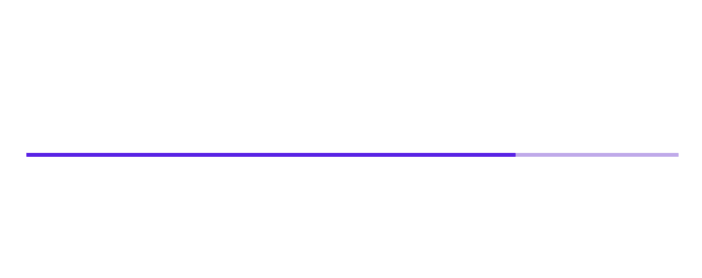
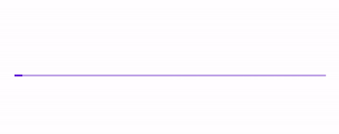
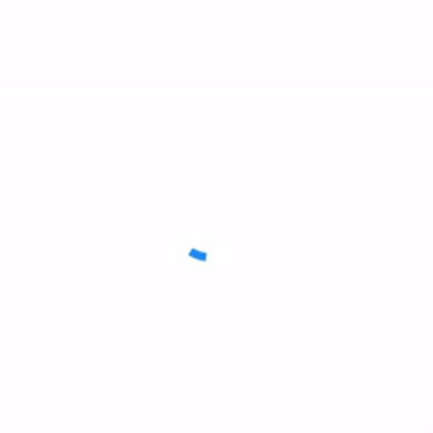

<!--docs:
title: "Linear progress indicator"
layout: detail
section: components
excerpt: "Progress view is a linear progress indicator that implements Material Design animation and layout."
iconId: progress_linear
path: /catalog/progress-indicators/progress-views/
api_doc_root: true
-->

# Progress indicators

[Progress indicators](https://material.io/components/progress-indicators) express an unspecified wait time or display the length of a process.


**Contents**

* [Using progress indicators](#using-progress-indicators)
* [Linear progress indicator](#linear-progress-indicator)
* [Circular progress indicator](#circular-progress-indicator)
* [Theming](#theming)

## Using progress indicators

Material Design's progress indicator component is spread across two distinct components in the Material iOS library. There are linear progress indicators, which are implemented by the `ProgressView` component, and circular progress indicators, which are implemented by the `ActivityIndicator` component.

Progress indicators inform users about the status of ongoing processes, such as loading an app, submitting a form, or saving updates. They communicate an app’s state and indicate available actions, such as whether users can navigate away from the current screen.

_**Note: When displaying progress for a sequence of processes, indicate overall progress rather than the progress of each activity.**_

### Installing

Installation steps for progress indicators depend on whether you want to use the linear or circular progress indicator.

#### Installing linear progress indicators

To use linear progress indicators in your app, first add the `ProgressView` subspec to your `Podfile`:

```bash
pod 'MaterialComponents/ProgressView'
```
<!--{: .code-renderer.code-renderer--install }-->

Then, run the following command:

```bash
pod install
```

From there, import the relevant target or file.

<!--<div class="material-code-render" markdown="1">-->
#### Swift
```swift
import MaterialComponents.MaterialProgressView
```

#### Objective-C

```objc
#import "MaterialProgressView.h"
```
<!--</div>-->

#### Installing circular progress indicators

To use circular progress indicators in your app, first add the `ActivityIndicator` subspec to your `Podfile`:

```bash
pod 'MaterialComponents/ActivityIndicator'
```
<!--{: .code-renderer.code-renderer--install }-->

Then, run the following command:

```bash
pod install
```

From there, import the relevant target or file.

<!--<div class="material-code-render" markdown="1">-->
#### Swift
```swift
import MaterialComponents.MaterialActivityIndicator
```

#### Objective-C

```objc
#import "MaterialActivityIndicator.h"
```
<!--</div>-->

### Making progress indicators accessible

Neither of the two progress indicators require additional setup for accessibility. They are accessible by default.

## Types

As mentioned above, Material Design offers two visually distinct types of progress indicators:
 1. [Linear](#linear-progress-indicator)
 1. [Circular](#circular-progress-indicator)

 Only one type should represent each kind of activity in an app. For example, if a refresh action displays a circular indicator on one screen, that same action shouldn’t use a linear indicator elsewhere in the app.


## Linear progress indicator

Linear progress indicators display progress by animating an indicator along the length of a fixed, visible track. The behavior of the indicator is dependent on whether the progress of a process is known.

Linear progress indicators support both determinate and indeterminate operations.
* Determinate operations display the indicator increasing in width from 0 to 100% of the track, in sync with the process’s progress.
* Indeterminate operations display the indicator continually growing and shrinking along the track until the process is complete.

### Linear progress indicator examples

[`MDCProgressView` GitHub source](https://github.com/material-components/material-components-ios/blob/develop/components/ProgressView/src/MDCProgressView.h).

### Determinate linear progress indicator example



To generate a determinate linear progress view like the one above, do the following:

<!--<div class="material-code-render" markdown="1">-->
#### Swift

```swift
let progressView = MDCProgressView()
progressView.progress = 0.75

let progressViewHeight = CGFloat(2)
progressView.frame = CGRect(x: 0, y: view.bounds.height - progressViewHeight, width: view.bounds.width, height: progressViewHeight)
view.addSubview(progressView)
```

#### Objective-C

```objc
@property(nonatomic) MDCProgressView *progressView;
...

// Progress view configuration.
self.progressView = [[MDCProgressView alloc] initWithFrame:myframe];
self.progressView.frame = CGRectMake(0, view.bounds.height - progressViewHeight, view.bounds.width, progressViewHeight);
self.progressView.progress = 0.75f;
[self.view addSubview:self.progressView];
```
<!--</div>-->

### Indeterminate linear progress indicator example



To generate an indeterminate linear progress view like the one above, set the `mode` property.

<!--<div class="material-code-render" markdown="1">-->
#### Swift

```swift
progressView.mode = .indeterminate
```

#### Objective-C

```objc
self.progressView.mode = MDCProgressViewModeIndeterminate;
```
<!--</div>-->

## Anatomy and key properties

A linear progress indicator consists of the following:
1. Track
2. Indicator

### Linear indicator attributes

&nbsp;                  | Attribute                         | Related method(s)                               | Default value
----------------------- | --------------------------------- | ----------------------------------------------- | -------------
**Color**               | `progressTintColor`  | `-setProgressTintColor:]` <br/> `-progressTintColor]` | Blue 500

### Linear track attributes

&nbsp;               | Attribute                | Related method(s) | Default value
-------------------- | ------------------------ | ----------------- | -------------
**Color**            | `trackTintColor`      | `-setTrackTintColor:]` <br/> `-trackTintColor]` | `progressTintColor` at `0.3` saturation

## Circular progress indicator

Circular progress indicators display progress by animating an indicator along an invisible circular track in a clockwise direction. They can be applied directly to a surface, such as a button or card.

Circular progress indicators support both determinate and indeterminate processes.
* Determinate circular indicators fill the invisible, circular track with color, as the indicator moves from 0 to 360 degrees.
* Indeterminate circular indicators grow and shrink in size while moving along the invisible track.

### Circular progress indicator examples

[`MDCActivityIndicator` GitHub source](https://github.com/material-components/material-components-ios/blob/develop/components/ActivityIndicator/src/MDCActivityIndicator.h).

### Determinate circular progress view example


`MDCActivityIndicator` instances can be shown as determinate by modifying the `indicatorMode`
property and setting a percentage progress with `progress`. `progress` must be set to a floating
point number between 0 and 1. Values beyond this range will be capped within the range.

_**NOTE: Activity indicators are hidden unless they are animating, even if the indicator is determinate
progress.**_

<!--<div class="material-code-render" markdown="1">-->
#### Swift
```swift
let activityIndicator = MDCActivityIndicator()
activityIndicator.sizeToFit()
activityIndicator.indicatorMode = .determinate
activityIndicator.progress = 0.5
view.addSubview(activityIndicator)

// To make the activity indicator appear:
activityIndicator.startAnimating()

// To make the activity indicator disappear:
activityIndicator.stopAnimating()
```

#### Objective-C

```objc
MDCActivityIndicator *activityIndicator = [[MDCActivityIndicator alloc] init];
[activityIndicator sizeToFit];
activityIndicator.indicatorMode = MDCActivityIndicatorModeDeterminate;
activityIndicator.progress = 0.5;
[view addSubview:activityIndicator];

// To make the activity indicator appear:
[activityIndicator startAnimating];

// To make the activity indicator disappear:
[activityIndicator stopAnimating];
```
<!--</div>-->

### Indeterminate circular progress view example



`MDCActivityIndicator` instances are indeterminate by default.

<!--<div class="material-code-render" markdown="1">-->
#### Swift
```swift
let activityIndicator = MDCActivityIndicator()
activityIndicator.sizeToFit()
view.addSubview(activityIndicator)

// To make the activity indicator appear:
activityIndicator.startAnimating()

// To make the activity indicator disappear:
activityIndicator.stopAnimating()
```

#### Objective-C

```objc
MDCActivityIndicator *activityIndicator = [[MDCActivityIndicator alloc] init];
[activityIndicator sizeToFit];
[view addSubview:activityIndicator];

// To make the activity indicator appear:
[activityIndicator startAnimating];

// To make the activity indicator disappear:
[activityIndicator stopAnimating];
```
<!--</div>-->

## Theming

Theming is only available for linear progress indicators on iOS. The following is an example of an `MDCProgressView` with a Shrine theme:


To theme an `MDCProgressView` with a theming extension and a container scheme, first add the following to your `Podfile`:

```ruby
pod 'MaterialComponents/ProgressView+Theming'
```

<!--{: .code-renderer.code-renderer--install }-->

Then run the installer:

```bash
pod install
```

Then, import the relevant target or file and call the theming method.

<!--<div class="material-code-render" markdown="1">-->
#### Swift

```swift
// Import the ProgressView theming module
import MaterialComponents.MaterialProgressView_Theming
...
// Create or use your app's Container Scheme
let containerScheme = MDCContainerScheme()
// Theme the progress view with either default theme
progressView.applyTheme(withScheme: containerScheme)
```

#### Objective-C

```objc
// Import the ProgressView Theming Extensions header
#import <MaterialComponents/MaterialProgressView+Theming.h>
...
 // Create or use your app's Container Scheme
MDCContainerScheme *containerScheme = [[MDCContainerScheme alloc] init];
 // Theme the progress view with either default theme
[self.progressView applyThemeWithScheme:containerScheme];
```
<!--</div>-->
