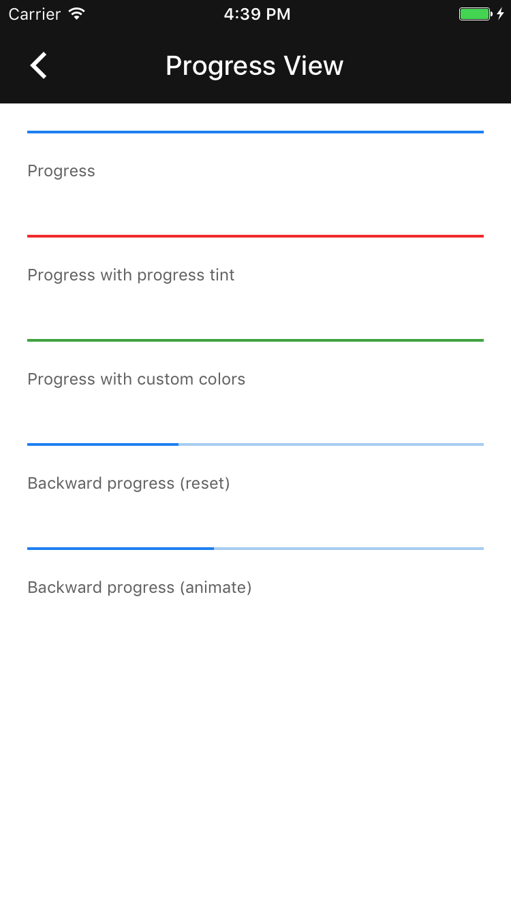

# Progress view

[](https://github.com/material-components/material-components-ios/issues?q=is%3Aopen+is%3Aissue+label%3Atype%3ABug+label%3A%5BProgressView%5D)

Progress view is a linear progress indicator that implements Material Design animation and layout.

<div class="article__asset article__asset--screenshot">
  
</div>

## Design & API documentation

<ul class="icon-list">
  <li class="icon-list-item icon-list-item--spec"><a href="https://material.io/go/design-progress-indicators">Material Design guidelines: Progress & Activity</a></li>
  <li class="icon-list-item icon-list-item--link">Class: <a href="https://github.com/material-components/material-components-ios/blob/develop/components/ProgressView/src/MDCProgressView.h">MDCProgressView</a></li>
  <li class="icon-list-item icon-list-item--link">Enumeration: <a href="https://github.com/material-components/material-components-ios/blob/develop/components/ProgressView/src/MDCProgressView.h">MDCProgressViewBackwardAnimationMode</a></li>
</ul>

## Related components

<ul class="icon-list">
  <li class="icon-list-item icon-list-item--link"><a href="../ActivityIndicator">ActivityIndicator</a></li>
</ul>

## Table of contents

- [Overview](#overview)
- [Installation](#installation)
  - [Installation with CocoaPods](#installation-with-cocoapods)
  - [Importing](#importing)
- [Usage](#usage)
  - [Typical use](#typical-use)
- [Differences From UIProgressView](#differences-from-uiprogressview)
- [Accessibility](#accessibility)
  - [MDCProgressView](#mdcprogressview)

- - -

## Overview

The `MDCProgressView` control is designed to be a drop-in replacement for `UIProgressView`. The API
methods are the same as a `UIProgressView`, with the addition of a few key methods required to
achieve the desired animation of the control.

## Installation

<!-- Extracted from docs/../../../docs/component-installation.md -->

### Installation with CocoaPods

Add the following to your `Podfile`:

```bash
pod 'MaterialComponents/ProgressView'
```
<!--{: .code-renderer.code-renderer--install }-->

Then, run the following command:

```bash
pod install
```

### Importing

To import the component:

<!--<div class="material-code-render" markdown="1">-->
#### Swift
```swift
import MaterialComponents.MaterialProgressView
```

#### Objective-C

```objc
#import "MaterialProgressView.h"
```
<!--</div>-->


## Usage

<!-- Extracted from docs/typical-use.md -->

### Typical use

Add the progress view to your view hierarchy like you would with any other view. Note that it works
best when the progress view is added at the bottom of a view, as showing (resp. hiding) grows up
(resp. shrinks down).

**Step 1: Add the progress view to a view**

Add the progress view to a view and set the desired progress and hidden state.

<!--<div class="material-code-render" markdown="1">-->
#### Swift

```swift
let progressView = MDCProgressView()
progressView.progress = 0

let progressViewHeight = CGFloat(2)
progressView.frame = CGRect(x: 0, y: view.bounds.height - progressViewHeight, width: view.bounds.width, height: progressViewHeight)
view.addSubview(progressView)
```

#### Objective-C

```objc
@property(nonatomic) MDCProgressView *progressView;
...

// Progress view configuration.
self.progressView = [[MDCProgressView alloc] initWithFrame:myframe];
self.progressView.progress = 0;  // You can also set a greater progress for actions already started.
[self.view addSubview:self.progressView];
```
<!--</div>-->

**Step 2: Change the progress and hidden state**

Both the progress and the hidden state can be animated, with a completion block.

<!--<div class="material-code-render" markdown="1">-->
#### Swift

```swift
func startAndShowProgressView() {
  progressView.progress = 0
  progressView.setHidden(false, animated: true)
}

func completeAndHideProgressView() {
  progressView.setProgress(1, animated: true) { (finished) in
    self.progressView.setHidden(true, animated: true)
  }
}
```

#### Objective-C

```objc
- (void)startAndShowProgressView {
  self.progressView.progress = 0;
  [self.progressView setHidden:NO animated:YES completion:nil];
}

- (void)completeAndHideProgressView {
  __weak __typeof__(self) weakSelf = self;
  [self.progressView setProgress:1 animated:YES completion:^(BOOL finished){
    [weakSelf.progressView setHidden:YES animated:YES completion:nil];
  }];
}
```
<!--</div>-->

<!-- Extracted from docs/differences-from-uiprogressview.md -->

## Differences From UIProgressView

This progress view provides an animation effect when showing and hidding it: it grows up (resp.
shrinks down). Additionally, all animated changes APIs take an optional completion block, to
synchronize multistep animations.


## Accessibility

<!-- Extracted from docs/accessibility.md -->

### MDCProgressView

#### -accessibilityValue

Like UIProgressView, MDCProgressView's `accessibilityValue` is based on the current value of the ProgressView's
`progress` property. Also like UIProgressView, this `accessibilityValue` takes the form of a whole number
percentage. To ensure the same behavior between the two classes, the MDCProgressView class has a static
UIProgressView that instances query for its `accessibilityValue` whenever they need to provide their own.

The ProgressView announces a new `accessibilityValue` whenever its `progress` changes if VoiceOver is on.

