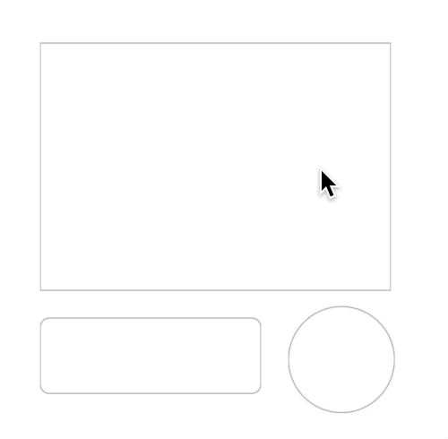

<!--docs:
title: "Ripple"
layout: detail
section: components
excerpt: "The Ripple component provides a radial action in the form of a visual ripple expanding outward from"
iconId: <#icon_id#>
path: /catalog/ripple/
api_doc_root: true
-->

<!-- This file was auto-generated using ./scripts/generate_readme Ripple -->

# Ripple

[](https://github.com/material-components/material-components-ios/issues?q=is%3Aopen+is%3Aissue+label%3Atype%3ABug+label%3A%5BRipple%5D)

The Ripple component provides a radial action in the form of a visual ripple expanding outward from
the user's touch. 
Ripple is a visual form of feedback for touch events providing users a clear signal that an element is being touched.



## Design & API documentation

<ul class="icon-list">
  <li class="icon-list-item icon-list-item--spec"><a href="https://material.io/go/design-ripple">Material Design guidelines: Ripple</a></li>
  <li class="icon-list-item icon-list-item--link">Class: <a href="https://material.io/components/ios/catalog/ripple/api-docs/Classes/MDCRippleTouchController.html">MDCRippleTouchController</a></li>
  <li class="icon-list-item icon-list-item--link">Class: <a href="https://material.io/components/ios/catalog/ripple/api-docs/Classes/MDCRippleView.html">MDCRippleView</a></li>
  <li class="icon-list-item icon-list-item--link">Class: <a href="https://material.io/components/ios/catalog/ripple/api-docs/Classes/MDCStatefulRippleView.html">MDCStatefulRippleView</a></li>
  <li class="icon-list-item icon-list-item--link">Protocol: <a href="https://material.io/components/ios/catalog/ripple/api-docs/Protocols/MDCRippleTouchControllerDelegate.html">MDCRippleTouchControllerDelegate</a></li>
  <li class="icon-list-item icon-list-item--link">Protocol: <a href="https://material.io/components/ios/catalog/ripple/api-docs/Protocols/MDCRippleViewDelegate.html">MDCRippleViewDelegate</a></li>
  <li class="icon-list-item icon-list-item--link">Enumeration: <a href="https://material.io/components/ios/catalog/ripple/api-docs/Enums.html">Enumerations</a></li>
  <li class="icon-list-item icon-list-item--link">Enumeration: <a href="https://material.io/components/ios/catalog/ripple/api-docs/Enums/MDCRippleState.html">MDCRippleState</a></li>
  <li class="icon-list-item icon-list-item--link">Enumeration: <a href="https://material.io/components/ios/catalog/ripple/api-docs/Enums/MDCRippleStyle.html">MDCRippleStyle</a></li>
</ul>

## Table of contents

- [Overview](#overview)
- [Installation](#installation)
  - [Installation with CocoaPods](#installation-with-cocoapods)
  - [Importing](#importing)
- [Usage](#usage)
  - [Importing](#importing)
  - [MDCRippleTouchController](#mdcrippletouchcontroller)
  - [MDCRippleView](#mdcrippleview)
  - [MDCStatefulRippleView](#mdcstatefulrippleview)
- [Migrations](#migrations)
  - [usesSuperviewShadowLayerAsMask migration](#usessuperviewshadowlayerasmask-migration)

- - -

## Overview

Ripple is a material design implementation of touch feedback and is a successor of Ink.

## Installation

<!-- Extracted from docs/../../../docs/component-installation.md -->

### Installation with CocoaPods

Add the following to your `Podfile`:

```bash
pod 'MaterialComponents/Ripple'
```
<!--{: .code-renderer.code-renderer--install }-->

Then, run the following command:

```bash
pod install
```

### Importing

To import the component:

<!--<div class="material-code-render" markdown="1">-->
#### Swift
```swift
import MaterialComponents.MaterialRipple
```

#### Objective-C

```objc
#import "MaterialRipple.h"
```
<!--</div>-->


## Usage

<!-- Extracted from docs/typical-use.md -->

### Importing

Before using Ripple, you'll need to import it:

<!--<div class="material-code-render" markdown="1">-->
#### Swift
```swift
import MaterialComponents.MaterialRipple
```

#### Objective-C

```objc
#import "MaterialRipple.h"
```
<!--</div>-->

The Ripple component exposes two interfaces that you can use to add material-like
feedback to the user:

1. `MDCRippleView` is a subclass of `UIView` that draws and animates ripples
and can be placed anywhere in your view hierarchy.
2. `MDCRippleTouchController` bundles an `MDCRippleView` instance with a
`UITapGestureRecognizer` instance to conveniently drive the ripples from the
user's touches.
3. `MDCStatefulRippleView` is a subclass of `MDCRippleView` that provides support for states. This allows to set the ripple in a state and have the ripple visually represent that state as part of the Material guidelines.

### MDCRippleTouchController

The simplest method of using ripple in your views is to use a
`MDCRippleTouchController`:

Initialize using the default initializer:
<!--<div class="material-code-render" markdown="1">-->
#### Swift
```swift
let myButton = UIButton(type: .system)
myButton.setTitle("Tap Me", for: .normal)
let rippleTouchController = MDCRippleTouchController()
rippleTouchController.addRipple(to: myButton)
```

#### Objective-C
```objc
UIButton *myButton = [UIButton buttonWithType:UIButtonTypeSystem];
[myButton setTitle:@"Tap me" forState:UIControlStateNormal];
MDCRippleTouchController *rippleTouchController = [[MDCRippleTouchController alloc] init];
[rippleTouchController addRippleToView:myButton];
```
<!--</div>-->

Initialize using the `initWithView:` convenience initializer:
<!--<div class="material-code-render" markdown="1">-->
#### Swift
```swift
let myButton = UIButton(type: .system)
myButton.setTitle("Tap Me", for: .normal)
let rippleTouchController = MDCRippleTouchController(view: myButton)
```

#### Objective-C
```objc
UIButton *myButton = [UIButton buttonWithType:UIButtonTypeSystem];
[myButton setTitle:@"Tap me" forState:UIControlStateNormal];
MDCRippleTouchController *rippleTouchController = [[MDCRippleTouchController alloc] initWithView:myButton];
```
<!--</div>-->

The `MDCRippleTouchControllerDelegate` gives you some control over aspects of the
ripple/touch relationship and its placement in the view hierarchy.
In the example below we are using the delegate to declare that we only want to process ripple
touches if the touch is in a certain location. We also insert the Ripple view at the bottom of
the parent view's view hierarchy. The reason we insert the ripple view at the bottom of the parent view's
hierarchy in this example, is so the ripple's overlay color would not affect the visibility and contrast
of the view's subviews, which may be images conveying a message or text.

<!--<div class="material-code-render" markdown="1">-->

#### Swift
```swift
class MyDelegate: NSObject, MDCRippleTouchControllerDelegate {

  func rippleTouchController(_ rippleTouchController: MDCRippleTouchController, shouldProcessRippleTouchesAtTouchLocation location: CGPoint) -> Bool {
    // Determine if we want to display the ripple
    return exampleView.frame.contains(location)
  }

  func rippleTouchController(_ rippleTouchController: MDCRippleTouchController,
                             insert rippleView: MDCRippleView,
                             into view: UIView) {
    view.insertSubview(rippleView, at: 0)
  }

  func rippleTouchController(_ rippleTouchController: MDCRippleTouchController,
                             didProcessRippleView rippleView: MDCRippleView,
                             atTouchLocation location: CGPoint) {
    print("Did process ripple view!")
  }

}

...

let myButton = UIButton(type: .system)
myButton.setTitle("Tap Me", for: .normal)

let myDelegate = MyDelegate()

let rippleTouchController = MDCRippleTouchController(view: myButton)
rippleTouchController.delegate = myDelegate
```

#### Objective-C
```objc
@interface MyDelegate: NSObject <MDCRippleTouchControllerDelegate>
@end

@implementation MyDelegate

- (BOOL)rippleTouchController:(MDCRippleTouchController *)rippleTouchController
    shouldProcessRippleTouchesAtTouchLocation:(CGPoint)location {
  return CGRectContainsPoint(exampleView.frame, location);
}

- (void)rippleTouchController:(MDCRippleTouchController *)rippleTouchController
         didProcessRippleView:(MDCRippleView *)rippleView
              atTouchLocation:(CGPoint)location {
  NSLog(@"Did process ripple view!");
}

- (void)rippleTouchController:(MDCRippleTouchController *)rippleTouchController insertRippleView:(MDCRippleView *)rippleView intoView:(UIView *)view {
    [view insertSubview:rippleView atIndex:0];
}
@end

...

UIButton *myButton = [UIButton buttonWithType:UIButtonTypeSystem];
[myButton setTitle:@"Tap me" forState:UIControlStateNormal];
MyDelegate *myDelegate = [[MyDelegate alloc] init];
MDCRippleTouchController *rippleTouchController = [[MDCRippleTouchController alloc] initWithView:myButton];
rippleTouchController.delegate = myDelegate;
```
<!--</div>-->

**NOTE:** The ripple touch controller does not keep a strong reference to the view to which it is attaching the ripple view.
An easy way to prevent the ripple touch controller from being deallocated prematurely is to make it a property of a view controller (like in these examples.)

### MDCRippleView

Alternatively, you can use MDCRippleView directly to display ripples using your
own touch processing:

<!--<div class="material-code-render" markdown="1">-->
#### Swift
```swift
let myCustomView = MyCustomView(frame: .zero)
let rippleView = MDCRippleView()
rippleView.rippleColor = .red
myCustomView.addSubview(rippleView)
...
// When the touches begin, there is one animation
rippleView.beginRippleTouchDownAtPoint(at: touchPoint, animated: true, completion: nil)
...
// When the touches end, there is another animation
rippleView.beginRippleTouchUpAnimated(animated: true, completion: nil)
```

#### Objective-C
```objc
MyCustomView *myCustomView = [[MyCustomView alloc] initWithFrame:CGRectZero];
MDCRippleView *rippleView = [[MDCRippleView alloc] init];
rippleView.rippleColor = UIColor.redColor;
[myCustomView addSubview:rippleView];
...
// When the touches begin, there is one animation
[rippleView beginRippleTouchDownAtPoint:touchPoint animated:YES completion:nil];
...
// When the touches end, there is another animation
[rippleView beginRippleTouchUpAnimated:YES completion:nil];
```
<!--</div>-->

### MDCStatefulRippleView

You can also use MDCStatefulRippleView to display stateful ripples using your
own touch processing.
To fully benefit from MDCStatefulRipple's ability to move between states visually,
the view that is adding the stateful ripple view must override 
UIView's `touchesBegan`, `touchesMoved`, `touchesEnded` and `touchesCancelled`
and call the stateful ripple view's corresponding APIs before calling the `super` implementation.
Here is an example:

<!--<div class="material-code-render" markdown="1">-->
#### Swift
```swift
let myCustomView = MyCustomView(frame: .zero)
let statefulRippleView = MDCStatefulRippleView()
statefulRippleView.setRippleColor(.blue, for: .selected)
myCustomView.addSubview(statefulRippleView)

...

override func touchesBegan(_ touches: Set<UITouch>, with event: UIEvent?) {
  statefulRippleView.touchesBegan(touches, with: event)
  super.touchesBegan(touches, with: event)

  statefulRippleView.isRippleHighlighted = true
}

override func touchesMoved(_ touches: Set<UITouch>, with event: UIEvent?) {
  statefulRippleView.touchesMoved(touches, with: event)
  super.touchesMoved(touches, with: event)
}

override func touchesEnded(_ touches: Set<UITouch>, with event: UIEvent?) {
  statefulRippleView.touchesEnded(touches, with: event)
  super.touchesEnded(touches, with: event)

  statefulRippleView.isRippleHighlighted = false
}

override func touchesCancelled(_ touches: Set<UITouch>, with event: UIEvent?) {
  statefulRippleView.touchesCancelled(touches, with: event)
  super.touchesCancelled(touches, with: event)

  statefulRippleView.isRippleHighlighted = false
}
```

#### Objective-C
```objc
MyCustomView *myCustomView = [[MyCustomView alloc] initWithFrame:CGRectZero];
MDCStatefulRippleView *statefulRippleView = [[MDCStatefulRippleView alloc] init];
[statefulRippleView setRippleColor:UIColor.blueColor forState:MDCRippleStateSelected];
[myCustomView addSubview:statefulRippleView];

...

- (void)touchesBegan:(NSSet *)touches withEvent:(UIEvent *)event {
  [statefulRippleView touchesBegan:touches withEvent:event];
  [super touchesBegan:touches withEvent:event];

  statefulRippleView.rippleHighlighted = YES;
}

- (void)touchesMoved:(NSSet *)touches withEvent:(UIEvent *)event {
  [statefulRippleView touchesMoved:touches withEvent:event];
  [super touchesMoved:touches withEvent:event];
}

- (void)touchesEnded:(NSSet *)touches withEvent:(UIEvent *)event {
  [statefulRippleView touchesEnded:touches withEvent:event];
  [super touchesEnded:touches withEvent:event];

  statefulRippleView.rippleHighlighted = NO;
}

- (void)touchesCancelled:(NSSet *)touches withEvent:(UIEvent *)event {
  [statefulRippleView touchesCancelled:touches withEvent:event];
  [super touchesCancelled:touches withEvent:event];

  statefulRippleView.rippleHighlighted = NO;
}
```
<!--</div>-->


## Migrations

<!-- Extracted from docs/migration-usesSuperviewShadowLayerAsMask.md -->

### usesSuperviewShadowLayerAsMask migration

tl;dr: If you are adding ripples to views with custom `layer.shadowPath` values, please disable
`usesSuperviewShadowLayerAsMask` and assign an explicit layer mask to the ripple view if needed
instead. usesSuperviewShadowLayerAsMask will eventually be disabled by default and then deleted.

MDCRippleView currently implements a convenience behavior that will inherit its parent view's
`layer.shadowPath` as the mask of the ripple view itself. This works for the general case where the
ripple view's frame equals the bounds of its super view, but behaves unexpectedly for any other
frame of the ripple view.

Due to the brittleness of this behavior, a new migration property, `usesSuperviewShadowLayerAsMask`,
has been added that will allow you to disable this behavior in favor of a more explicit
determination of the ripple's layer mask.

Example usage:

<!--<div class="material-code-render" markdown="1">-->
#### Swift

```swift
// During initialization:
rippleView.usesSuperviewShadowLayerAsMask = false

// Simple example of applying a mask to the ripple view using the ripple view's bounds:
let rippleViewMask = CAShapeLayer()
rippleViewMask.path = UIBezierPath(rect: rippleView.bounds).cgPath
rippleView.layer.mask = rippleViewMask
```

#### Objective-C

```objc
// During initialization:
rippleView.usesSuperviewShadowLayerAsMask = NO;

// Simple example of applying a mask to the ripple view using the ripple view's bounds:
CAShapeLayer *rippleViewMask = [[CAShapeLayer alloc] init];
rippleViewMask.path = [UIBezierPath bezierPathWithRect:rippleView.bounds].CGPath;
rippleView.layer.mask = rippleViewMask;
```
<!--</div>-->

Please consider disabling `usesSuperviewShadowLayerAsMask` if you are creating MDCRippleView
instances. The property will be disabled by default in the future and then deprecated.

