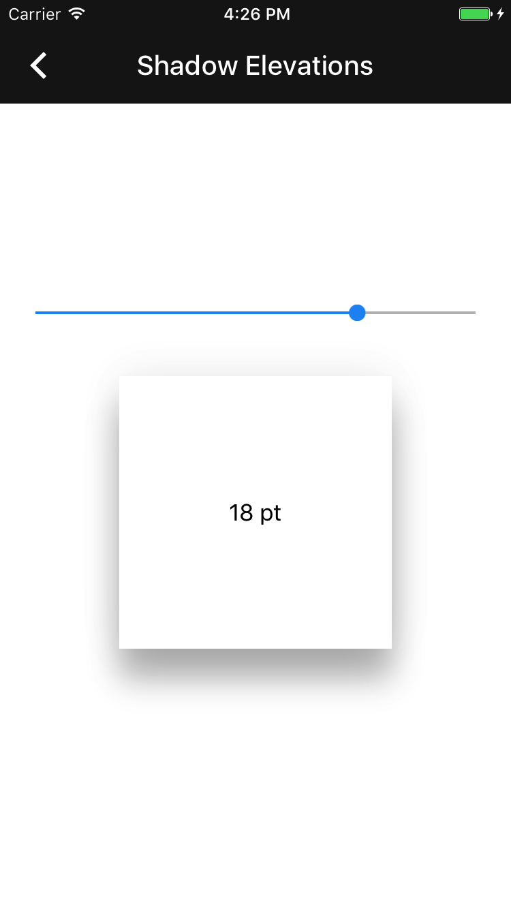

<!--docs:
title: "Shadow elevations"
layout: detail
section: components
excerpt: "The Shadow Elevations component provides the most commonly-used Material Design elevations."
iconId: shadow
path: /catalog/shadows/shadow-elevations/
api_doc_root: true
-->

# Shadow elevations

A shadow elevation specifies the degree of shadow intensity to be displayed beneath an object.
Higher shadow elevations have greater shadow intensities, akin to raising an object above a
surface resulting in a more prominent, albeit more diffuse, shadow. This component provides commonly
used Material Design elevations for components.

<div class="article__asset article__asset--screenshot">
  
</div>

## Design & API Documentation

<ul class="icon-list">
  <li class="icon-list-item icon-list-item--spec"><a href="https://material.io/guidelines/what-is-material/elevation-shadows.html">Material Design guidelines: Elevation & Shadows</a></li>
  <li class="icon-list-item icon-list-item--link"><a href="https://material.io/components/ios/catalog/shadows/shadow-elevations/api-docs/Constants.html">API: Constants</a></li>
</ul>

- - -

## Installation

### Installation with CocoaPods

To add this component to your Xcode project using CocoaPods, add the following to your `Podfile`:

```bash
pod 'MaterialComponents/ShadowElevations'
```
<!--{: .code-renderer.code-renderer--install }-->

Then, run the following command:

```bash
pod install
```


- - -

## Usage

### Importing

Before using Shadow Elevations, you'll need to import it:

<!--<div class="material-code-render" markdown="1">-->
#### Swift
```swift
import MaterialComponents

class ShadowedView: UIView {

  override class var layerClass: AnyClass {
    return MDCShadowLayer.self
  }

  var shadowLayer: MDCShadowLayer {
    return self.layer as! MDCShadowLayer
  }

  func setDefaultElevation() {
    self.shadowLayer.elevation = .cardResting
  }

}
```

#### Objective-C
```objc
#import "MaterialShadowElevations.h"

@interface ShadowedView: UIView

@end

@implementation ShadowedView

+ (Class)layerClass {
  return [MDCShadowLayer class];
}

- (MDCShadowLayer *)shadowLayer {
  return (MDCShadowLayer *)self.layer;
}

- (void)setDefaultElevation {
  self.shadowLayer.elevation = MDCShadowElevationCardResting;
}

@end
```
<!--</div>-->

- - -

## Related Components

<ul class="icon-list">
  <li class="icon-list-item icon-list-item--components"><a href="../ShadowLayer">Shadow Layer</a></li>
</ul>
