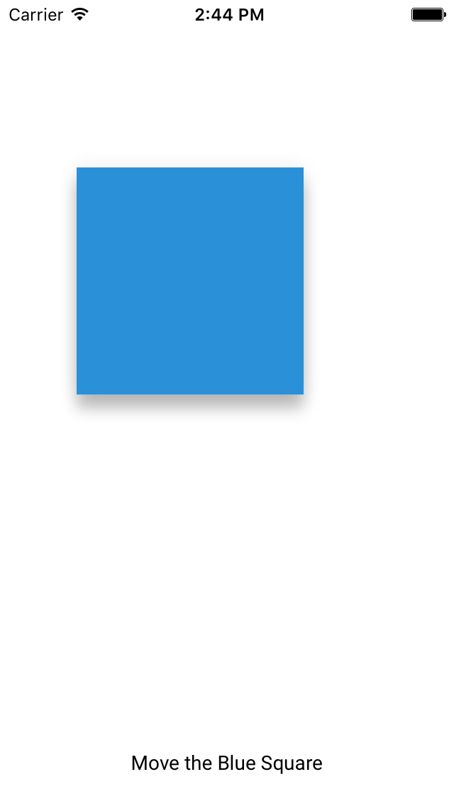

# Shadow Layer

<!--{: .ios-screenshot .right }-->

Shadow Layer implements the Material Design specifications for elevation and shadows.
By simulating the physical properties of paper, elevation and light source, shadows give
visual depth to components. Shadow Layer provides an elevation property which affects
a shadow's depth and strength, automatically handling shadow diffusion based on the shadow's
elevation.
<!--{: .intro }-->

### MDCShadowLayer

`MDCShadowLayer` provides a Core Animation `CALayer` that will render a shadow based on its
elevation property. `UIViews` can easily utilize this by overriding their layerClass method to
return `MDCShadowLayer`.

`elevation` sets the diffusion level of the shadow. The higher the shadow elevation, the more
diffused the shadow becomes. Elevation uses points as a unit to specify height. Common shadow
elevations are defined in [MDCShadowElevations](../ShadowElevations) and range from 0 to 24 points.
The shadow diffusion effect diminishes as elevations exceed 24 points.

Set `shadowMaskEnabled` to ensure the interior, non-shadow portion of the layer is visible.
This is enabled by default and the internal portion of the layer is cut out.

### MDCShadowMetrics

`MDCShadowMetrics` is a series of properties used to set `MDCShadowLayer`. `MDCShadowLayer` consists
of two distinct layers. The overlay of these two layers generates a single Material Design
shadow that adheres to defined height and light source principles.

### Design Specifications

<ul class="icon-list">
  <li class="icon-link"><a href="https://www.google.com/design/spec/what-is-material/elevation-shadows.html">Elevation and Shadows</a></li>
</ul>

### API Documentation

<ul class="icon-list">
  <li class="icon-link"><a href="/apidocs/ShadowLayer/Classes/MDCShadowLayer.html">MDCShadowLayer</a></li>
  <li class="icon-link"><a href="/apidocs/ShadowLayer/Classes/MDCShadowMetrics.html">MDCShadowMetrics</a></li>
</ul>

- - -

## Installation

### Requirements

- Xcode 7.0 or higher.
- iOS SDK version 7.0 or higher.

### Installation with CocoaPods

To add the ShadowLayer component to your Xcode project using CocoaPods, add the following to your
PodFile:

~~~ bash
$ pod 'MaterialComponents/ShadowLayer'
~~~

Then, run the following command:

~~~ bash
$ pod install
~~~

- - -

## Usage

Example of a custom button based on UIButton with Material Design shadows:

<!--
-->

### Objective C
~~~ objc
@interface ShadowButton : UIButton

@end

@implementation ShadowButton

+ (Class)layerClass {
  return [MDCShadowLayer class];
}

@end
~~~
<!--
-->

Add the custom button to view:

<!--
-->
### Objective C
~~~ objc
ShadowButton *button = [ShadowButton buttonWithType:UIButtonTypeSystem];
button.frame = CGRectMake(100, 100, 200, 50);
[button setTitle: @"Button" forState:UIControlStateNormal];
[(MDCShadowLayer *)button.layer setElevation:6.f];
[self.view addSubview:button];

~~~
<!--
-->

Creating a custom UIView with a shadow:

<!--
-->
#### Swift
~~~ swift
class ShadowedView: UIView {

  override class func layerClass() -> AnyClass {
    return MDCShadowLayer.self
  }

  var shadowLayer: MDCShadowLayer {
    return self.layer as! MDCShadowLayer
  }

  func setElevation(points: CGFloat) {
    self.shadowLayer.elevation = points
  }

}

~~~
<!--
-->

To improve performance, consider rasterizing MDCShadowLayer when the view using the shadow is not
animating or changing size.

<!--
-->
### Objective C
~~~ objc

self.layer.shouldRasterize = YES;
self.layer.rasterizationScale = [UIScreen mainScreen].scale;

~~~
<!--
-->

Disable rasterization before animating MDCShadowLayer.

