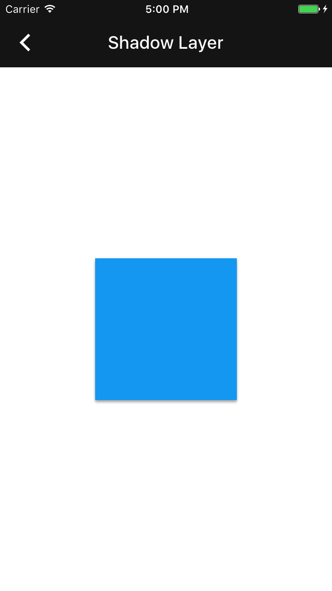

<!--docs:
title: "Shadow layer"
layout: detail
section: components
excerpt: "The shadow layer component implements the Material Design specifications for elevation and shadows."
iconId: shadow
path: /catalog/shadows/
api_doc_root: true
-->

# Shadow layer

Shadow layer implements the Material Design specifications for elevation and shadows.
By simulating the physical properties of paper, elevation and light source, shadows give
visual depth to components. Shadow layer provides an elevation property which affects
a shadow's depth and strength, automatically handling shadow diffusion based on the shadow's
elevation.

<div class="article__asset article__asset--screenshot">
  
</div>

## Design & API Documentation

<ul class="icon-list">
  <li class="icon-list-item icon-list-item--spec"><a href="https://material.io/guidelines/what-is-material/elevation-shadows.html">Material Design guidelines: Elevation & Shadows</a></li>
  <li class="icon-list-item icon-list-item--link"><a href="https://material.io/components/ios/catalog/shadows/shadow-layers/api-docs/Classes/MDCShadowLayer.html">API: MDCShadowLayer</a></li>
  <li class="icon-list-item icon-list-item--link"><a href="https://material.io/components/ios/catalog/shadows/shadow-layers/api-docs/Classes/MDCShadowMetrics.html">API: MDCShadowMetrics</a></li>
</ul>

### MDCShadowLayer

`MDCShadowLayer` provides a Core Animation `CALayer` that will render a shadow based on its
elevation property. `UIViews` can use this by overriding their layerClass method to
return `MDCShadowLayer`.

`elevation` sets the diffusion level of the shadow. The higher the shadow elevation, the more
diffused the shadow becomes. Elevation uses points as a unit to specify height. Common shadow
elevations are defined in [MDCShadowElevations](../ShadowElevations/) and range from 0 to 24 points.
The shadow diffusion effect diminishes as elevations exceed 24 points.  The default value is 0 (no
shadow).

Set `shadowMaskEnabled` to ensure the interior, non-shadow portion of the layer is visible.
This is enabled by default and the internal portion of the layer is cut out.

### MDCShadowMetrics

`MDCShadowMetrics` is a series of properties used to set `MDCShadowLayer`. `MDCShadowLayer` consists
of two distinct layers. The overlay of these two layers generates a single Material Design
shadow that adheres to defined height and light source principles.

- - -

## Installation

### Installation with CocoaPods

To add this component to your Xcode project using CocoaPods, add the following to your `Podfile`:

```bash
pod 'MaterialComponents/ShadowLayer'
```
<!--{: .code-renderer.code-renderer--install }-->

Then, run the following command:

```bash
pod install
```


- - -

## Usage

### Importing

Before using shadow layer, you'll need to import it:

<!--<div class="material-code-render" markdown="1">-->
#### Swift

```swift
import MaterialComponents
```

#### Objective-C

```objc
#import "MaterialShadowLayer.h"
```
<!--</div>-->


Example of a custom button based on UIButton with Material Design shadows:

<!--<div class="material-code-render" markdown="1">-->
#### Swift
```swift
class ShadowButton: UIButton {

  override class var layerClass: AnyClass {
    return MDCShadowLayer.self
  }

}
```

#### Objective C
```objc
@interface ShadowButton : UIButton

@end

@implementation ShadowButton

+ (Class)layerClass {
  return [MDCShadowLayer class];
}

@end
```
<!--</div>-->


Add the custom button to view:

<!--<div class="material-code-render" markdown="1">-->
#### Swift
```swift
let button = ShadowButton(type: .system)
button.frame = CGRect(x: 100, y: 100, width: 200, height: 50)
button.setTitle("Button", for: .normal)
let buttonLayer = button.layer as! MDCShadowLayer
buttonLayer.elevation = ShadowElevation(6)
addSubview(button)
```

#### Objective C
```objc
ShadowButton *button = [ShadowButton buttonWithType:UIButtonTypeSystem];
button.frame = CGRectMake(100, 100, 200, 50);
[button setTitle: @"Button" forState:UIControlStateNormal];
[(MDCShadowLayer *)button.layer setElevation:6];
[self addSubview:button];

```
<!--</div>-->


Creating a custom UIView with a shadow:

<!--<div class="material-code-render" markdown="1">-->
#### Swift
```swift
class ShadowedView: UIView {

  override class var layerClass: AnyClass {
    return MDCShadowLayer.self
  }

  var shadowLayer: MDCShadowLayer {
    return self.layer as! MDCShadowLayer
  }

  var elevation: ShadowElevation {
    get {
      return self.shadowLayer.elevation
    }
    set {
      self.shadowLayer.elevation = newValue
    }
  }

}
```

#### Objective C
```objc
@interface ShadowedView : UIView
@end

@implementation ShadowedView

+ (Class)layerClass {
  return [MDCShadowLayer class];
}

- (MDCShadowLayer)shadowLayer {
  return (MDCShadowLayer *)self.layer;
}

- (void)setElevation:(CGFloat)points {
  [(MDCShadowLayer *)self.layer setElevation:points];
}

@end
```
<!--</div>-->


To improve performance, consider rasterizing MDCShadowLayer when the view using the shadow is not
animating or changing size.

<!--<div class="material-code-render" markdown="1">-->
#### Swift
```swift

layer.shouldRasterize = true
layer.rasterizationScale = UIScreen.main.scale

```

#### Objective C
```objc

self.layer.shouldRasterize = YES;
self.layer.rasterizationScale = [UIScreen mainScreen].scale;

```
<!--</div>-->

Disable rasterization before animating MDCShadowLayer.

- - -

## Related Components

<ul class="icon-list">
  <li class="icon-list-item icon-list-item--components"><a href="../ShadowElevations">Shadow Elevations</a></li>
</ul>
