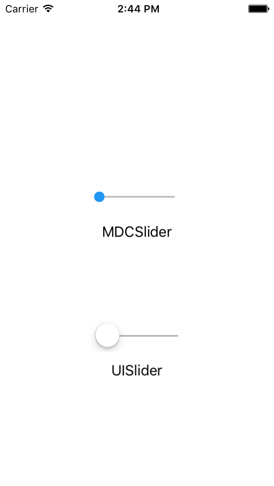

# Slider

<!--{: .ios-screenshot .right }-->

The `MDCSlider` object is a Material Design control used to select a value from a continuous range
or discrete set of values.
<!--{: .intro }-->

### Design Specifications

<ul class="icon-list">
  <li class="icon-link"><a href="https://www.google.com/design/spec/components/sliders.html">Sliders</a></li>
</ul>

### API Documentation

<ul class="icon-list">
  <li class="icon-link"><a href="/apidocs/Slider/Classes/MDCSlider.html">MDCSlider</a></li>
</ul>

- - -

## Installation

### Requirements

- Xcode 7.0 or higher.
- iOS SDK version 7.0 or higher.

### Installation with CocoaPods

To add the Slider component to your Xcode project using CocoaPods, add the following to your
PodFile:

~~~ bash
pod 'MaterialComponents/Slider'
~~~

Then, run the following command:

~~~ bash
$ pod install
~~~

- - -

## Usage

<!--
-->

### Objective C
~~~ objc

- (void)viewDidLoad {
...

  MDCSlider *slider = [[MDCSlider alloc] initWithFrame:CGRectMake(0, 0, 100, 27)];
  [slider addTarget:self
                action:@selector(didChangeSliderValue:)
      forControlEvents:UIControlEventValueChanged];
  [self.view addSubview:slider];
  slider.center = CGPointMake(CGRectGetMidX(self.view.bounds), CGRectGetMidY(self.view.bounds) - 2 * slider.frame.size.height);

...
}

- (void)didChangeSliderValue:(id)sender {
  MDCSlider *slider = sender;
  NSLog(@"did change %@ value: %f", NSStringFromClass([sender class]), slider.value);
}

~~~
<!--
-->

### The differences between the UISlider class and the MDCSlider class:

Does not have api to:

- set right and left icons
- set the thumb image
- set the right and left track images (for a custom track)
- set the right (background track) color

Same features:

- set color for thumb via @c thumbColor
- set color of track via @c trackColor

New features:

- making the slider a snap to discrete values via property numberOfDiscreteValues.
