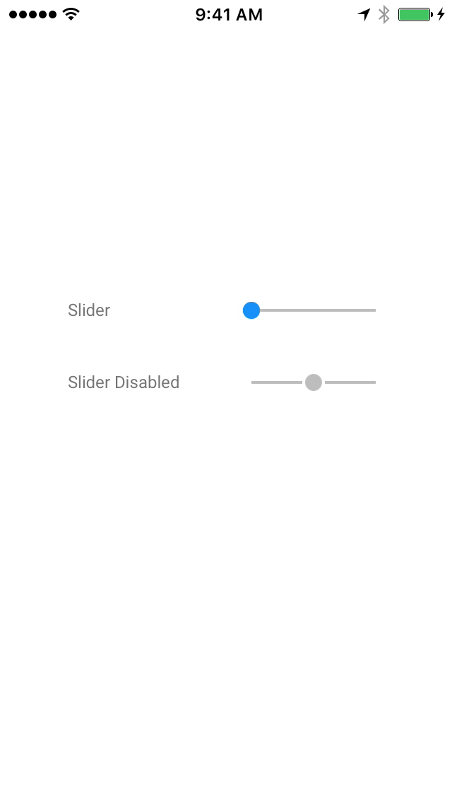

<!---->
See <a href="https://material-ext.appspot.com/mdc-ios-preview/components/Slider/">MDC site documentation</a> for richer experience.
<!--See <a href="https://github.com/google/material-components-ios/tree/develop/components/Slider">GitHub</a> for README documentation.-->

# Slider

  <video src="docs/assets/slider.mp4" autoplay loop></video>
  

The `MDCSlider` object is a material design control used to select a value from a continuous range
or discrete set of values.
<!--{: .intro }-->

### Design Specifications

<ul class="icon-list">
  <li class="icon-link"><a href="https://www.google.com/design/spec/components/sliders.html">Sliders</a></li>
</ul>

### API Documentation

<ul class="icon-list">
  <li class="icon-link"><a href="https://material-ext.appspot.com/mdc-ios-preview/components/Slider/apidocs/Classes/MDCSlider.html">MDCSlider</a></li>
</ul>

- - -

## Installation

### Requirements

- Xcode 7.0 or higher.
- iOS SDK version 7.0 or higher.

### Installation with CocoaPods

To add this component to your Xcode project using CocoaPods, add the following to your `Podfile`:

~~~ bash
pod 'MaterialComponents/Slider'
~~~

Then, run the following command:

~~~ bash
pod install
~~~

- - -

## Usage

### Importing

Before using Slider, you'll need to import it:

<!--
-->
#### Objective-C

~~~ objc
#import "MaterialSlider.h"
~~~

#### Swift
~~~ swift
import MaterialComponents
~~~
<!--
-->

### Standard usage

MDCSlider can be be used like a standard `UIControl`.

<!--
-->
#### Objective C

~~~ objc

- (void)viewDidLoad {
  MDCSlider *slider = [[MDCSlider alloc] initWithFrame:CGRectMake(50, 50, 100, 27)];
  [slider addTarget:self
                action:@selector(didChangeSliderValue:)
      forControlEvents:UIControlEventValueChanged];
  [self.view addSubview:slider];
}

- (void)didChangeSliderValue:(MDCSlider *)slider {
  NSLog(@"did change %@ value: %f", NSStringFromClass([slider class]), slider.value);
}
~~~

#### Swift

~~~ swift
override func viewDidLoad() {
  let slider = MDCSlider(frame: CGRectMake(50, 50, 100, 27))
  slider.addTarget(self,
      action: Selector("didChangeSliderValue:"),
      forControlEvents: .ValueChanged)
  view.addSubview(slider)
}

func didChangeSliderValue(senderSlider:MDCSlider) {
  NSLog("Did change slider value to: %@", senderSlider.value)
}
~~~
<!--
-->

### The differences between the UISlider class and the MDCSlider class:

Does not have api to:

- set right and left icons
- set the thumb image
- set the right and left track images (for a custom track)
- set the right (background track) color

Same features:

- set color for thumb via @c thumbColor
- set color of track via @c trackColor

New features:

- making the slider a snap to discrete values via property numberOfDiscreteValues.
