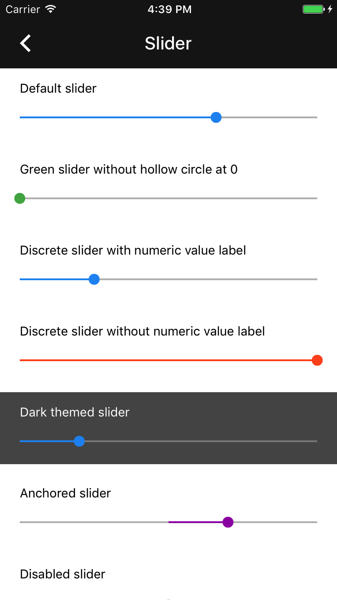

<!--docs:
title: "Sliders"
layout: detail
section: components
excerpt: "The Slider component provides a Material Design control for selecting a value from a continuous range or discrete set of values."
iconId: slider
path: /catalog/sliders/
api_doc_root: true
-->

# Slider

<div class="article__asset article__asset--screenshot">
  
</div>

The `MDCSlider` object is a Material Design control used to select a value from a continuous range
or discrete set of values.

## Design & API Documentation

<ul class="icon-list">
  <li class="icon-list-item icon-list-item--spec"><a href="https://material.io/go/design-sliders">Material Design guidelines: Sliders</a></li>
  <li class="icon-list-item icon-list-item--link"><a href="https://material.io/components/ios/catalog/sliders/api-docs/Classes/MDCSlider.html">API: MDCSlider</a></li>
</ul>

## Extensions

<ul class="icon-list">
  <li class="icon-list-item icon-list-item--link"><a href="docs/color-theming.md">Color Theming</a></li>
</ul>

- - -

## Installation

### Installation with CocoaPods

To add this component to your Xcode project using CocoaPods, add the following to your `Podfile`:

```bash
pod 'MaterialComponents/Slider'
```
<!--{: .code-renderer.code-renderer--install }-->

To add this component along with its themer and other related extensions, please add the following instead:
```bash
pod 'MaterialComponents/Slider+Extensions'
```

Then, run the following command:

```bash
pod install
```


- - -


## Usage

### Importing

Before using Slider, you'll need to import it:

<!--<div class="material-code-render" markdown="1">-->
#### Swift
```swift
import MaterialComponents.MaterialSlider
```

#### Objective-C

```objc
#import "MaterialSlider.h"
```
<!--</div>-->

### Standard usage

MDCSlider can be be used like a standard `UIControl`.

<!--<div class="material-code-render" markdown="1">-->
#### Swift

```swift
override func viewDidLoad() {
  super.viewDidLoad()

  let slider = MDCSlider(frame: CGRect(x: 50, y: 50, width: 100, height: 27))
  slider.addTarget(self,
                   action: #selector(didChangeSliderValue(senderSlider:)),
                   for: .valueChanged)
  view.addSubview(slider)
}

func didChangeSliderValue(senderSlider:MDCSlider) {
  print("Did change slider value to: %@", senderSlider.value)
}
```

#### Objective C

```objc
- (void)viewDidLoad {
  MDCSlider *slider = [[MDCSlider alloc] initWithFrame:CGRectMake(50, 50, 100, 27)];
  [slider addTarget:self
                action:@selector(didChangeSliderValue:)
      forControlEvents:UIControlEventValueChanged];
  [self.view addSubview:slider];
}

- (void)didChangeSliderValue:(MDCSlider *)slider {
  NSLog(@"did change %@ value: %f", NSStringFromClass([slider class]), slider.value);
}
```
<!--</div>-->

### Stateful API

`MDCSlider` exposes stateful APIs to customize the colors for different control states. In order to use this API you must enable `statefulAPIEnabled` on your `MDCSlider` instances.

<!--<div class="material-code-render" markdown="1">-->
#### Swift

```swift
 let slider = MDCSlider()
 slider.isStatefulAPIEnabled = true

 // Setting a thumb color for selected state.
 slider.setThumbColor(.red, for: .selected)
```

#### Objective C

```objc
 MDCSlider *slider = [[MDCSlider alloc] init];
 slider.statefulAPIEnabled = YES;
 
 // Setting a thumb color for selected state.
 [slider setThumbColor:[UIColor redColor] forState:UIControlStateSelected];
```
<!--</div>-->

### The differences between the UISlider class and the MDCSlider class:

Does not have api to:

- set right and left icons
- set the thumb image
- set the right and left track images (for a custom track)
- set the right (background track) color

Same features:

- set color for thumb via @c thumbColor
- set color of track via @c trackColor

New features:

- making the slider a snap to discrete values via property numberOfDiscreteValues
