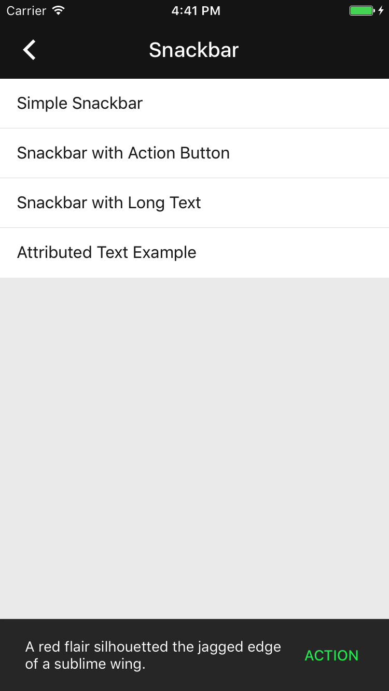

<!--docs:
title: "Material Snackbars"
layout: detail
section: components
excerpt: "Snackbars provide brief messages about app processes at the bottom of the screen."
iconId: 
path: /catalog/Snackbars/
-->

# Snackbars

[](https://github.com/material-components/material-components-ios/issues?q=is%3Aopen+is%3Aissue+label%3Atype%3ABug+label%3A%5BSnackbar%5D)

[Snackbars](https://material.io/components/snackbars) provide brief messages about app processes at the bottom of the screen. They can contain up to two lines of text and a text action button, but no icons.


## Contents

* [Using snackbars](#using-snackbars)
* [Installing snackbars](#installing-snackbars)
* [Importing snackbars](#importing-snackbars)
* [Making snackbars accessible](#making-snackbars-accessible)
* [Snackbar example](#snackbar-example)
* [Theming snackbars](#theming-snackbars)

## Using snackbars

Snackbars inform users of a process that an app has performed or will perform. They appear temporarily, towards the bottom of the screen. They shouldn’t interrupt the user experience, and they don’t require user input to disappear.

Displaying a snackbar involves two classes: `MDCSnackbarManager` and `MDCSnackbarMessage`.
First, create an instance of `MDCSnackbarMessage` and provide a string to display to the user. Next,
pass the `MDCSnackbarMessage` to `MDCSnackbarManager.defaultManager` with the static `-showMessage:` method. This will
automatically construct an `MDCSnackbarMessageView` and appropriate overlay views so the snackbar is
visible to the user.

Snackbar manager can be instructed to suspend and resume displaying messages as needed. When
messages are suspended the manager provides a suspension token that the client must keep as long as
messages are suspended. When the client releases the suspension token or calls the manager's resume
method with the suspension token, then messages will resume being displayed.
### Installing snackbars

Add the following to your `Podfile`:

```bash
pod 'MaterialComponents/Snackbar'
```
<!--{: .code-renderer.code-renderer--install }-->

Then, run the following command:

```bash
pod install
```

### Importing snackbars

To import the component:

<!--<div class="material-code-render" markdown="1">-->
#### Swift
```swift
import MaterialComponents.MaterialSnackbar
```

#### Objective-C

```objc
#import "MaterialSnackbar.h"
```
<!--</div>-->

### Making snackbars accessible

#### VoiceOver

Snackbars have automatic VoiceOver support through UIKit, but `MDCSnackbarMessageView` also exposes `accessibilityLabel` and `accessibilityHint` properties for overriding the default values.

#### Dynamic Type

`MDCSnackbarMessageView` has a `mdc_adjustsFontForContentSizeCategory` property that is modeled after Apple's `adjustsFontForContentSizeCategory` property. Set this property to `YES` for font scaling according to the current trait environment.

## Snackbars anatomy and key properties

The following is an anatomy diagram of a snackbar:


1. Text label
1. Container
1. Action (optional)

### Text label attributes

&nbsp;               | Attribute                | Related method(s) | Default value
-------------------- | ------------------------ | ----------------- | -------------
**Text label**       | `text`                   | `-[MDCSnackBarMessageView setText:]` <br/> `-[MDCSnackBarMessageView text]` | `nil`
**Color**            | `messageTextColor`        | `-[MDCSnackBarMessageView setMessageTextColor:]` <br/> `-[MDCSnackBarMessageView messageTextColor]` | White at 60% opacity
**Typography**       | `messageFont`            | `-[MDCSnackBarMessageView setMessageFont:]` <br/> `-[MDCSnackBarMessageView messageFont]`  | System body font.

### Container attributes

&nbsp;                  | Attribute                         | Related method(s)                               | Default value
----------------------- | --------------------------------- | ----------------------------------------------- | -------------
**Color**               | `snackbarMessageViewBackgroundColor`  | `-[MDCSnackBarMessageView setSnackbarMessageViewBackgroundColor:]` <br/> `-[MDCSnackBarMessageView snackbarMessageViewBackgroundColor]` | `#323232`
**Elevation**           | `elevation`                   | `-[MDCSnackBarMessageView setElevation:]` <br/> `-[MDCSnackBarMessageView elevation]`                                             | `6`
### Action attributes

&nbsp;               | Attribute                  | Related method(s)    | Default value
-------------------- | -------------------------- | -------------------- | -------------
**Color**            | N/A        | `-[MDCSnackBarMessageView setButtonTitleColor:forState:]` <br/> `-[MDCSnackBarMessageView buttonTitleColorForState]` | White at 60% opacity
**Typography**       | `buttonFont`            | `-[MDCSnackBarMessageView setButtonFont:]` <br/> `-[MDCSnackBarMessageView buttonFont]`  | System body font.

## Snackbar example



The following is an example of a snackbar with a message and an action button:

<!--<div class="material-code-render" markdown="1">-->
#### Swift

```swift
let action = MDCSnackbarMessageAction()
let actionHandler = {() in
  let answerMessage = MDCSnackbarMessage()
  answerMessage.text = "Fascinating"
  MDCSnackbarManager.show(answerMessage)
}
action.handler = actionHandler
action.title = "OK"
message.action = action
```

#### Objective-C

```objc
MDCSnackbarMessageAction *action = [[MDCSnackbarMessageAction alloc] init];
void (^actionHandler)() = ^() {
  MDCSnackbarMessage *answerMessage = [[MDCSnackbarMessage alloc] init];
  answerMessage.text = @"A red flair silhouetted the jagged edge of a sublime wing.";
  [MDCSnackbarManager.defaultManager showMessage:answerMessage];
};
action.handler = actionHandler;
action.title = "Action";
message.action = action;
```
<!--</div>-->

## Theming snackbars

Snacksbars on iOS do not support theming.