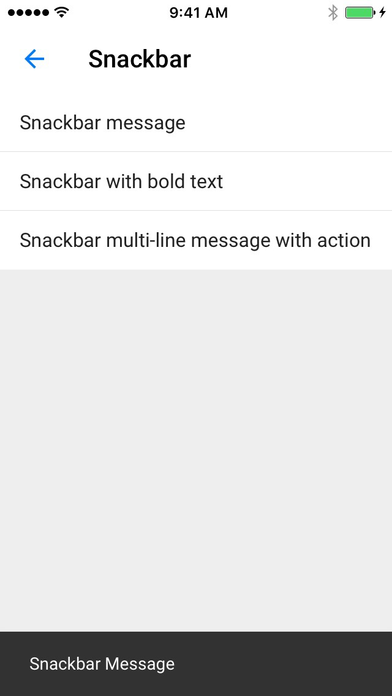

<!--docs:
title: "Snackbar"
layout: detail
section: components
excerpt: "Snackbars provide brief feedback about an operation through a message at the bottom of the screen."
iconId: toast
path: /catalog/snackbars/
api_doc_root: true
-->

<!-- This file was auto-generated using ./scripts/generate_readme Snackbar -->

# Snackbar

[](https://github.com/material-components/material-components-ios/issues?q=is%3Aopen+is%3Aissue+label%3Atype%3ABug+label%3A%5BSnackbar%5D)

Snackbars provide brief feedback about an operation through a message at the bottom of the screen.
Snackbars contain up to two lines of text directly related to the operation performed. They may
contain a text action, but no icons.

<div class="article__asset article__asset--screenshot">
  
</div>

## Design & API documentation

<ul class="icon-list">
  <li class="icon-list-item icon-list-item--spec"><a href="https://material.io/go/design-snackbar">Material Design guidelines: Snack Bar</a></li>
  <li class="icon-list-item icon-list-item--link">Class: <a href="https://material.io/components/ios/catalog/snackbars/api-docs/Classes/MDCSnackbarManager.html">MDCSnackbarManager</a></li>
  <li class="icon-list-item icon-list-item--link">Class: <a href="https://material.io/components/ios/catalog/snackbars/api-docs/Classes/MDCSnackbarMessage.html">MDCSnackbarMessage</a></li>
  <li class="icon-list-item icon-list-item--link">Class: <a href="https://material.io/components/ios/catalog/snackbars/api-docs/Classes/MDCSnackbarMessageAction.html">MDCSnackbarMessageAction</a></li>
  <li class="icon-list-item icon-list-item--link">Class: <a href="https://material.io/components/ios/catalog/snackbars/api-docs/Classes/MDCSnackbarMessageView.html">MDCSnackbarMessageView</a></li>
  <li class="icon-list-item icon-list-item--link">Protocol: <a href="https://material.io/components/ios/catalog/snackbars/api-docs/Protocols.html#/c:objc(pl)MDCSnackbarSuspensionToken">MDCSnackbarSuspensionToken</a></li>
  <li class="icon-list-item icon-list-item--link">Protocol: <a href="https://material.io/components/ios/catalog/snackbars/api-docs/Protocols/MDCSnackbarManagerDelegate.html">MDCSnackbarManagerDelegate</a></li>
  <li class="icon-list-item icon-list-item--link">Enumeration: <a href="https://material.io/components/ios/catalog/snackbars/api-docs/Enums.html">Enumerations</a></li>
  <li class="icon-list-item icon-list-item--link">Enumeration: <a href="https://material.io/components/ios/catalog/snackbars/api-docs/Enums/MDCSnackbarAlignment.html">MDCSnackbarAlignment</a></li>
</ul>

## Related components

<ul class="icon-list">
  <li class="icon-list-item icon-list-item--link"><a href="../OverlayWindow">OverlayWindow</a></li>
</ul>

## Table of contents

- [Overview](#overview)
  - [Snackbar Manager and Message](#snackbar-manager-and-message)
  - [Suspending and Resuming Display of Messages](#suspending-and-resuming-display-of-messages)
- [Installation](#installation)
  - [Installation with CocoaPods](#installation-with-cocoapods)
  - [Importing](#importing)
- [Usage](#usage)
  - [Typical use: display a message](#typical-use-display-a-message)
  - [Typical use: display a message with an action](#typical-use-display-a-message-with-an-action)
- [Extensions](#extensions)
  - [Color Theming](#color-theming)
  - [Typography Theming](#typography-theming)

- - -

## Overview

### Snackbar Manager and Message

Snackbar is comprised of two classes: MDCSnackbarManager and MDCSnackbarMessage. Snackbar messages
contain text to be displayed to a user. Messages are passed to the manager. The manager decides when
it is appropriate to show a message to the user.

### Suspending and Resuming Display of Messages

Snackbar manager can be instructed to suspend and resume displaying messages as needed. When
messages are suspended the manager provides a suspension token that the client must keep as long as
messages are suspended. When the client releases the suspension token or calls the manager's resume
method with the suspension token, then messages will resume being displayed.

## Installation

<!-- Extracted from docs/../../../docs/component-installation.md -->

### Installation with CocoaPods

Add the following to your `Podfile`:

```bash
pod 'MaterialComponents/Snackbar'
```
<!--{: .code-renderer.code-renderer--install }-->

Then, run the following command:

```bash
pod install
```

### Importing

To import the component:

<!--<div class="material-code-render" markdown="1">-->
#### Swift
```swift
import MaterialComponents.MaterialSnackbar
```

#### Objective-C

```objc
#import "MaterialSnackbar.h"
```
<!--</div>-->


## Usage

Displaying a snackbar requires using two classes: MDCSnackbarManager and MDCSnackbarMessage.
First, create an instance of MDCSnackbarMessage and provide a string to display to the user. Next,
pass the MDCSnackbarMessage to the MDCSnackbarManager with the static showMessage method. This will
automatically construct an MDCSnackbarMessageView and appropriate overlay views so the snackbar is
visible to the user.

<!-- Extracted from docs/typical-use-display-a-message.md -->

### Typical use: display a message

<!--<div class="material-code-render" markdown="1">-->
#### Swift

```swift
let message = MDCSnackbarMessage()
message.text = "The groundhog (Marmota monax) is also known as a woodchuck or whistlepig."
MDCSnackbarManager.show(message)
```

#### Objective-C

```objc
MDCSnackbarMessage *message = [[MDCSnackbarMessage alloc] init];
message.text = @"How much wood would a woodchuck chuck if a woodchuck could chuck wood?";
[MDCSnackbarManager showMessage:message];
```
<!--</div>-->

<!-- Extracted from docs/typical-use-display-a-message-with-action.md -->

### Typical use: display a message with an action

<!--<div class="material-code-render" markdown="1">-->
#### Swift

```swift
let action = MDCSnackbarMessageAction()
let actionHandler = {() in
  let answerMessage = MDCSnackbarMessage()
  answerMessage.text = "Fascinating"
  MDCSnackbarManager.show(answerMessage)
}
action.handler = actionHandler
action.title = "OK"
message.action = action
```

#### Objective-C

```objc
MDCSnackbarMessageAction *action = [[MDCSnackbarMessageAction alloc] init];
void (^actionHandler)() = ^() {
  MDCSnackbarMessage *answerMessage = [[MDCSnackbarMessage alloc] init];
  answerMessage.text = @"A lot";
  [MDCSnackbarManager showMessage:answerMessage];
};
action.handler = actionHandler;
action.title = @"Answer";
message.action = action;
```
<!--</div>-->


## Extensions

<!-- Extracted from docs/color-theming.md -->

### Color Theming

There is currently no theing extension for MDCSnackbar.

<!-- Extracted from docs/typography-theming.md -->

### Typography Theming

You can theme an snackbar with your app's typography scheme using the TypographyThemer extension.

You must first add the Typography Themer extension to your project:

```bash
pod 'MaterialComponents/Snackbar+TypographyThemer'
```

<!--<div class="material-code-render" markdown="1">-->
#### Swift
```swift
// Step 1: Import the TypographyThemer extension
import MaterialComponents.MaterialSnackbar_TypographyThemer

// Step 2: Create or get a typography scheme
let typographyScheme = MDCTypographyScheme()

// Step 3: Apply the typography scheme to your component
MDCSnackbarTypographyThemer.applyTypographyScheme(typographyScheme)
```

#### Objective-C

```objc
// Step 1: Import the TypographyThemer extension
#import "MaterialSnackbar+TypographyThemer.h"

// Step 2: Create or get a typography scheme
id<MDCTypographyScheming> typographyScheme = [[MDCTypographyScheme alloc] init];

// Step 3: Apply the typography scheme to your component
[MDCSnackbarTypographyThemer applyTypographyScheme:colorScheme];
```
<!--</div>-->

