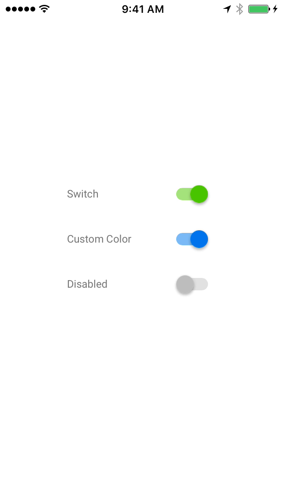

# Switch

  <video src="docs/assets/switch.mp4" autoplay loop></video>
  

Switch provides an Material Design on/off switch control with an interface similar to UISwitch. Note
that `MDCSwitch` objects have an intrinsic size and are not resizable.
<!--{: .intro }-->

### Design Specifications

<ul class="icon-list">
  <li class="icon-link"><a href="https://www.google.com/design/spec/components/selection-controls.html#selection-controls-switch">Switch Selection Control</a></li>
</ul>

### API Documentation

<ul class="icon-list">
  <li class="icon-link"><a href="apidocs/Classes/MDCSwitch.html">MDCSwitch</a></li>
  <li class="icon-link"><a href="apidocs/Functions.html">Global Functions</a></li>
</ul>

- - -

## Installation

### Requirements

- Xcode 7.0 or higher.
- iOS SDK version 7.0 or higher.

### Installation with CocoaPods

To add this component to your Xcode project using CocoaPods, add the following to your `Podfile`:

~~~ bash
pod 'MaterialComponents/Switch'
~~~

Then, run the following command:

~~~ bash
pod install
~~~

- - -

## Usage

### Importing

Before using Switch, you'll need to import it:

<!--
-->
#### Objective-C

~~~ objc
#import "MaterialSwitch.h"
~~~

#### Swift
~~~ swift
import MaterialComponents
~~~
<!--
-->

### Setup

<!--
-->
### Objective C

~~~ objc
- (void)viewDidLoad {
  [super viewDidLoad];

  MDCSwitch *mdcSwitch = [[MDCSwitch alloc] init];
  [mdcSwitch addTarget:self
                action:@selector(didChangeSliderValue:)
      forControlEvents:UIControlEventValueChanged];
  [self.view addSubview:mdcSwitch];
  mdcSwitch.center = CGPointMake(50, 50);
}

- (void)didChangeSliderValue:(id)sender {
  ...
}
~~~

#### Swift
~~~ swift
  override func viewDidLoad() {
    super.viewDidLoad()
    view.backgroundColor = UIColor.whiteColor()

    switchComponent.on = true
    switchComponent.addTarget(self, action: Selector("didChangeSwitchValue:"), forControlEvents: UIControlEvents.ValueChanged)
    view.addSubview(switchComponent)
    switchComponent.center = CGPointMake(50, 50);
  }

  func didChangeSwitchValue(senderSwitch:MDCSwitch) {
    NSLog("did change value: %@", senderSwitch.on);
  }
~~~
<!--
-->
