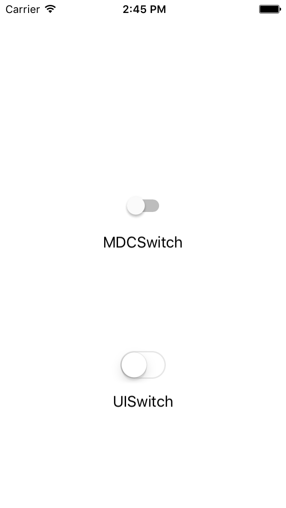

# Switch

<!--{: .ios-screenshot .right }-->

Switch provides an Material Design on/off switch control with an interface similar to UISwitch. Note
that `MDCSwitch` objects have an intrinsic size and are not resizable.
<!--{: .intro }-->

### Design Specifications

<ul class="icon-list">
  <li class="icon-link"><a href="https://www.google.com/design/spec/components/selection-controls.html#selection-controls-switch">Switch Selection Control</a></li>
</ul>

### API Documentation

<ul class="icon-list">
  <li class="icon-link"><a href="/apidocs/Switch/Classes/MDCSwitch.html">MDCSwitch</a></li>
  <li class="icon-link"><a href="/apidocs/Switch/Functions.html">Global Functions</a></li>
</ul>

- - -

## Installation

### Requirements

- Xcode 7.0 or higher.
- iOS SDK version 7.0 or higher.

### Installation with CocoaPods

To add the Switch component to your Xcode project using CocoaPods, add the following to your
PodFile:

~~~ bash
pod 'MaterialComponents/Switch'
~~~

Then, run the following command:

~~~ bash
$ pod install
~~~

- - -

## Usage

### Importing

Before using Switch, you'll need to import it:

<!--
-->
#### Objective-C

~~~ objc
#import "MaterialSwitch.h"
~~~

#### Swift
~~~ swift
import MaterialComponents
~~~
<!--
-->

<!--
-->
### Objective C
~~~ objc

- (void)viewDidLoad {
  [super viewDidLoad];

  MDCSwitch *mdcSwitch = [[MDCSwitch alloc] init];
  [mdcSwitch addTarget:self
                action:@selector(didChangeSliderValue:)
      forControlEvents:UIControlEventValueChanged];
  [self.view addSubview:mdcSwitch];
  mdcSwitch.center = CGPointMake(50, 50);
}

- (void)didChangeSliderValue:(id)sender {
  ...
}

~~~
<!--
-->
