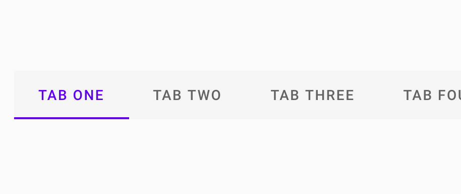
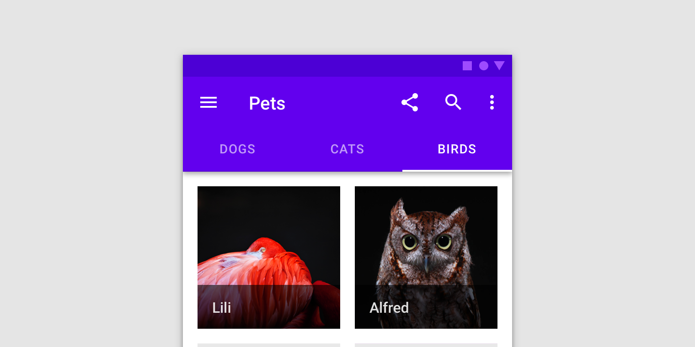
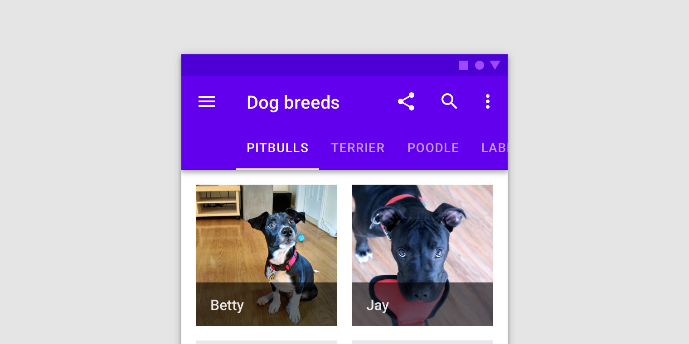
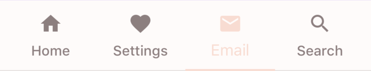

<!--docs:
title: "Tabs"
layout: detail
section: components
excerpt: "Material Design tabs are bars of buttons used to navigate between groups of content."
iconId: tabs
path: /catalog/tabs/
api_doc_root: true
-->

# Tabs

[](https://github.com/material-components/material-components-ios/issues?q=is%3Aopen+is%3Aissue+label%3Atype%3ABug+label%3A%5BTabs%5D)

[Tabs](https://material.io/components/tabs) organize content across different screens, data sets, and other interactions.



## Contents

* [Using tabs](#using-tabs)
* [Fixed tabs](#fixed-tabs)
* [Scrollable tabs](#scrollable-tabs)
* [Theming](#theming)
* [Migrating from legacy tabs](#migrating-from-legacy-tabs)

- - -

## Using tabs

### Installing

In order to use `MDCTabBarView`, first add the component to your `Podfile`:

```bash
pod MaterialComponents/Tabs+TabBarView
```
<!--{: .code-renderer.code-renderer--install }-->

Then, run `pod install`:

```bash
pod install
```

After that, import the relevant target or file.

<!--<div class="material-code-render" markdown="1">-->
#### Swift
```swift
import MaterialComponents.MaterialTabs_TabBarView
```

#### Objective-C
```objc
#import <MaterialComponents/MaterialTabs+TabBarView.h>
```
<!--</div>-->

From there, initialize an `MDCTabBarView` and add it to your view controller's view.

### Making tabs accessible

`MDCTabBarView` is accessible by default. VoiceOver reads the titles of the `UITabBarItem`s contained within a tab bar as `accessibilityLabels`, and the `MDCTabBarView` handles setting the `accessibilityTraits` when tab bar items become selected and unselected.

## Types 

Material tabs can be broken into two main categories: fixed and scrollable.

## Fixed tabs



## Scrollable tabs



### Tabs example

`MDCTabBarView` supports both fixed and scrolling tabs. By default, `MDCTabbarView` has a fixed layout. To set it up for scrolling, set the `preferredLayoutStyle` property to `.scrolling`. To receive updates about user actions, set the `delegate` property to an object conforming to `MDCTabBarViewDelegate`. Here is a simple set up of an `MDCTabBarView`:

<!--<div class="material-code-render" markdown="1">-->
#### Swift

```swift
let tabBarView = MDCTabBarView()
tabBarView.items = [
  UITabBarItem(title: "Recents", image: UIImage(named: "phone"), tag: 0),
  UITabBarItem(title: "Favorites", image: UIImage(named: "heart"), tag: 0),
]
view.addSubview(tabBarView)
// Configure constraints
```

#### Objective-C

```objc
MDCTabBarView *tabBarView = [[MDCTabBarView alloc] init];
tabBarView.items = @[
    [[UITabBarItem alloc] initWithTitle:@"Recents" image:[UIImage imageNamed:@"phone"] tag:0],
    [[UITabBarItem alloc] initWithTitle:@"Favorites" image:[UIImage imageNamed:@"heart"] tag:0],
];
[self.view addSubview:tabBarView];
// Configure constraints
```
<!--</div>-->

### Tabs anatomy

Tab bars contain tab bar items with optional icons and text labels. Tab bar items can be selected or unselected. The selection indicator appears below the currently selected tab bar item.


1.  Container
2.  Selected icon (optional if there’s a label)
3.  Selected text label (optional if there’s an icon)
4.  Selection indicator
5.  Unselected icon (optional if there’s a label)
6.  Unselected text label (optional if there’s an icon)
7.  Tab bar item

### Container attributes

&nbsp;        | Attribute            | Related method(s)                  | Default value
------------- | -------------------- | ---------------------------------- | -------------
**Color**     | `barTintColor` | `-setBarTintColor:`<br>`-barTintColor` | white
**Layout style**  | `preferredLayoutStyle`            | `-setPreferredLayoutStyle:`<br>`-preferredLayoutStyle`  | `.fixed`

### Tab item icon attributes

&nbsp;    | Attribute      | Related method(s)                                                | Default value
--------- | -------------- | ---------------------------------------------------------------- | -------------
**Icon**  | N/A | `-[UITabBarItem initWithTitle:image:tag:]` <br/> `-[UITabBarItem initWithTitle:image:selectedImage:]` | `nil`
**Color** | N/A  | `-setImageTintColor:forState:` <br> `-imageTintColorForState:` | `nil`

### Tab item text label attributes

&nbsp;           | Attribute           | Related method(s)                                               | Default value
---------------- | ------------------- | --------------------------------------------------------------- | -------------
**Text**         | N/A        | `-[UITabBarItem initWithTitle:image:tag:]` <br/> `-[UITabBarItem initWithTitle:image:selectedImage:]` | `nil`
**Color**        | N/A      | `-setTitleColor:forState:` <br> `-titleColorForState:` | On primary color
**Typography**   | N/A  | `-setTitleFont:forState:` <br> `-titleFontForState:`    | Button

### Tab item container attributes

&nbsp;               | Attribute                                                                                     | Related method(s)                                                            | Default value
-------------------- | ------------------------------------------- | ------------------------------------------------ | -------------
**Ripple color**     | `rippleColor`   | `-setRippleColor:`<br>`-rippleColor`   | White at 16% opacity

### Tab indicator attributes

&nbsp;                 | Attribute                       | Related method(s)                                            | Default value
---------------------- | ------------------------------- | ------------------------------------------------------------ | -------------
**Color**              | `selectionIndicatorStrokeColor`  | `-setSelectionIndicatorStrokeColor:` <br> `-selectionIndicatorStrokeColor` | On primary color

## Theming

Tabs supports Material Theming using a Container Scheme. To learn more about theming extensions, see [here](https://github.com/material-components/material-components-ios/blob/develop/docs/theming.md). Below is a screenshot of an `MDCTabBarView` with the Material Design Shrine theme:



### Tabs theming example

To make use of tabs theming install the tabs theming extensions with Cocoapods. First, add the following line to your `Podfile`:

```bash
pod MaterialComponents/Tabs+TabBarViewTheming
```

<!--{: .code-renderer.code-renderer--install }-->

Then Run the installer:

```bash
pod install
```

Next, import the Tabs theming target, and call the correct theming method.

<!--<div class="material-code-render" markdown="1">-->
#### Swift

```swift
import MaterialComponents.MaterialTabs_TabBarViewTheming
...

// Create an MDCTabbarView
let tabBar = MDCTabBarView()
// Create or use your app's Container Scheme
let containerScheme = MDCContainerScheme()
// Theme the tab bar with either Primary Theme
tabBar.applyPrimaryTheme(withScheme: containerScheme)
// Or Surface Theme
tabBar.applySurfaceTheme(withScheme: containerScheme)
```

#### Objective-C

```objc
// Import the Tabs Theming Extensions header
#import <MaterialComponents/MaterialTabs+TabBarViewTheming.h>
...
// Create or use your app's Container Scheme
MDCContainerScheme *containerScheme = [[MDCContainerScheme alloc] init];
// Theme the tab bar with either Primary Theme
[self.tabBar applyPrimaryThemeWithScheme:containerScheme];
// Or Surface Theme
[self.tabBar applySurfaceThemeWithScheme:containerScheme];
```

## Migrating from legacy tabs

Below are some of the differences between `MDCTabBarView` and its predecessor, `MDCTabBar`. If you have been using `MDCTabBar`, make note of the following changes.

#### Subclassing Restricted

Subclassing is not supported by `MDCTabBarView`. Any requirements that you have
for Material Tabs that are not met by the public APIs should be filed as a
feature request or bug against `MDCTabBarView`.

#### Selected Item Behavior

`MDCTabBarView` does not automatically mark any item as *selected* when the
`items` array is set, unless the previously-selected item is in the new
`items` array.  This is a change from `MDCTabBar`, but ensures that the view
and its APIs present equivalent information.

#### Colors, Fonts, and Theming

To set the image tint colors, use `- setImageTintColor:forState:`. The
`MDCTabBar` APIs, `- selectedItemTintColor` and `- unselectedItemTintColor` are
unavailable. 

To set the fonts of the labels, use `- setTitleFont:forState:`.
The `MDCTabBar` APIs, `- selectedItemTitleFont` and `- unselectedItemTitleFont`
are unavailable. Note that the tab bar may adjust the sizes of its views to
account for changes in fonts, and that can result in unexpected changes from
Fixed Tabs to Scrollable Tabs depending on font choices and title length.

`MDCTabBarView` uses Material Ripple by default (`MDCRippleView`) and does not
support Ink. You may configure the Ripple color for touch feedback by setting
the `- rippleColor` property.

#### Alignment and Item Rendering

The `MDCTabBar` API `itemAppearance` has no equivalent on `MDCTabBarView`.
Whatever relevant properties (*e.g.*, `title`, `image`) are provided on `UITabBarItem`
should be used instead.

The `MDCTabBar` APIs `displaysUppercaseTitles` and `titleTextTransform` have no
equivalent in `MDCTabBarView`. Titles are rendered as set on `UITabBarItem` and
`accessibilityLabel` should be set on the item if the title text is not
correctly handled by UIAccessibility.

#### UIBarPositioningDelegate

`MDCTabBarView` no longer conforms to `UIBarPositioning`, since Material Tabs
are always positioned above their related content views. As a result,
`MDCTabBarViewDelegate` does not inherit from `UIBarPositioningDelegate`.

#### Selection Indicator Template

The Selection Indicator Template APIs and protocols are copied nearly verbatim
from `MDCTabBar`, with the names changed to prevent collision. One difference
is the expected behavior of `contentFrame` as used by the indicator template.
In `MDCTabBar` the value of `contentFrame` was the union of the title and image
frames. However, in `MDCTabBarView` the width of the `contentFrame` is always
the width of the title (when present), and the height will include both the
title and image. This change is necessary to support internal clients.

#### Custom Views

Features like badges and horizontal layout of titles and images are not
supported on `MDCTabBarView`. Clients who need such behavior should implement
their own custom `UIView` and assign it to the `mdc_customView` property of a
`UITabBarItem` sublcass that conforms to `MDCTabBarItemCustomViewing`. A simple
subclass conforming to the `MDCTabBarItemCustomViewing` protocol is provided as
`MDCTabBarItem`.

<!--<div class="material-code-render" markdown="1">-->
#### Swift

```swift
let customView = MyCustomTabView()
let customItem = MDCTabBarItem()
customItem.mdc_customView = customView
let tabBarView = MDCTabBarView()
tabBarView.items = [ customItem ]
```

#### Objective-C

```objc
MyCustomTabView *customView = [[MyCustomTabView alloc] init];
MDCTabBarItem *customItem = [[MDCTabBarItem alloc] init];
customItem.mdc_customView = customView;
MDCTabBarView *tabBarView = [[MDCTabBarView alloc] init];
tabBarView.items = @[ customItem ]
```
<!--</div>-->
