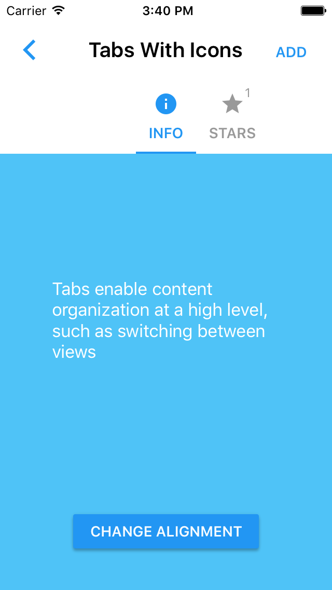
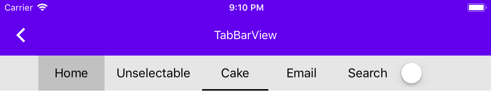
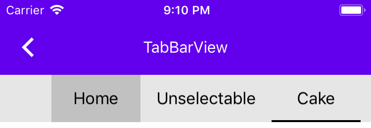

<!--docs:
title: "Tabs"
layout: detail
section: components
excerpt: "Material Design tabs are bars of buttons used to navigate between groups of content."
iconId: tabs
path: /catalog/tabs/
api_doc_root: true
-->

<!-- This file was auto-generated using ./scripts/generate_readme Tabs -->

# Tabs

[](https://github.com/material-components/material-components-ios/issues?q=is%3Aopen+is%3Aissue+label%3Atype%3ABug+label%3A%5BTabs%5D)

Tabs are bars of buttons used to navigate between groups of content.

<div class="article__asset article__asset--screenshot">
    
</div>

## Design & API documentation

<ul class="icon-list">
  <li class="icon-list-item icon-list-item--spec"><a href="https://material.io/go/design-tabs">Material Design guidelines: Tabs</a></li>
  <li class="icon-list-item icon-list-item--link">Class: <a href="https://material.io/components/ios/catalog/tabs/api-docs/Classes.html#/c:objc(cs)MDCTabBarUnderlineIndicatorTemplate">MDCTabBarUnderlineIndicatorTemplate</a></li>
  <li class="icon-list-item icon-list-item--link">Class: <a href="https://material.io/components/ios/catalog/tabs/api-docs/Classes/MDCTabBar.html">MDCTabBar</a></li>
  <li class="icon-list-item icon-list-item--link">Class: <a href="https://material.io/components/ios/catalog/tabs/api-docs/Classes/MDCTabBarIndicatorAttributes.html">MDCTabBarIndicatorAttributes</a></li>
  <li class="icon-list-item icon-list-item--link">Class: <a href="https://material.io/components/ios/catalog/tabs/api-docs/Classes/MDCTabBarViewController.html">MDCTabBarViewController</a></li>
  <li class="icon-list-item icon-list-item--link">Protocol: <a href="https://material.io/components/ios/catalog/tabs/api-docs/Protocols/MDCTabBarControllerDelegate.html">MDCTabBarControllerDelegate</a></li>
  <li class="icon-list-item icon-list-item--link">Protocol: <a href="https://material.io/components/ios/catalog/tabs/api-docs/Protocols/MDCTabBarDelegate.html">MDCTabBarDelegate</a></li>
  <li class="icon-list-item icon-list-item--link">Protocol: <a href="https://material.io/components/ios/catalog/tabs/api-docs/Protocols/MDCTabBarIndicatorContext.html">MDCTabBarIndicatorContext</a></li>
  <li class="icon-list-item icon-list-item--link">Protocol: <a href="https://material.io/components/ios/catalog/tabs/api-docs/Protocols/MDCTabBarIndicatorTemplate.html">MDCTabBarIndicatorTemplate</a></li>
  <li class="icon-list-item icon-list-item--link">Enumeration: <a href="https://material.io/components/ios/catalog/tabs/api-docs/Enums.html">Enumerations</a></li>
  <li class="icon-list-item icon-list-item--link">Enumeration: <a href="https://material.io/components/ios/catalog/tabs/api-docs/Enums/MDCTabBarAlignment.html">MDCTabBarAlignment</a></li>
  <li class="icon-list-item icon-list-item--link">Enumeration: <a href="https://material.io/components/ios/catalog/tabs/api-docs/Enums/MDCTabBarItemAppearance.html">MDCTabBarItemAppearance</a></li>
  <li class="icon-list-item icon-list-item--link">Enumeration: <a href="https://material.io/components/ios/catalog/tabs/api-docs/Enums/MDCTabBarItemState.html">MDCTabBarItemState</a></li>
  <li class="icon-list-item icon-list-item--link">Enumeration: <a href="https://material.io/components/ios/catalog/tabs/api-docs/Enums/MDCTabBarTextTransform.html">MDCTabBarTextTransform</a></li>
</ul>

## Table of contents

- [Overview](#overview)
- [Installation](#installation)
  - [Installation with CocoaPods](#installation-with-cocoapods)
  - [Importing](#importing)
- [Usage](#usage)
  - [Importing](#importing)
  - [Delegate](#delegate)
  - [Selected item](#selected-item)
  - [Appearance](#appearance)
  - [Styling](#styling)
  - [Custom selection indicators](#custom-selection-indicators)
  - [Bottom navigation](#bottom-navigation)
- [Examples](#examples)
  - [Creating a tab bar](#creating-a-tab-bar)
- [Extensions](#extensions)
  - [Typography Theming](#typography-theming)
  - [Theming Extensions](#theming-extensions)
- [MDCTabBarView](#mdctabbarview)
  - [Importing MDCTabBarView](#importing-mdctabbarview)
  - [Typical Use of MDCTabBarView](#typical-use-of-mdctabbarview)
  - [Migrating from MDCTabBar](#migrating-from-mdctabbar)

- - -

## Overview

When a user taps a tab, the content changes to match the selected subject in the tabs.

We provide this functionality through MDCTabBar which communicates via a delegate as well as
MDCTabBarViewController which provides a view containment model similar to UITabViewController.

Tabs can also show a badge (usually a number) like UITabBar.

## Installation

<!-- Extracted from docs/../../../docs/component-installation.md -->

### Installation with CocoaPods

Add the following to your `Podfile`:

```bash
pod 'MaterialComponents/Tabs'
```
<!--{: .code-renderer.code-renderer--install }-->

Then, run the following command:

```bash
pod install
```

### Importing

To import the component:

<!--<div class="material-code-render" markdown="1">-->
#### Swift
```swift
import MaterialComponents.MaterialTabs
```

#### Objective-C

```objc
#import "MaterialTabs.h"
```
<!--</div>-->


## Usage

<!-- Extracted from docs/usage.md -->

### Importing

To use the tab bar in your code, import the MaterialTabs umbrella header (Objective-C) or MaterialComponents module (Swift).

<!--<div class="material-code-render" markdown="1">-->
#### Swift

```swift
import MaterialComponents
```

#### Objective-C

```objc
#import "MaterialTabs.h"
```

<!--</div>-->

### Delegate

Conform your class to the MDCTabBarDelegate protocol and set it as the tab bar's delegate to handle updating the UI when the user selects a tab.

### Selected item

Update the selected tab programmatically by setting `selectedItem`, optionally with an animation. Delegate methods are not called for programmatic changes, so callers are responsible for updating UI as needed after updating the selected item.

### Appearance

Set the `itemAppearance` property on the tab bar to switch between item display modes. Items can be displayed as titles (the default), icons, or combined.

### Styling

By default, the tab bar is configured to display items with white text and icons. To customize the color of the tab bar, set the `tintColor`, `selectedItemTintColor`, `unselectedItemTintColor`, `inkColor`, and `barTintColor` properties. If `selectedItemTintColor` is nil, the tab bar's `tintColor` will be used automatically for selected items.

Configure where items are placed in the tab bar by setting the `alignment` property.

### Custom selection indicators

The currently-selected tab is indicated visually by a *selection indicator*. By default this is an
underline, but you can customize its appearance by defining a selection indicator template and
setting the `selectionIndicatorTemplate` property on the tab bar. Template objects are provided
contextual information about a tab's content and return *attributes* that describe how that tab's
indicator should appear. The indicator will then automatically display the provided shape and
animate changes as the user selects different tabs.

See `MDCTabBarIndicatorTemplate` and `MDCTabBarIndicatorAttributes` for details.

### Bottom navigation

Implement `positionForBar:` and return `UIBarPositionBottom` to configure the tab bar as a bottom
navigation bar. The bar will automatically update with the appropriate styling.


## Examples

<!-- Extracted from docs/examples.md -->

### Creating a tab bar

<!--<div class="material-code-render" markdown="1">-->
#### Swift

```swift
let tabBar = MDCTabBar(frame: view.bounds)
tabBar.items = [
UITabBarItem(title: "Recents", image: UIImage(named: "phone"), tag: 0),
UITabBarItem(title: "Favorites", image: UIImage(named: "heart"), tag: 0),
]
tabBar.itemAppearance = .titledImages
tabBar.autoresizingMask = [.flexibleWidth, .flexibleBottomMargin]
tabBar.sizeToFit()
view.addSubview(tabBar)
```

#### Objective-C

```objc
MDCTabBar *tabBar = [[MDCTabBar alloc] initWithFrame:self.view.bounds];
tabBar.items = @[
    [[UITabBarItem alloc] initWithTitle:@"Recents" image:[UIImage imageNamed:@"phone"] tag:0],
    [[UITabBarItem alloc] initWithTitle:@"Favorites" image:[UIImage imageNamed:@"heart"] tag:0],
];
tabBar.itemAppearance = MDCTabBarItemAppearanceTitledImages;
tabBar.autoresizingMask =
    UIViewAutoresizingFlexibleWidth | UIViewAutoresizingFlexibleBottomMargin;
[tabBar sizeToFit];
[self.view addSubview:tabBar];
```

<!--</div>-->


## Extensions

<!-- Extracted from docs/color-theming.md -->


<!-- Extracted from docs/typography-theming.md -->

### Typography Theming

You can theme a tab bar with your app's typography scheme using the TypographyThemer extension.

You must first add the Typography Themer extension to your project:

```bash
pod 'MaterialComponents/Tabs+TypographyThemer'
```
<!--<div class="material-code-render" markdown="1">-->
#### Swift

```swift
// Step 1: Import the TypographyThemer extension
import MaterialComponents.MaterialTabs_TypographyThemer

// Step 2: Create or get a typography scheme
let typographyScheme = MDCTypographyScheme()

// Step 3: Apply the typography scheme to your component
MDCTabBarTypographyThemer.applyTypographyScheme(typographyScheme, to: component)
```

#### Objective-C

```objc
// Step 1: Import the TypographyThemer extension
#import "MaterialTabs+TypographyThemer.h"

// Step 2: Create or get a typography scheme
id<MDCTypographyScheming> typographyScheme = [[MDCTypographyScheme alloc] init];

// Step 3: Apply the typography scheme to your component
[MDCTabBarTypographyThemer applyTypographyScheme:colorScheme
     toTabBar:component];
```
<!--</div>-->


<!-- Extracted from docs/theming-extensions.md -->

### Theming Extensions

`MDCTabBar` supports Material Theming using a Container Scheme.
There are two variants for Material Theming of a MDCTabBar, which are the Primary Theme
and the Surface Theme.

<!--<div class="material-code-render" markdown="1">-->

#### Swift

```swift
// Import the Tabs Theming Extensions module
import MaterialComponents.MaterialTabs_MaterialTheming
 ...
 // Create or use your app's Container Scheme
let containerScheme = MDCContainerScheme()
 // Theme the tab bar with either Primary Theme
tabBar.applyPrimaryTheme(withScheme: containerScheme)
 // Or Surface Theme
tabBar.applySurfaceTheme(withScheme: containerScheme)
```

#### Objective-C

```objc
// Import the Tabs Theming Extensions header
#import <MaterialComponents/MaterialTabBar+MaterialTheming.h>
 ...
 // Create or use your app's Container Scheme
MDCContainerScheme *containerScheme = [[MDCContainerScheme alloc] init];
 // Theme the tab bar with either Primary Theme
[self.tabBar applyPrimaryThemeWithScheme:containerScheme];
 // Or Surface Theme
[self.tabBar applySurfaceThemeWithScheme:containerScheme];
```

<!--</div>-->


## MDCTabBarView

<!-- Extracted from docs/tabbarview.md -->

> **_NOTE:_** This is currently in Beta. Features may change without warning and without a change in the Material 
> Components for iOS version number.

<div class="article__asset article__asset--screenshot">
    
</div>
<div class="article__asset article__asset--screenshot">
    
</div>


### Importing MDCTabBarView

`MDCTabBarView` is currently part of the MaterialComponentsBeta podspec. You
may need to follow the [Material Components for iOS Beta integration
guide](https://github.com/material-components/material-components-ios/blob/develop/contributing/beta_components.md)
to configure your project to use `MDCTabBarView`.

<!--<div class="material-code-render" markdown="1">-->
#### Swift

```swift
import MaterialComponentsBeta.MaterialTabs_TabBarView
```

#### Objective-C

```objc
#import "MaterialTabs+TabBarView.h"
```
<!--</div>-->

### Typical Use of MDCTabBarView

<!--<div class="material-code-render" markdown="1">-->
#### Swift

```swift
let tabBarView = MDCTabBarView()
addSubview(tabBarView)

// Configure constraints
```

#### Objective-C

```objc
MDCTabBarView *tabBarView = [[MDCTabBarView alloc] init];
[self.view addSubview:tabBarView];

// Configure constraints
```
<!--</div>-->

### Migrating from MDCTabBar

#### Subclassing Restricted

Subclassing is not supported by `MDCTabBarView`. Any requirements that you have
for Material Tabs that are not met by the public APIs should be filed as a
feature request or bug against `MDCTabBarView`.

#### Selected Item Behavior

`MDCTabBarView` does not automatically mark any item as *selected* when the
`items` array is set, unless the previously-selected item is in the new
`items` array.  This is a change from `MDCTabBar`, but ensures that the view
and its APIs present equivalent information.

#### Colors, Fonts, and Theming

To set the image tint colors, use `- setImageTintColor:forState:`. The
`MDCTabBar` APIs, `- selectedItemTintColor` and `- unselectedItemTintColor` are
unavailable. 

To set the fonts of the labels, use `- setTitleFont:forState:`.
The `MDCTabBar` APIs, `- selectedItemTitleFont` and `- unselectedItemTitleFont`
are unavailable. Note that the tab bar may adjust the sizes of its views to
account for changes in fonts, and that can result in unexpected changes from
Fixed Tabs to Scrollable Tabs depending on font choices and title length.

`MDCTabBarView` uses Material Ripple by default (`MDCRippleView`) and does not
support Ink. You may configure the Ripple color for touch feedback by setting
the `- rippleColor` property.

#### Alignment and Item Rendering

The `MDCTabBar` API `itemAppearance` has no equivalent on `MDCTabBarView`.
Whatever relevant properties (*e.g.*, `title`, `image`) are provided on `UITabBarItem`
should be used instead.

The `MDCTabBar` APIs `displaysUppercaseTitles` and `titleTextTransform` have no
equivalent in `MDCTabBarView`. Titles are rendered as set on `UITabBarItem` and
`accessibilityLabel` should be set on the item if the title text is not
correctly handled by UIAccessibility.

#### UIBarPositioningDelegate

`MDCTabBarView` no longer conforms to `UIBarPositioning`, since Material Tabs
are always positioned above their related content views. As a result,
`MDCTabBarViewDelegate` does not inherit from `UIBarPositioningDelegate`.

#### Selection Indicator Template

The Selection Indicator Template APIs and protocols are copied nearly verbatim
from `MDCTabBar`, with the names changed to prevent collision. One difference
is the expected behavior of `contentFrame` as used by the indicator template.
In `MDCTabBar` the value of `contentFrame` was the union of the title and image
frames. However, in `MDCTabBarView` the width of the `contentFrame` is always
the width of the title (when present), and the height will include both the
title and image. This change is necessary to support internal clients.

#### Custom Views

Features like badges and horizontal layout of titles and images are not
supported on `MDCTabBarView`. Clients who need such behavior should implement
their own custom `UIView` and assign it to the `mdc_customView` property of a
`UITabBarItem` sublcass that conforms to `MDCTabBarItemCustomViewing`. A simple
subclass conforming to the `MDCTabBarItemCustomViewing` protocol is provided as
`MDCTabBarItem`.

<!--<div class="material-code-render" markdown="1">-->

##### Swift

```swift
let customView = MyCustomTabView()
let customItem = MDCTabBarItem()
customItem.mdc_customView = customView
let tabBarView = MDCTabBarView()
tabBarView.items = [ customItem ]
```

##### Objective-C

```objc
MyCustomTabView *customView = [[MyCustomTabView alloc] init];
MDCTabBarItem *customItem = [[MDCTabBarItem alloc] init];
customItem.mdc_customView = customView;
MDCTabBarView *tabBarView = [[MDCTabBarView alloc] init];
tabBarView.items = @[ customItem ]
```
<!--</div>-->

> **_NOTE:_** This will be updated as APIs are added and migrations are defined.

