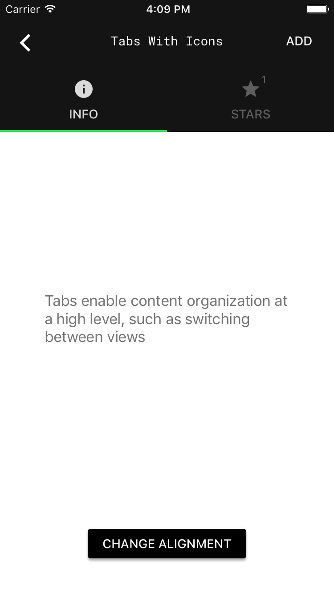

<!--docs:
title: "Tabs"
layout: detail
section: components
excerpt: "Material Design tabs are bars of buttons used to navigate between groups of content."
iconId: tabs
path: /catalog/tabs/
api_doc_root: true
-->

<!-- This file was auto-generated using ./scripts/generate_readme Tabs -->

# Tabs

[](https://github.com/material-components/material-components-ios/issues?q=is%3Aopen+is%3Aissue+label%3Atype%3ABug+label%3A%5BTabs%5D)

Tabs are bars of buttons used to navigate between groups of content.

<div class="article__asset article__asset--screenshot">
    
</div>

## Design & API documentation

<ul class="icon-list">
  <li class="icon-list-item icon-list-item--spec"><a href="https://material.io/go/design-tabs">Material Design guidelines: Tabs</a></li>
  <li class="icon-list-item icon-list-item--link">Class: <a href="https://material.io/components/ios/catalog/tabs/api-docs/Classes.html#/c:objc(cs)MDCTabBarUnderlineIndicatorTemplate">MDCTabBarUnderlineIndicatorTemplate</a></li>
  <li class="icon-list-item icon-list-item--link">Class: <a href="https://material.io/components/ios/catalog/tabs/api-docs/Classes/MDCTabBar.html">MDCTabBar</a></li>
  <li class="icon-list-item icon-list-item--link">Class: <a href="https://material.io/components/ios/catalog/tabs/api-docs/Classes/MDCTabBarIndicatorAttributes.html">MDCTabBarIndicatorAttributes</a></li>
  <li class="icon-list-item icon-list-item--link">Class: <a href="https://material.io/components/ios/catalog/tabs/api-docs/Classes/MDCTabBarViewController.html">MDCTabBarViewController</a></li>
  <li class="icon-list-item icon-list-item--link">Protocol: <a href="https://material.io/components/ios/catalog/tabs/api-docs/Protocols/MDCTabBarControllerDelegate.html">MDCTabBarControllerDelegate</a></li>
  <li class="icon-list-item icon-list-item--link">Protocol: <a href="https://material.io/components/ios/catalog/tabs/api-docs/Protocols/MDCTabBarDelegate.html">MDCTabBarDelegate</a></li>
  <li class="icon-list-item icon-list-item--link">Protocol: <a href="https://material.io/components/ios/catalog/tabs/api-docs/Protocols/MDCTabBarIndicatorContext.html">MDCTabBarIndicatorContext</a></li>
  <li class="icon-list-item icon-list-item--link">Protocol: <a href="https://material.io/components/ios/catalog/tabs/api-docs/Protocols/MDCTabBarIndicatorTemplate.html">MDCTabBarIndicatorTemplate</a></li>
  <li class="icon-list-item icon-list-item--link">Enumeration: <a href="https://material.io/components/ios/catalog/tabs/api-docs/Enums.html">Enumerations</a></li>
  <li class="icon-list-item icon-list-item--link">Enumeration: <a href="https://material.io/components/ios/catalog/tabs/api-docs/Enums/MDCTabBarAlignment.html">MDCTabBarAlignment</a></li>
  <li class="icon-list-item icon-list-item--link">Enumeration: <a href="https://material.io/components/ios/catalog/tabs/api-docs/Enums/MDCTabBarItemAppearance.html">MDCTabBarItemAppearance</a></li>
  <li class="icon-list-item icon-list-item--link">Enumeration: <a href="https://material.io/components/ios/catalog/tabs/api-docs/Enums/MDCTabBarItemState.html">MDCTabBarItemState</a></li>
  <li class="icon-list-item icon-list-item--link">Enumeration: <a href="https://material.io/components/ios/catalog/tabs/api-docs/Enums/MDCTabBarTextTransform.html">MDCTabBarTextTransform</a></li>
</ul>

## Table of contents

- [Overview](#overview)
- [Installation](#installation)
  - [Installation with CocoaPods](#installation-with-cocoapods)
  - [Importing](#importing)
- [Usage](#usage)
  - [Importing](#importing)
  - [Delegate](#delegate)
  - [Selected item](#selected-item)
  - [Appearance](#appearance)
  - [Styling](#styling)
  - [Custom selection indicators](#custom-selection-indicators)
  - [Bottom navigation](#bottom-navigation)
- [Examples](#examples)
  - [Creating a tab bar](#creating-a-tab-bar)
- [Extensions](#extensions)
  - [Color Theming](#color-theming)
  - [Typography Theming](#typography-theming)

- - -

## Overview

When a user taps a tab, the content changes to match the selected subject in the tabs.

We provide this functionality through MDCTabBar which communicates via a delegate as well as
MDCTabBarViewController which provides a view containment model similar to UITabViewController.

Tabs can also show a badge (usually a number) like UITabBar.

## Installation

<!-- Extracted from docs/../../../docs/component-installation.md -->

### Installation with CocoaPods

Add the following to your `Podfile`:

```bash
pod 'MaterialComponents/Tabs'
```
<!--{: .code-renderer.code-renderer--install }-->

Then, run the following command:

```bash
pod install
```

### Importing

To import the component:

<!--<div class="material-code-render" markdown="1">-->
#### Swift
```swift
import MaterialComponents.MaterialTabs
```

#### Objective-C

```objc
#import "MaterialTabs.h"
```
<!--</div>-->


## Usage

<!-- Extracted from docs/usage.md -->

### Importing

To use the tab bar in your code, import the MaterialTabs umbrella header (Objective-C) or MaterialComponents module (Swift).

<!--<div class="material-code-render" markdown="1">-->
#### Swift

```swift
import MaterialComponents
```

#### Objective-C

```objc
#import "MaterialTabs.h"
```

<!--</div>-->

### Delegate

Conform your class to the MDCTabBarDelegate protocol and set it as the tab bar's delegate to handle updating the UI when the user selects a tab.

### Selected item

Update the selected tab programmatically by setting `selectedItem`, optionally with an animation. Delegate methods are not called for programmatic changes, so callers are responsible for updating UI as needed after updating the selected item.

### Appearance

Set the `itemAppearance` property on the tab bar to switch between item display modes. Items can be displayed as titles (the default), icons, or combined.

### Styling

By default, the tab bar is configured to display items with white text and icons. To customize the color of the tab bar, set the `tintColor`, `selectedItemTintColor`, `unselectedItemTintColor`, `inkColor`, and `barTintColor` properties. If `selectedItemTintColor` is nil, the tab bar's `tintColor` will be used automatically for selected items.

Configure where items are placed in the tab bar by setting the `alignment` property.

### Custom selection indicators

The currently-selected tab is indicated visually by a *selection indicator*. By default this is an
underline, but you can customize its appearance by defining a selection indicator template and
setting the `selectionIndicatorTemplate` property on the tab bar. Template objects are provided
contextual information about a tab's content and return *attributes* that describe how that tab's
indicator should appear. The indicator will then automatically display the provided shape and
animate changes as the user selects different tabs.

See `MDCTabBarIndicatorTemplate` and `MDCTabBarIndicatorAttributes` for details.

### Bottom navigation

Implement `positionForBar:` and return `UIBarPositionBottom` to configure the tab bar as a bottom
navigation bar. The bar will automatically update with the appropriate styling.


## Examples

<!-- Extracted from docs/examples.md -->

### Creating a tab bar

<!--<div class="material-code-render" markdown="1">-->
#### Swift

```swift
let tabBar = MDCTabBar(frame: view.bounds)
tabBar.items = [
UITabBarItem(title: "Recents", image: UIImage(named: "phone"), tag: 0),
UITabBarItem(title: "Favorites", image: UIImage(named: "heart"), tag: 0),
]
tabBar.itemAppearance = .titledImages
tabBar.autoresizingMask = [.flexibleWidth, .flexibleBottomMargin]
tabBar.sizeToFit()
view.addSubview(tabBar)
```

#### Objective-C

```objc
MDCTabBar *tabBar = [[MDCTabBar alloc] initWithFrame:self.view.bounds];
tabBar.items = @[
    [[UITabBarItem alloc] initWithTitle:@"Recents" image:[UIImage imageNamed:@"phone"] tag:0],
    [[UITabBarItem alloc] initWithTitle:@"Favorites" image:[UIImage imageNamed:@"heart"] tag:0],
];
tabBar.itemAppearance = MDCTabBarItemAppearanceTitledImages;
tabBar.autoresizingMask =
    UIViewAutoresizingFlexibleWidth | UIViewAutoresizingFlexibleBottomMargin;
[tabBar sizeToFit];
[self.view addSubview:tabBar];
```

<!--</div>-->


## Extensions

<!-- Extracted from docs/color-theming.md -->

### Color Theming

You can theme a tab bar with your app's color scheme using the ColorThemer extension.

You must first add the Color Themer extension to your project:

```bash
pod 'MaterialComponents/Tabs+ColorThemer'
```

<!--<div class="material-code-render" markdown="1">-->
#### Swift
```swift
// Step 1: Import the ColorThemer extension
import MaterialComponents.MaterialTabs_ColorThemer

// Step 2: Create or get a color scheme
let colorScheme = MDCSemanticColorScheme()

// Step 3: Apply the color scheme to your component
// Primary variant
MDCTabBarColorThemer.applySemanticColorScheme(colorScheme, toTabs: component)
// Or surface variant
MDCTabBarColorThemer.applySurfaceVariant(withColorScheme: colorScheme, toTabs: component)
```

#### Objective-C

```objc
// Step 1: Import the ColorThemer extension
#import "MaterialTabs+ColorThemer.h"

// Step 2: Create or get a color scheme
id<MDCColorScheming> colorScheme = [[MDCSemanticColorScheme alloc] init];

// Step 3: Apply the color scheme to your component
// Primary variant
[MDCTabBarColorThemer applySemanticColorScheme:colorScheme toTabs:component];
// Or surface variant
[MDCTabBarColorThemer applySurfaceVariantWithColorScheme:colorScheme toTabs:component];
```
<!--</div>-->


<!-- Extracted from docs/typography-theming.md -->

### Typography Theming

You can theme a tab bar with your app's typography scheme using the TypographyThemer extension.

You must first add the Typography Themer extension to your project:

```bash
pod 'MaterialComponents/Tabs+TypographyThemer'
```
<!--<div class="material-code-render" markdown="1">-->
#### Swift
```swift
// Step 1: Import the TypographyThemer extension
import MaterialComponents.MaterialTabs_TypographyThemer

// Step 2: Create or get a typography scheme
let typographyScheme = MDCTypographyScheme()

// Step 3: Apply the typography scheme to your component
MDCTabBarTypographyThemer.applyTypographyScheme(typographyScheme, to: component)
```

#### Objective-C

```objc
// Step 1: Import the TypographyThemer extension
#import "MaterialTabs+TypographyThemer.h"

// Step 2: Create or get a typography scheme
id<MDCTypographyScheming> typographyScheme = [[MDCTypographyScheme alloc] init];

// Step 3: Apply the typography scheme to your component
[MDCTabBarTypographyThemer applyTypographyScheme:colorScheme
     toTabBar:component];
```
<!--</div>-->

