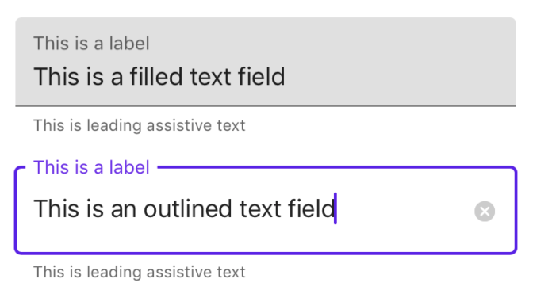

<!-- This file was auto-generated using ./scripts/generate_readme TextControls -->

# TextControls

[](https://github.com/material-components/material-components-ios/issues?q=is%3Aopen+is%3Aissue+label%3Atype%3ABug+label%3A%5BTextControls%5D)

TextControls are controls used for text input that make use of classes like UITextField and UITextView.

<div class="article__asset article__asset--screenshot">
  
</div>

## Design & API documentation


## Table of contents

- [Overview](#overview)
- [Installation](#installation)
  - [Installation with CocoaPods](#installation-with-cocoapods)
  - [Importing](#importing)
- [Usage](#usage)
  - [Text fields](#text-fields)
- [Theming](#theming)
  - [Theming](#theming)
- [Examples](#examples)
  - [Creating a text field](#creating-a-text-field)

- - -

## Overview

At this time, the only text control we offer is the text field. There are three text field classes:

<ul class="icon-list">
  <li class="icon-list-item icon-list-item--link">MDCFilledTextField: A text field implementing the Material <a href="https://material.io/components/text-fields/#filled-text-field">filled style</a></li>
  <li class="icon-list-item icon-list-item--link">MDCOutlinedTextField: A text field implementing the Material <a href="https://material.io/components/text-fields/#outlined-text-field">outlined style</a></li>
  <li class="icon-list-item icon-list-item">MDCBaseTextField: An unstyled text field that the previous two inherit from</li>
</ul>

## Installation

<!-- Extracted from docs/installation.md -->

### Installation with CocoaPods

Add any of the following to your `Podfile`, depending on which TextControl target you're interested in:

```bash
pod 'MaterialComponents/TextControls+FilledTextFields'
pod 'MaterialComponents/TextControls+FilledTextFieldsTheming'
pod 'MaterialComponents/TextControls+OutlinedTextFields'
pod 'MaterialComponents/TextControls+OutlinedTextFieldsTheming'
```
<!--{: .code-renderer.code-renderer--install }-->

Then, run the following command:

```bash
pod install
```

### Importing

To use TextControls in your code, import the appropriate MaterialTextControls umbrella header (Objective-C) or MaterialComponents module (Swift).

<!--<div class="material-code-render" markdown="1">-->
#### Swift

```swift
import MaterialComponents.MaterialTextControls_FilledTextFields
import MaterialComponents.MaterialTextControls_FilledTextFieldsTheming
import MaterialComponents.MaterialTextControls_OutlinedTextFields
import MaterialComponents.MaterialTextControls_OutlinedTextFieldsTheming
```

#### Objective-C

```objc
#import "MaterialTextControls+FilledTextFields.h"
#import "MaterialTextControls+FilledTextFieldsTheming.h"
#import "MaterialTextControls+OutlinedTextFields.h"
#import "MaterialTextControls+OutlinedTextFieldsTheming.h"
```

<!--</div>-->


## Usage

<!-- Extracted from docs/typical-use.md -->

### Text fields

The largest difference between MDCTextControl text fields and UITextFields from a usability standpoint relates to the sizing behavior of MDCTextControl text fields. Where UITextField can be whatever height a user wants it to be, MDCTextControl text fields have heights that they need to be in order to look correct. The process for ensuring that MDCTextControl text fields have their preferred heights depends on whether one is in an Auto Layout or Manual Layout environment. In an Auto Layout environment, the text field's preferred height will be reflected in `intrinsicContentSize`, and the user will not have to do anything other than set a width constraint on the text field to ensure that the preferred height is achieved. In a Manual Layout environment, standard methods like `sizeThatFits:` or `sizeToFit` must be used to inform the frames of the text field. These methods assume that the text field already has the preferred width.


## Theming

<!-- Extracted from docs/theming.md -->

### Theming

You can theme a text field to match the Material Design style by importing a theming extension. The content below assumes you have read the article on [Theming](../../docs/theming.md).

First, import the text field theming extension and create a text field.

<!--<div class="material-code-render" markdown="1">-->
#### Swift
```swift
import MaterialComponents.MaterialTextControls_OutlinedTextFieldsTheming

let textField = MDCOutlinedTextField()
```

#### Objective-C

```objc
#import <MaterialComponents/MaterialTextControls+FilledTextFieldsTheming.h>

MDCFilledTextField *filledTextField = [[MDCFilledTextField alloc] init];
```
<!--</div>-->

Then pass a container scheme to one of the theming methods on the theming extension.

<!--<div class="material-code-render" markdown="1">-->
#### Swift
```swift
filledTextField.applyTheme(withScheme: containerScheme)
```

#### Objective-C
```objc
[self.filledTextField applyThemeWithScheme:self.containerScheme];
```
<!--</div>-->


## Examples

<!-- Extracted from docs/examples.md -->

### Creating a text field

<!--<div class="material-code-render" markdown="1">-->
#### Swift

```swift
let estimatedFrame = ...
let textField = MDCFilledTextField(frame: estimatedFrame)
textField.label.text = "This is the floating label"
textField.leadingAssistiveLabel.text = "This is helper text"
textField.sizeToFit()
view.addSubview(textField)
```

#### Objective-C

```objc
CGRect estimatedFrame = ...
MDCOutlinedTextField *textField = [[MDCOutlinedTextField alloc] initWithFrame:estimatedFrame];
textField.label.text = "This is the floating label";
textField.leadingAssistiveLabel.text = "This is helper text";
[textField sizeToFit];
[view addSubview:textField];
```

<!--</div>-->

