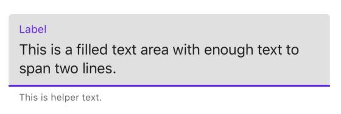
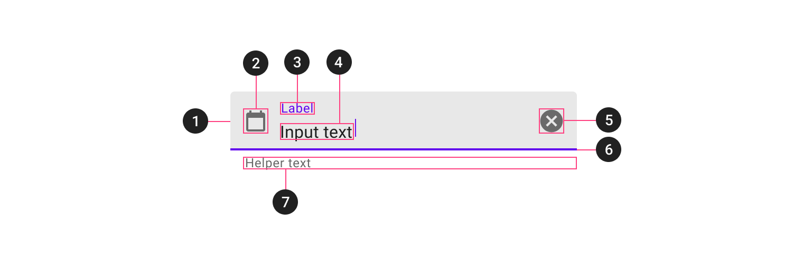
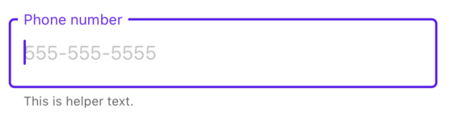
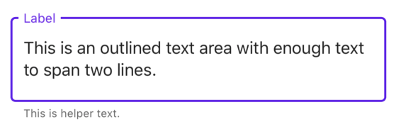

<!--docs:
title: "Text Fields"
layout: detail
section: components
excerpt: "A text field with an animated floating label and other Material Design features."
iconId: text_field
path: /catalog/textfields/
-->

# Text fields

[Text fields](https://material.io/components/text-fields) let users enter and
edit text.


**Contents**

*   [Using text fields](#using-text-fields)
*   [Filled text field](#filled-text-field)
*   [Outlined text field](#outlined-text-field)
*   [Theming](#theming)

- - -

## Using text fields

### Installing

To make use of Material text fields, add any of the following subspecs to your `Podfile`:

```bash
pod 'MaterialComponents/TextControls+FilledTextAreas'
pod 'MaterialComponents/TextControls+FilledTextFields'
pod 'MaterialComponents/TextControls+OutlinedTextAreas'
pod 'MaterialComponents/TextControls+OutlinedTextFields'
```
<!--{: .code-renderer.code-renderer--install }-->

Then, run the following command:

```bash
pod install
```

From there, import the relevant target or file and instantiate your text field.

<!--<div class="material-code-render" markdown="1">-->
#### Swift

```swift
import MaterialComponents.MaterialTextControls_FilledTextAreas
import MaterialComponents.MaterialTextControls_FilledTextFields
import MaterialComponents.MaterialTextControls_OutlinedTextAreas
import MaterialComponents.MaterialTextControls_OutlinedTextFields
```

#### Objective-C

```objc
#import "MaterialTextControls+FilledTextAreas.h"
#import "MaterialTextControls+FilledTextFields.h"
#import "MaterialTextControls+OutlinedTextAreas.h"
#import "MaterialTextControls+OutlinedTextFields.h"
```

<!--</div>-->

## Making text fields accessible

Material iOS text field offerings either inherit from `UITextField` or they contain `UITextView` instances. Both of these classes are accessible by default, and generally work out of the box with VoiceOver. However, the text fields we provide make use of floating labels above the text and assistive labels below the text, which makes the VoiceOver behavior of our text fields slightly different. If `accessibilityLabel` is _not_ explictly set on a single-line text field or multi-line text area, the `accessibilityLabel` that VoiceOver reads is a concatenation of the floating label text, the entered text, and the assistive label text. If `accessibilityLabel` _is_ set, the screen reader will read whatever it is set to. If you would like fine-grained control over what VoiceOver reads for these classes it is probably best to set the `accessibilityLabel` yourself.

## Types

Text fields come in two styles:

1.  [Filled text fields](#filled-text-field)
2.  [Outlined text fields](#outlined-text-field)


Material iOS text fields consist of both single-line and multi-line offerings in both filled and outlined styles. The single-line text fields are `MDCFilledTextField` and `MDCOutlinedTextField`. The multi-line text fields (text areas) are `MDCFilledTextArea` and `MDCOutlinedTextArea`. Because these classes make use of things like floating labels and assistive labels, their layout considerations are different than those of `UITextField` and `UITextView`. Where `UITextField` and `UITextView` can be whatever height a developer wants them to be, these classes have heights that they need to be in order to look correct. The process for ensuring that instances of these classes are sized correctly depends on whether one is in an Auto Layout or Manual Layout environment. In an Auto Layout environment, the text field or text area's preferred height will be reflected in `-intrinsicContentSize`, and the user will probably not have to do anything other than set a width constraint on the view to ensure that the preferred height is achieved. In a Manual Layout environment, standard methods like `-sizeThatFits:` or `-sizeToFit` must be used to inform the frames of the text field. These methods assume that the view already has a preferred width, and that any relevant APIs related to preferred number of lines have been set.

## Filled text field

[Filled text fields](https://material.io/components/text-fields/#filled-text-field)
have more visual emphasis than outlined text fields, making them stand out when
surrounded by other content and components.

### Single-line filled text field


To set up a single-line filled text field using [`MDCFilledTextField`](https://github.com/material-components/material-components-ios/blob/develop/components/TextControls/src/FilledTextFields/MDCFilledTextField.h), do the following:

<!--<div class="material-code-render" markdown="1">-->
#### Swift

```swift
let estimatedFrame = ...
let textField = MDCFilledTextField(frame: estimatedFrame)
textField.label.text = "Phone number"
textField.placeholder = "555-555-5555"
textField.leadingAssistiveLabel.text = "This is helper text"
textField.sizeToFit()
view.addSubview(textField)
```

#### Objective-C

```objc
CGRect estimatedFrame = ...
MDCFilledTextField *textField = [[MDCFilledTextField alloc] initWithFrame:estimatedFrame];
textField.label.text = @"Phone number";
textField.placeholder = @"555-555-5555";
textField.leadingAssistiveLabel.text = @"This is helper text";
[textField sizeToFit];
[view addSubview:textField];
```
<!--</div>-->

### Multi-line filled text field



To set up a multi-line filled text field (text area) using [`MDCFilledTextArea`](https://github.com/material-components/material-components-ios/blob/develop/components/TextControls/src/FilledTextAreas/MDCFilledTextArea.h), do the following:

<!--<div class="material-code-render" markdown="1">-->
#### Swift

```swift
let estimatedFrame = ...
let textArea = MDCFilledTextArea(frame: estimatedFrame)
textArea.label.text = "Label"
textArea.textView.text = "This is a filled text area with enough text to span two lines."
textArea.leadingAssistiveLabel.text = "This is helper text"
textArea.sizeToFit()
view.addSubview(textArea)
```

#### Objective-C

```objc
CGRect estimatedFrame = ...
MDCFilledTextArea *textArea = [[MDCFilledTextArea alloc] initWithFrame:estimatedFrame];
textArea.label.text = @"Label";
textArea.leadingAssistiveLabel.text = @"This is helper text";
textArea.textView.text = @"This is a filled text area with enough text to span two lines.";
[textArea sizeToFit];
[view addSubview:textArea];
```
<!--</div>-->

### Anatomy and key properties

A filled text field has a filled container, input text, a label, an activation indicator, optional helper/error text and optional leading/trailing icons. This applies to both text fields and text areas.



1. Container
2. Leading icon
3. Label
4. Input text
5. Trailing icon
6. Activation indicator 
7. Helper/error/counter text
8. Prefix/suffix/placeholder (not supported on iOS)

#### Container attributes

&nbsp;                 | Attribute                | Related method(s)                                                                       | Default value
---------------------- | ------------------------ | --------------------------------------------------------------------------------------- | -------------
**Color**              | N/A                      | `-setFilledBackgroundColor:forState:`<br/>`-filledBackgroundColorForState:`             | On surface color at 12% opacity

#### Leading icon attributes

&nbsp;                  | Attribute                         | Related method(s)                                                     | Default value
----------------------- | --------------------------------- | --------------------------------------------------------------------- | -------------
**Icon**                | `leadingView`                     | `-setLeadingView`<br/>`-leadingView`                                  | `nil`

#### Label attributes

&nbsp;                         | Attribute                | Related method(s)                                       | Default value
------------------------------ | ------------------------ | ------------------------------------------------------- | -------------
**Text**                       | `label.text`             | N/A                                                     | `nil`
**Color**                      | `label.textColor` |  `-setFloatingColor:forState:` <br/> `-floatingLabelColorForState:` <br/>`-setNormalLabelColor:forState:` <br/> `-normalLabelColorForState:`  | On surface color at 60% opacity when not editing and primary color when editing

#### Input text attributes

&nbsp;               | Attribute                    | Related method(s)                                            | Default value
-------------------- | --------------------------- | ------------------------------------------------------------ | -------------
**Input text**       | `text`                        | `-setText:`<br/>`-text`                                      | `nil`
**Typography**       | `font`                       | `-setFont:` <br/> `-font`                                     | Subtitle 1
**Input text color** | `textColor`                  | `-setTextColor:`<br/>`-textColor`<br/>`-setTextColor:forState`<br/>`-textColorForState:`<br/> | On surface color at 87% opacity
**Cursor color**     | `tintColor`                  |  `-setTintColor:`<br/>`-tintColor:`                            | Primary color                     

#### Trailing icon attributes

&nbsp;                  | Attribute                         | Related method(s)                                                     | Default value
----------------------- | --------------------------------- | --------------------------------------------------------------------- | -------------
**Icon**                | `trailingView`                     | `-setTrailingView`<br/>`-trailingView`                                  | `nil`

#### Activation indicator attributes

&nbsp;            | Attribute                   | Related method(s)                                                            | Default value
----------------- | --------------------------- | ---------------------------------------------------------------------------- | -------------
**Color**         | N/A | `-setUnderlineColor:forState:`<br/> `-underlineColorForState:` | On surface at 42% opacity when not editing and Primary when editing

#### Helper/error/counter text attributes

&nbsp;                      | Attribute                                                           | Related method(s)                                                                                                   | Default value
--------------------------- | ------------------------------------------------------------------- | ------------------------------------------------------------------------------------------------------ | -------------
**Helper/Error text**      | `leadingAssistiveLabel.text`<br/>`trailingAssistiveLabel.text`  | N/A           | `nil`
**Helper/Error text color**       | `leadingAssistiveLabel.textColor`<br/>`trailingAssistiveLabel.textColor` | N/A | On Surface at 60% opacity
**Helper text typography**  | `leadingAssistiveLabel.font`<br/>`trailingAssistiveLabel.font`  | N/A  | Caption

#### Prefix/suffix attributes

Not supported.

## Outlined text field

[Outlined text fields](https://material.io/components/text-fields/#outlined-text-field)
have less visual emphasis than filled text fields. When they appear in places
like forms, where many text fields are placed together, their reduced emphasis
helps simplify the layout.

### Single-line outlined text field



To set up a single-line outlined text field using [`MDCOutlinedTextField`](https://github.com/material-components/material-components-ios/blob/develop/components/TextControls/src/OutlinedTextFields/MDCOutlinedTextField.h), do the following:

<!--<div class="material-code-render" markdown="1">-->
#### Swift

```swift
let estimatedFrame = ...
let textField = MDCOutlinedTextField(frame: estimatedFrame)
textField.label.text = "Phone number"
textField.placeholder = "555-555-5555"
textField.leadingAssistiveLabel.text = "This is helper text"
textField.sizeToFit()
view.addSubview(textField)
```

#### Objective-C

```objc
CGRect estimatedFrame = ...
MDCOutlinedTextField *textField = [[MDCOutlinedTextField alloc] initWithFrame:estimatedFrame];
textField.label.text = @"Phone number";
textField.placeholder = @"555-555-5555";
textField.leadingAssistiveLabel.text = @"This is helper text";
[textField sizeToFit];
[view addSubview:textField];
```
<!--</div>-->

### Multi-line Outlined text field



To set up a multi-line outlined text field (text area) using [`MDCOutlinedTextArea`](https://github.com/material-components/material-components-ios/blob/develop/components/TextControls/src/OutlinedTextAreas/MDCOutlinedTextArea.h), do the following:

<!--<div class="material-code-render" markdown="1">-->
#### Swift

```swift
let estimatedFrame = ...
let textArea = MDCOutlinedTextArea(frame: estimatedFrame)
textArea.label.text = "Label"
textArea.leadingAssistiveLabel.text = "This is helper text"
textArea.textView.text = "This is an outlined text area with enough text to span two lines."
textArea.sizeToFit()
view.addSubview(textArea)
```

#### Objective-C

```objc
CGRect estimatedFrame = ...
MDCOutlinedTextArea *textArea = [[MDCOutlinedTextArea alloc] initWithFrame:estimatedFrame];
textArea.label.text = @"Label";
textArea.leadingAssistiveLabel.text = @"This is helper text";
textArea.textView.text = @"This is an outlined text area with enough text to span two lines.";
[textArea sizeToFit];
[view addSubview:textArea];
```
<!--</div>-->

### Anatomy and key properties

An outlined text field has a stroked container, input text, a label, optional
helper/error text and optional leading/trailing icons.


1.  Container
2.  Leading icon
3.  Label
4.  Input text
5.  Trailing icon
6.  Helper/error/counter text
7.  Prefix/suffix/placeholder (not supported on iOS)

The following examples shows a filled text field with a label.

#### Container attributes

&nbsp;                 | Attribute                | Related method(s)                                                                       | Default value
---------------------- | ------------------------ | --------------------------------------------------------------------------------------- | -------------
**Stroke color**       | N/A                      | `-setOutlineColor:forState:`<br/>`-outlineColorForState:`                               | On surface at 38% opacity when not editing and primary when editing

#### Leading icon attributes

&nbsp;                  | Attribute                         | Related method(s)                                                     | Default value
----------------------- | --------------------------------- | --------------------------------------------------------------------- | -------------
**Icon**                | `leadingView`                     | `-setLeadingView`<br/>`-leadingView`                                  | `nil`

#### Label attributes

&nbsp;                         | Attribute                | Related method(s)                                       | Default value
------------------------------ | ------------------------ | ------------------------------------------------------- | -------------
**Text**                       | `label.text`             | N/A                                                     | `nil`
**Color**                      | `label.textColor` |  `-setFloatingColor:forState:` <br/> `-floatingLabelColorForState:` <br/>`-setNormalLabelColor:forState:` <br/> `-normalLabelColorForState:`  | On surface color at 60% opacity when not editing and primary color when editing

#### Input text attributes

&nbsp;               | Attribute                    | Related method(s)                                            | Default value
-------------------- | --------------------------- | ------------------------------------------------------------ | -------------
**Input text**       | `text`                        | `-setText:`<br/>`-text`                                      | `nil`
**Typography**       | `font`                       | `-setFont:` <br/> `-font`                                     | Subtitle 1
**Input text color** | `textColor`                  | `-setTextColor:`<br/>`-textColor`<br/>`-setTextColor:forState`<br/>`-textColorForState:`<br/> | On surface color at 87% opacity
**Cursor color**     | `tintColor`                  |  `-setTintColor:`<br/>`-tintColor:`                            | Primary color                     

#### Trailing icon attributes

&nbsp;                  | Attribute                         | Related method(s)                                                     | Default value
----------------------- | --------------------------------- | --------------------------------------------------------------------- | -------------
**Icon**                | `trailingView`                     | `-setTrailingView`<br/>`-trailingView`                                  | `nil`

#### Activation indicator attributes

&nbsp;            | Attribute                   | Related method(s)                                                            | Default value
----------------- | --------------------------- | ---------------------------------------------------------------------------- | -------------
**Color**         | N/A | `-setUnderlineColor:forState:`<br/> `-underlineColorForState:` | On surface at 42% opacity when not editing and Primary when editing

#### Helper/error/counter text attributes

&nbsp;                      | Attribute                                                           | Related method(s)                                                                                                   | Default value
--------------------------- | ------------------------------------------------------------------- | ------------------------------------------------------------------------------------------------------ | -------------
**Helper/Error text**      | `leadingAssistiveLabel.text`<br/>`trailingAssistiveLabel.text`  | N/A           | `nil`
**Helper/Error text color**       | `leadingAssistiveLabel.textColor`<br/>`trailingAssistiveLabel.textColor` | N/A | On Surface at 60% opacity
**Helper text typography**  | `leadingAssistiveLabel.font`<br/>`trailingAssistiveLabel.font`  | N/A  | Caption

#### Prefix/suffix attributes

Not supported.

## Theming

Text fields and text areas support Material Theming using a Container Scheme. The filled and outlined text fields and text areas each have default theming methods and theming methods intended to convey an error state. [Learn more about theming extensions](../../docs/theming.md). Below are some screenshots of filled and outlined text fields using the Shrine theme:


In order to achieve something like the examples shown above, add one of the relevant theming subspecs to your `Podfile`:

```bash
pod 'MaterialComponents/TextControls+FilledTextAreasTheming'
pod 'MaterialComponents/TextControls+FilledTextFieldsTheming'
pod 'MaterialComponents/TextControls+OutlinedTextAreasTheming'
pod 'MaterialComponents/TextControls+OutlinedTextFieldsTheming'
```

<!--{: .code-renderer.code-renderer--install }-->

Then Run the installer:

```bash
pod install
```

Next, import the relevant target or file.

<!--<div class="material-code-render" markdown="1">-->
#### Swift

```swift
import MaterialComponents.MaterialTextControls_FilledTextAreasTheming
import MaterialComponents.MaterialTextControls_FilledTextFieldsTheming
import MaterialComponents.MaterialTextControls_OutlinedTextAreasTheming
import MaterialComponents.MaterialTextControls_OutlinedTextFieldsTheming
```

#### Objective-C

```objc
#import "MaterialTextControls+FilledTextAreasTheming.h"
#import "MaterialTextControls+FilledTextFieldsTheming.h"
#import "MaterialTextControls+OutlinedTextAreasTheming.h"
#import "MaterialTextControls+OutlinedTextFieldsTheming.h"
```
<!--</div>-->

From there, call either the default or the error theming method.

<!--<div class="material-code-render" markdown="1">-->
#### Swift

```swift
let containerScheme = ... // Set up a container scheme
textField.applyTheme(withScheme: self.containerScheme) // Default theming method
textField.applyErrorTheme(withScheme: self.containerScheme) // Error theming method
```

#### Objective-C

```objc
MDCContainerScheme *containerScheme = ... // Set up a container scheme;
[textField applyThemeWithScheme:self.containerScheme]; // Default theming method
[textField applyErrorThemeWithScheme:self.containerScheme]; // Error theming method
```
<!--</div>-->
