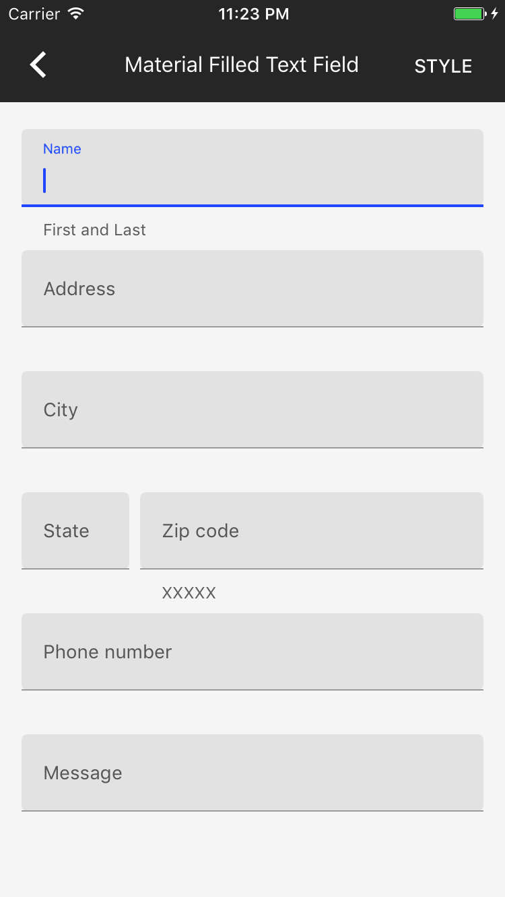

<!--docs:
title: "Text Fields"
layout: detail
section: components
excerpt: "Text fields allow users to input text into your app."
icon_id: text_field
path: /catalog/textfields/
api_doc_root: true
-->

# Text Fields

  

Text fields allow users to input text into your app. They are a direct connection to your users' thoughts and intentions via on-screen, or physical, keyboard. The Material Design Text Fields take the familiar element to a new level by adding useful animations, character counts, helper text, error states, and styles.

## Design & API Documentation

<ul class="icon-list">
  <li class="icon-list-item icon-list-item--spec">
    <a href="https://material.io/guidelines/components/text-fields.html">Material Design guidelines: Text Fields</a>
  </li>
  <li class="icon-list-item icon-list-item--link">
    <a href="https://material.io/components/ios/catalog/textfields/api-docs/Classes/MDCTextField.html">API: MDCTextField</a>
  </li>
  <li class="icon-list-item icon-list-item--link">
    <a href="https://material.io/components/ios/catalog/textfields/api-docs/Classes/MDCMultilineTextField.html">API: MDCMultilineTextField</a>
  </li>
</ul>

## Installation

### Requirements

- Xcode 7.0 or higher.
- iOS SDK version 8.0 or higher.

### Installation with CocoaPods

To add this component to your Xcode project using CocoaPods, add the following to your `Podfile`:

~~~
pod 'MaterialComponents/TextFields'
~~~

Then run the following command:

~~~ bash
pod install
~~~

- - -

### Overview

Text Fields provides both a single-line version based on UITextField and a multi-line version backed by UITextView as well as objects that customize the text fields' behavior and appearance called 'Text Input Controllers'.

The actual components (MDCTextField & MDCMultilineTextField) are 'dumb': they do not have styles, animations, or advanced features. They are designed to be controlled from the outside, via very liberal public API, with a text input controller.

One text input controller is included (MDCTextInputControllerDefault) manipulates the exposed elements of the text field to make placeholders float.

There is also a text input controller for full width forms (MDCTextInputControllerFullWidth). Like MDCTextInputControllerDefault, it also handles errors and character counting.

Customize the included text input controllers via their parameters or create your own to express your app's brand identity thru typography, color, and animation: if the placeholder should move, add constraints or change the frame. If the trailing label should display validation information, change the text and color it.

This pattern is not a delegation or data source-like relationship but rather a controller-to-view relationship: the text field does not require nor expect to be served data or instruction but is instead malleable and easily influenced by outside interference.

### Text Field Classes: The Inputs

#### Text Field

This is a single line text input. It's subclassed from UITextField and supports all the features you'd expect from a UITextField:

* Placeholder
* Overlay views (left and right / leading and trailing)
* Custom fonts, colors
* Clear button

as well as new features:

* Underline
* Labels below the input
* Custom layouts
* Persistable placeholder

#### Multiline Text Field

This is a multiline line text input. It's subclassed from UIView with an embedded UITextView. It supports all the features of the single line text field and UITextView plus:

* Minimum number of lines

### Text Field Classes: The Controllers

#### Default Text Input Controller

This class holds all the 'magic' logic necessary to make the naturally 'dumb' text field and text view behave with:

* Animations
* Styles
* Errors
* Character counts

- - -

#### Full Width Text Input Controller

Similar to the default text input controller but optimized for full width forms like emails.

## Usage

A text field that conforms to MDCTextInput can be added to a view hierarchy the same way UITextField and UIView are. But to achieve the animations and presentations defined by the guidelines (floating placeholders, character counts), a controller that conforms to protocol MDCTextInputController must be initialized to manage the text field.

**NOTE:** Expect to interact with _both the text field_ (for the traditional API) _and the controller_ (for changes affecting the presentation and state).

### Importing

Before using Text Fields, you'll need to import it:

<!--
-->
#### Swift

~~~ swift
import MaterialComponents.MaterialTextFields
~~~

#### Objective-C

~~~ objc
#import "MaterialTextFields.h"
~~~
<!--
-->

## Examples - Single Line

### Text Field with Floating Placeholder

<!--
-->
#### Swift

~~~ swift
let textFieldFloating = MDCTextField()
scrollView.addSubview(textFieldFloating)

textFieldFloating.placeholder = "Full Name"
textFieldFloating.delegate = self

textFieldControllerFloating = MDCTextInputControllerDefault(input: textFieldFloating) // Hold on as a property
~~~

#### Objective-C

~~~ objc
MDCTextField *textFieldFloating = [[MDCTextField alloc] init];
[self.scrollView addSubview:textFieldFloating];

textFieldFloating.placeholder = @"Full Name";
textFieldFloating.delegate = self;

self.textFieldControllerFloating = [[MDCTextInputControllerDefault alloc] initWithTextInput:textFieldFloating];
~~~
<!--
-->

### Text Field with Character Count and Inline Placeholder

<!--
-->
#### Swift

~~~ swift
// First the text field component is setup just like a UITextField
let textFieldDefaultCharMax = MDCTextField()
scrollView.addSubview(textFieldDefaultCharMax)

textFieldDefaultCharMax.placeholder = "Enter up to 50 characters"
textFieldDefaultCharMax.delegate = self

// Second the controller is created to manage the text field
textFieldControllerDefaultCharMax = MDCTextInputControllerDefault(input: textFieldDefaultCharMax) // Hold on as a property
textFieldControllerDefaultCharMax.characterCountMax = 50
textFieldControllerDefaultCharMax.isFloatingEnabled = false
~~~

#### Objective-C

~~~ objc
// First the text field component is setup just like a UITextField
MDCTextField *textFieldDefaultCharMax = [[MDCTextField alloc] init];
[self.scrollView addSubview:textFieldDefaultCharMax];

textFieldDefaultCharMax.placeholder = @"Enter up to 50 characters";
textFieldDefaultCharMax.delegate = self;

// Second the controller is created to manage the text field
self.textFieldControllerDefaultCharMax = [[MDCTextInputControllerDefault alloc] initWithTextInput: textFieldDefaultCharMax];
self.textFieldControllerDefaultCharMax.characterCountMax = 50;
self.textFieldControllerDefaultCharMax.floatingEnabled = NO;

~~~
<!--
-->

## Examples - Multi Line

### Text Field with Floating Placeholder

<!--
-->
#### Swift

~~~ swift
let textFieldFloating = MDCMultilineTextField()
scrollView.addSubview(textFieldFloating)

textFieldFloating.placeholder = "Full Name"
textFieldFloating.delegate = self

textFieldControllerFloating = MDCTextInputControllerDefault(input: textFieldFloating) // Hold on as a property
~~~

#### Objective-C

~~~ objc
MDCMultilineTextField *textFieldFloating = [[MDCMultilineTextField alloc] init];
[self.scrollView addSubview:textFieldFloating];

textFieldFloating.placeholder = @"Full Name";
textFieldFloating.delegate = self;

self.textFieldControllerFloating = [[MDCTextInputControllerDefault alloc] initWithTextInput:textFieldFloating];
~~~
<!--
-->

### Text Field with Character Count and Inline Placeholder

<!--
-->
#### Swift

~~~ swift
// First the text field component is setup just like a UITextField
let textFieldDefaultCharMax = MDCMultilineTextField()
scrollView.addSubview(textFieldDefaultCharMax)

textFieldDefaultCharMax.placeholder = "Enter up to 50 characters"
textFieldDefaultCharMax.delegate = self

// Second the controller is created to manage the text field
textFieldControllerDefaultCharMax = MDCTextInputControllerDefault(input: textFieldDefaultCharMax) // Hold on as a property
textFieldControllerDefaultCharMax.characterCountMax = 50
textFieldControllerDefaultCharMax.isFloatingEnabled = false
~~~

#### Objective-C

~~~ objc
// First the text field component is setup just like a UITextField
MDCMultilineTextField *textFieldDefaultCharMax = [[MDCMultilineTextField alloc] init];
[self.scrollView addSubview:textFieldDefaultCharMax];

textFieldDefaultCharMax.placeholder = @"Enter up to 50 characters";
textFieldDefaultCharMax.delegate = self;

// Second the controller is created to manage the text field
self.textFieldControllerDefaultCharMax = [[MDCTextInputControllerDefault alloc] initWithTextInput: textFieldDefaultCharMax];
self.textFieldControllerDefaultCharMax.characterCountMax = 50;
self.textFieldControllerDefaultCharMax.floatingEnabled = NO;
~~~
<!--
-->

