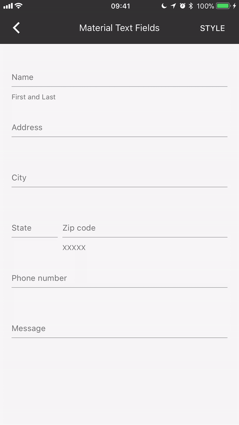

#  Text field styles

MDC's text fields are designed to be styled by controllers implementing the `MDCTextInputController` protocol. The following controllers are included in the text field component and each one is highly customizable to express your app's branding and styling.

Some of the classes are marked as "Preferred". These are known, through extensive UX research, to have big performance gains in usability.

There's also a class called `MDCTextInputControllerBase`. It's meant to be used as a superclass for controllers that want default floating placeholder behavior with minimal customization. Several other controllers inherit from it.

Two of the classes include "Legacy" in their names. They are included to support older designs and avoid breaking changes that come from the size of newer styles.

## MDCTextInputControllerOutlined (Preferred)

- Stroked border
- Border-crossing, floating placeholder
- No fill

### Notes:
This class is intended for singleline text fields only. For a visually compatible multiline controller, use `MDCTextInputControllerOutlinedTextArea`.

## MDCTextInputControllerFilled (Preferred)

- Optional stroked border / underline
- Floating placeholder
- Colored fill

## MDCTextInputControllerOutlinedTextArea (Preferred)

- Stroked border
- Border-crossing, floating placeholder
- No fill

### Notes:
This class is intended for multiline text fields only. For a visually compatible singleline controller, use `MDCTextInputControllerOutlined`.

## MDCTextInputControllerUnderline

- Underline
- Optional floating of placeholder (default is to float)
- No fill
- "Classic" early Material Design look

## MDCTextInputControllerFullWidth

- No border / underline
- Inline placeholder
- Optional fill
- No leading underline label
- Trailing underline label is inline with placeholder

## MDCTextInputControllerLegacyDefault

- Underline
- Optional floating of placeholder (default is to float)
- No fill
- "Classic" early Material Design look
- Legacy clear button (X)

### Notes:
This class has different layout behavior and sizing than `MDCTextInputControllerDefault` but is included for backward compatibility.

## MDCTextInputControllerLegacyFullWidth

- No border / underline
- Inline placeholder
- Optional fill
- No leading underline label
- Trailing underline label is inline with placeholder
- Legacy clear button (X)

### Notes:
This class has different layout behavior and sizing than `MDCTextInputControllerFullWidth` but is included for backward compatibility.
