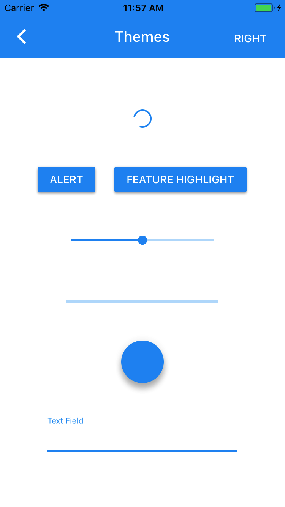

# Themes

*Notice*: This component will soon be deprecated. Please consider using the
[schemes/Typography](../schemes/Typography) and [schemes/Color](../schemes/Color) components and
the [Material Theming](../../docs/theming) APIs instead.

---

<div class="article__asset article__asset--screenshot">
  
</div>

Themes provides a mechanism to colorize components with color schemes. Color schemes are a predefined set of colors that can be broadly applied to a variety of components and user interface elements.

## Installation

### Requirements

- Xcode 8.0 or higher.
- iOS SDK version 9.0 or higher.

### Installation with CocoaPods

To add this component to your Xcode project using CocoaPods, add the following to your `Podfile`:

~~~
pod 'MaterialComponents/<ComponentName>/ColorThemer'
~~~

Then run the following command:

~~~ bash
pod install
~~~

- - -

### Overview

Themes are used to colorize a user interface through application of color schemes. Color schemes are composed of a primary and secondary color. Primary and secondary colors also have light and dark variant colors associated with them. Color scheme initializers allow color schemes to be created in several ways including: allowing one color to be passed to the initalized whereby all other colors are automatically derived, allowing all colors in the color scheme to be defined manually, and allowing some colors to be manually defined and others automatically derived from the defined colors.

Most components have a respective color themer that can colorize the component with a color scheme. The color themer will apply the appropriate colors from the color scheme to a component. Through use of a component color themer it is possible to theme all instances of a component with a UIAppearance proxy or a specific instance of component. The color themer will apply primary and secondary colors from the color scheme to appropriately colorize the component.

## Usage

Most components have a respective color themer that can be used to apply a color scheme to the component.

### Importing

Before using a themer, you'll need to import MaterialThemes to make use of color schemes:

<!--<div class="material-code-render" markdown="1">-->
#### Swift

```swift
import MaterialComponents.MaterialThemes
```

#### Objective-C

```objc
#import "MaterialThemes.h"
```
<!--</div>-->

## Examples

### Theme several components

<!--<div class="material-code-render" markdown="1">-->
#### Swift

```swift
// Define a color scheme.
let colorScheme = MDCBasicColorScheme(primaryColor: UIColor.init(white: 0.2, alpha: 1),
                                      primaryLightColor: .init(white: 0.7, alpha: 1),
                                      primaryDarkColor: .init(white: 0, alpha: 1))

// Theme all instances of the flexible header, progress view and slider components using a
// UIAppearance proxy.
MDCFlexibleHeaderColorThemer.apply(colorScheme, to: MDCFlexibleHeaderView.appearance())
MDCProgressViewColorThemer.apply(colorScheme, to: MDCProgressView.appearance())
MDCSliderColorThemer.apply(colorScheme, to: MDCSlider.appearance())
```

#### Objective-C

```objc
MDCBasicColorScheme *colorScheme =
          [[MDCBasicColorScheme alloc] initWithPrimaryColor:[UIColor colorWithWhite:0.2 alpha:1]
                                          primaryLightColor:[UIColor colorWithWhite:0.7 alpha:1]
                                           primaryDarkColor:[UIColor colorWithWhite:0 alpha:1]];


// Theme all instances of the flexible header, progress view and slider components using a
// UIAppearance proxy.
[MDCFlexibleHeaderColorThemer applyColorScheme:colorScheme
                            toFlexibleHeaderView:[MDCFlexibleHeaderView appearance]];
[MDCProgressViewColorThemer applyColorScheme:colorScheme
                                toProgressView:[MDCProgressView appearance]];
[MDCSliderColorThemer applyColorScheme:colorScheme toSlider:[MDCSlider appearance]];
```

<!--</div>-->

