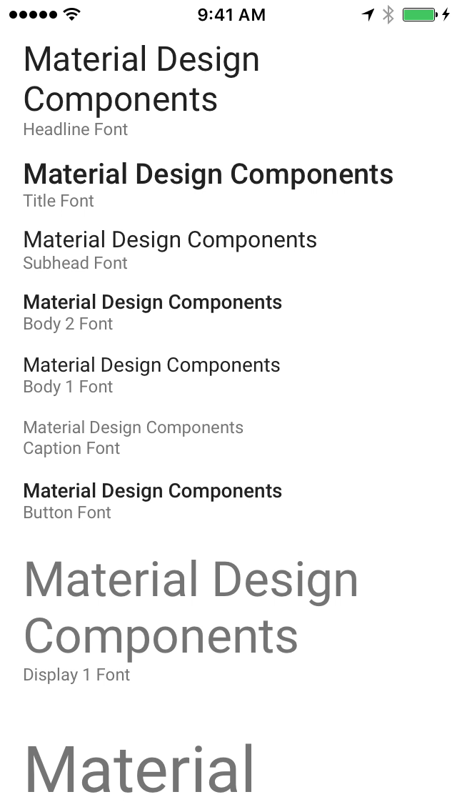

<!-- This file was auto-generated using ./scripts/generate_readme Typography -->

# Typography

*Notice*: Much of this component, with exception of the UIFont and UIFontDescriptor APIs, will soon
be deprecated. Please consider using the [schemes/Typography](schemes/Typography) component and
the [Material Theming](../docs/theming) APIs instead.

---

<div class="article__asset article__asset--screenshot">
  
</div>

The Typography component provides methods for displaying text using the type sizes and opacities
from the Material Design specifications.

## Design & API Documentation

<ul class="icon-list">
  <li class="icon-list-item icon-list-item--spec"><a href="https://material.io/go/design-typography">Material Design guidelines: Typography</a></li>
  <li class="icon-list-item icon-list-item--link"><a href="https://github.com/material-components/material-components-ios/blob/develop/components/Typography/src/MDCTypography.h">API: MDCTypography</a></li>
  <li class="icon-list-item icon-list-item--link"><a href="https://github.com/material-components/material-components-ios/blob/develop/components/Typography/src/MDCTypography.h">API: MDCTypographyFontLoading</a></li>
</ul>

## Installation

### Installation with CocoaPods

To add this component to your Xcode project using CocoaPods, add the following to your `Podfile`:

```bash
pod 'MaterialComponents/Typography'
```
<!--{: .code-renderer.code-renderer--install }-->

Then, run the following command:

```bash
pod install
```

## Usage

<!-- Extracted from docs/typical-use.md -->

### Importing

Before using Typography, you'll need to import it:

<!--<div class="material-code-render" markdown="1">-->
#### Swift
```swift
import MaterialComponents.MaterialTypography
```

#### Objective-C

```objc
#import "MaterialTypography.h"
```
<!--</div>-->

### Font
Select a font most appropriate to its usage and set it as your label's font. All fonts are returned
from class methods beginning with the font's Material Design type style and ending with 'Font'.
Material Typography should be used consistently throughout the entire UI.

### Opacity
Each font has a respective opacity (alpha) value returned by class methods beginning with the
font's Material Design type style and ending with 'FontOpacity'. These CGFloats should be set on the
label's alpha property. If animating alpha, it should be the maximum value reached.


## Type Sizes and Opacities

<!-- Extracted from docs/type-size-opacity.md -->

`MDCTypography` provides a `UIFont` font and a `CGFloat` opacity for each of the standard type
settings in the Material Design specifications.

### Material Design type styles and their respective `MDCTypography` methods

| Material Design Type | MDCTypography Font | MDCTypography Opacity |
| -------------------- | ------------------ | --------------------- |
| Display 4 | display4Font | display4FontOpacity |
| Display 3 | display3Font | display3FontOpacity |
| Display 2 | display2Font | display2FontOpacity |
| Display 1 | display1Font | display1FontOpacity |
| Headline | headlineFont | headlineFontOpacity |
| Subheading | subheadFont | subheadFontOpacity |
| Body 2 | body2Font | body2FontOpacity |
| Body 1 | body1Font | body1FontOpacity |
| Caption | captionFont | captionFontOpacity |
| Button | buttonFont | buttonFontOpacity |
<!--{: .data-table }-->

### Font size reference

<!--{: .article__asset.article__asset--illustration }-->

### Font opacity reference

<!--{: .article__asset.article__asset--illustration }-->

## Examples

### Create a Title Label

<!--<div class="material-code-render" markdown="1">-->
#### Swift

```swift
let label = UILabel()
label.text = "This is a title"
label.font = MDCTypography.titleFont()
label.alpha = MDCTypography.titleFontOpacity()

// If using autolayout, the following line is unnecessary as long
// as all constraints are valid.
label.sizeToFit()
self.view.addSubview(label)
```

#### Objective C

```objc
UILabel *label = [[UILabel alloc] init];
label.text = @"This is a title";
label.font = [MDCTypography titleFont];
label.alpha = [MDCTypography titleFontOpacity];

// If using autolayout, the following line is unnecessary as long
// as all constraints are valid.
[label sizeToFit];
[self.view addSubview:label];
```
<!--</div>-->

### Create a Display 1 Label

<!--<div class="material-code-render" markdown="1">-->
#### Swift

```swift
let label = UILabel()
label.text = "Display 1"
label.font = MDCTypography.display1Font()
label.alpha = MDCTypography.display1FontOpacity()

// If using autolayout, the following line is unnecessary as long
// as all constraints are valid.
label.sizeToFit()
self.view.addSubview(label)
```

#### Objective

```objc
UILabel *label = [[UILabel alloc] init];
label.text = @"Display 1";
label.font = [MDCTypography display1Font];
label.alpha = [MDCTypography display1FontOpacity];

// If using autolayout, the following line is unnecessary as long
// as all constraints are valid.
[label sizeToFit];
[self.view addSubview:label];

```
<!--</div>-->

### Set an Existing Label as a Caption Label

<!--<div class="material-code-render" markdown="1">-->
#### Swift

```swift
label.font = MDCTypography.captionFont()
label.alpha = MDCTypography.captionFontOpacity()

// If using autolayout, the following line is unnecessary as long
// as all constraints are valid.
label.sizeToFit()
```
#### Objective C

```objc
self.label.font = [MDCTypography captionFont];
self.label.alpha = [MDCTypography captionFontOpacity];

// If using autolayout, the following line is unnecessary as long
// as all constraints are valid.
[self.label sizeToFit];
```
<!--</div>-->


## Advanced Usage

<!-- Extracted from docs/advanced-use.md -->

### Custom Fonts
Material Components for iOS allows you to set your own font for all of the components. Use the class
method `setFontLoader:` on MDCTypography to specify a loader that conforms to the
`MDCTypographyFontLoading` protocol.

If you want to use the system font use `MDCSystemFontLoader` which already conforms to the
`MDCTypographyFontLoading` protocol. It is used if no font loader is set.

<!--<div class="material-code-render" markdown="1">-->
#### Swift
```swift
class CustomFontLoader: NSObject, MDCTypographyFontLoading {
  func regularFont(ofSize fontSize: CGFloat) -> UIFont {
    // Consider using MDFFontDiskLoader to register your font.
    return UIFont.init(name: "yourCustomRegularFont", size: fontSize)!
  }
  func mediumFont(ofSize fontSize: CGFloat) -> UIFont {
    // Consider using MDFFontDiskLoader to register your font.
    return UIFont.init(name: "yourCustomMediumFont", size: fontSize)!
  }
  func lightFont(ofSize fontSize: CGFloat) -> UIFont {
    // Consider using MDFFontDiskLoader to register your font.
    return UIFont.init(name: "yourCustomLightFont", size: fontSize)!
  }
}

...

func application(_ application: UIApplication, didFinishLaunchingWithOptions launchOptions: [UIApplicationLaunchOptionsKey: Any]?) -> Bool {

  // Before any UI is called
  MDCTypography.setFontLoader(CustomFontLoader())

}
```

#### Objective-C

```objc
@interface CustomFontLoader : NSObject <MDCTypographyFontLoading>
@end

@implementation CustomFontLoader

- (UIFont *)regularFontOfSize:(CGFloat)fontSize {
  // Consider using MDFFontDiskLoader to register your font.
  return [UIFont fontWithName:@"yourCustomRegularFont" size:fontSize];
}

- (UIFont *)mediumFontOfSize:(CGFloat)fontSize {
  // Consider using MDFFontDiskLoader to register your font.
  return [UIFont fontWithName:@"yourCustomMediumFont" size:fontSize];
}

- (UIFont *)lightFontOfSize:(CGFloat)fontSize {
  // Consider using MDFFontDiskLoader to register your font.
  return [UIFont fontWithName:@"yourCustomLightFont" size:fontSize];
}

@end

...

- (BOOL)application:(UIApplication *)application
    didFinishLaunchingWithOptions:(NSDictionary *)launchOptions {
  // Before any UI is called
  [MDCTypography setFontLoader:[[CustomFontLoader alloc] init]];
}
```
<!--</div>-->


<!-- Extracted from docs/dynamic-type.md -->

### Dynamic Type

Material Components for iOS supports the iOS Dynamic Type feature on all [Material-supported iOS versions](../../docs/build-env#ios).

#### Overview

Typography library provides APIs that allow users to support Dynamic Type feature in Material Components.

To support Dynamic Type in your component, you need to set up text styles represented by `MDCFontTextStyle` on text, such as `MDCFontTextStyleBody1` or `MDCFontTextStyleTitle`. These text styles describe how text size should be adjusted when Dynamic Type setting changes. Next, enable `mdc_adjustsFontForContentSizeCategory` on components that have Dynamic Type support. This setting tells the component to adjust the text size based on user setting.

#### Configure Text Styles

Users configure text styles in source code. First, you call the `scalerForMaterialTextStyle:` method. This method returns an `MDCFontScalar` object for a given `MDCFontTextStyle`. Next, use the `MDCFontScalar` object to scale a `UIFont` by calling `scaledFontWithFont:` method. This method scales the font based on Dynamic Type setting provided by the user. This method also supports both system fonts and custom fonts.

#### Objective-C

```objc
UIFont *customFont = [UIFont fontWithName:@"CustomFontName" size:18.0];
MDCFontScaler *fontScaler = [MDCFontScaler scalerForMaterialTextStyle:MDCTextStyleBody1];
UIFont *customScalableFont = [fontScaler scaledFontWithFont:customFont];
label.font = customScalingFont;
```

#### Swift

```swift
let customFont = UIFont(name: "CustomFontName", size: 18.0)!
let fontScaler = MDCFontScaler(forMaterialTextStyle:.body1);
let customScalableFont = fontScaler.scaledFont(with:customFont);
label.font = customScalingFont;
```

The text control doesn't adjust the font size automatically when the user adjust Dynamic Type setting. To detech such adjustments, you can listen to `UIContentSizeCategoryDidChangeNotification` and update the font by calling `mdc_scaledFontForCurrentSizeCategory` method when the notification arrives.


#### Configure Dynamic Type in Material Components

In your source code, set `mdc_adjustsFontForContentSizeCategory` to `YES` on components that have Dynamic Type support. When the user makes Dynamic Type changes in Settings, components will respond automatically.

#### Fallback behavior to handle legacy Dynamic Type behavior in Material Components

If `adjustsFontForContentSizeCategoryWhenScaledFontIsUnavailable` is set to `YES`, the font size will adjust even if a scalable font has not been provided for a given UIFont property on this component. It needs to be set before `mdc_adjustsFontForContentSizeCategory` is configured to let the component know whether the fallback behavior should be applied.

