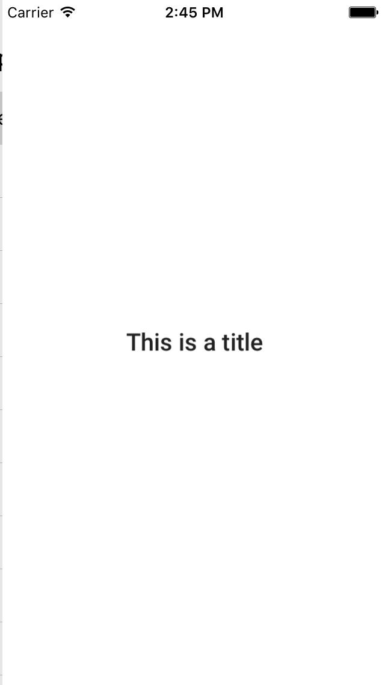

# Typography

<!--{: .ios-screenshot .right }-->

The Typography component provides methods for displaying text using the type sizes and opacities
from the Material Design specifications.
<!--{: .intro }-->

### Design Specifications

<ul class="icon-list">
<li class="icon-link"><a href="https://www.google.com/design/spec/style/typography.html">Typography</a></li>
</ul>

### API Documentation

<ul class="icon-list">
<li class="icon-link"><a href="/apidocs/Typography/Classes/MDCFontResource.html">MDCFontResource</a></li>
<li class="icon-link"><a href="/apidocs/Typography/Classes/MDCRobotoFontLoader.html">MDCRobotoFontLoader</a></li>
<li class="icon-link"><a href="/apidocs/Typography/Classes.html#/c:objc(cs)MDCSystemFontLoader">MDCSystemFontLoader</a></li>
<li class="icon-link"><a href="/apidocs/Typography/Classes/MDCTypography.html">MDCTypography</a></li>
<li class="icon-link"><a href="/apidocs/Typography/Protocols/MDCTypographyFontLoader.html">MDCTypographyFontLoader</a></li>
</ul>

- - -

## Installation

### Requirements

- Xcode 7.0 or higher.
- iOS SDK version 7.0 or higher.

### Installation with CocoaPods

To add the Typography component to your Xcode project using CocoaPods, add the following to your
PodFile:

~~~ bash
pod 'MaterialComponents/Typography'
~~~

Then, run the following command:

~~~ bash
$ pod install
~~~

- - -

## Usage

### Importing

Before using Typography, you'll need to import it:

<!--
-->
#### Objective-C

~~~ objc
#import "MaterialTypography.h"
~~~

#### Swift
~~~ swift
import MaterialComponents
~~~
<!--
-->

### Font
Select a font most appropriate to its usage and set it as your label's font. All fonts are returned
from class methods beginning with the font's Material Design type style and ending with 'Font'.
Material Typography should be used consistently throughout the entire UI.

### Opacity
Each font has a respective opacity (alpha) value returned by class methods beginning with the
font's Material Design type style and ending with 'FontOpacity'. These CGFloats should be set on the
label's alpha property. If animating alpha, it should be the maximum value reached.

- - -

## Type Sizes and Opacities

`MDCTypography` provides a `UIFont` font and a `CGFloat` opacity for each of the standard type
settings in the Material Design specifications.

### Material Design type styles and their respective `MDCTypography` methods

| Material Design Type | MDCTypography Font | MDCTypography Opacity |
| -------------------- | ------------------ | --------------------- |
| Display 4 | display4Font | display4FontOpacity |
| Display 3 | display3Font | display3FontOpacity |
| Display 2 | display2Font | display2FontOpacity |
| Display 1 | display1Font | display1FontOpacity |
| Headline | headlineFont | headlineFontOpacity |
| Subheading | subheadFont | subheadFontOpacity |
| Body 2 | body2Font | body2FontOpacity |
| Body 1 | body1Font | body1FontOpacity |
| Caption | captionFont | captionFontOpacity |
| Button | buttonFont | buttonFontOpacity |
<!--{: .data-table }-->

### Font size reference

<!--{: .illustration }-->

### Font opacity reference

<!--{: .illustration }-->

- - -

## Examples

### Create a Title Label

<!--
-->

#### Objective C

~~~ objc
#import "MaterialTypography.h"

UILabel *label = [[UILabel alloc] init];
label.text = @"This is a title";
label.font = [MDCTypography titleFont];
label.alpha = [MDCTypography titleFontOpacity];

// If using autolayout, the following line is unnecessary as long
// as all constraints are valid.
[label sizeToFit];
[self.view addSubview:label];

~~~

#### Swift

~~~ swift
let label = UILabel()
label.text = "This is a title"
label.font = MDCTypography.titleFont()
label.alpha = MDCTypography.titleFontOpacity()

// If using autolayout, the following line is unnecessary as long
// as all constraints are valid.
label.sizeToFit()
self.view.addSubview(label)
~~~
<!--
-->

### Create a Display 1 Label

<!--
-->

#### Objective

~~~ objc
#import "MaterialTypography.h"

UILabel *label = [[UILabel alloc] init];
label.text = @"Display 1";
label.font = [MDCTypography display1Font];
label.alpha = [MDCTypography display1FontOpacity];

// If using autolayout, the following line is unnecessary as long
// as all constraints are valid.
[label sizeToFit];
[self.view addSubview:label];

~~~

#### Swift

~~~ swift
let label = UILabel()
label.text = "Display 1"
label.font = MDCTypography.display1Font()
label.alpha = MDCTypography.display1FontOpacity()

// If using autolayout, the following line is unnecessary as long
// as all constraints are valid.
label.sizeToFit()
self.view.addSubview(label)
~~~
<!--
-->

### Set an Existing Label as a Caption Label

<!--
-->

#### Objective C

~~~ objc
#import "MaterialTypography.h"

self.label.font = [MDCTypography captionFont];
self.label.alpha = [MDCTypography captionFontOpacity];

// If using autolayout, the following line is unnecessary as long
// as all constraints are valid.
[self.label sizeToFit];
~~~

#### Swift

~~~ swift
self.label.font = MDCTypography.captionFont()
self.label.alpha = MDCTypography.captionFontOpacity()

// If using autolayout, the following line is unnecessary as long
// as all constraints are valid.
self.label.sizeToFit()
~~~
<!--
-->

- - -

## Advanced Usage

### Custom Fonts
Material Components iOS allows you to set your own font instead of Roboto. Since
all of the other Material Component font requests funnel through the Typography
component, it is possible to switch the font used by all of Material Components.
Use `setFontLoader:` to specify a font loader with your own fonts. It should
conform to the `MDCTypographyFontLoading` protocol which has APIs for
`regularFontOfSize:`, `mediumFontOfSize:`, and `lightFontOfSize:` which are need
for material typography styles.

#### The default FontLoaer
If no font loader has been set Typography attempts to use the Material
[RobotoFontLoader](https://github.com/google/material-components-ios/tree/develop/components/FontDiskLoader)
which results in Roboto fonts being used when text styles are requested.

If your Podfile.lock has:
~~~ bash
MaterialComponents/RobotoFontLoader
~~~
Then one of your specs depends on RobotoFontLoader and the Roboto will be used
if no font loader has been set.
