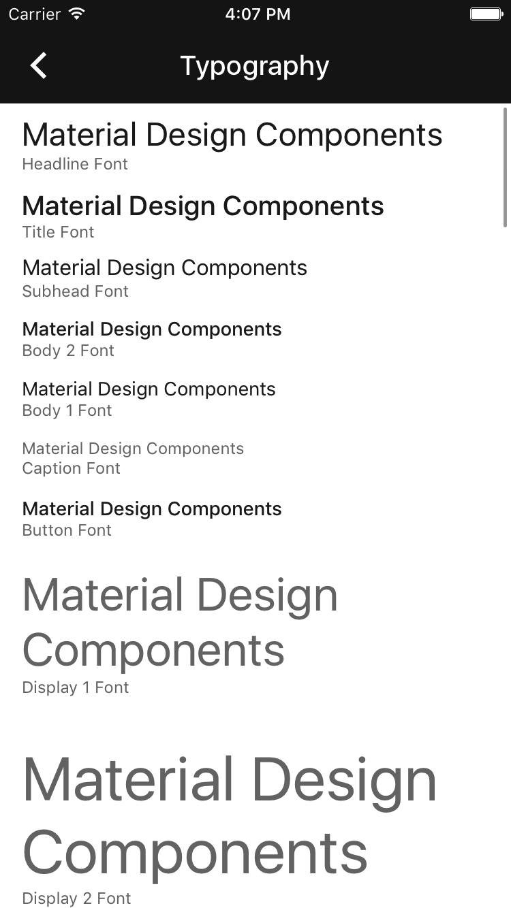

# Typography

  <video src="docs/assets/typography.mp4" autoplay loop></video>
  

The Typography component provides methods for displaying text using the type sizes and opacities
from the Material Design specifications.
<!--{: .intro }-->

### Design Specifications

<ul class="icon-list">
<li class="icon-link"><a href="https://www.google.com/design/spec/style/typography.html">Typography</a></li>
</ul>

### API Documentation

<ul class="icon-list">
<li class="icon-link"><a href="apidocs/Classes/MDCTypography.html">MDCTypography</a></li>
<li class="icon-link"><a href="../FontDiskLoader/apidocs/Classes/MDCFontDiskLoader.html">MDCFontDiskLoader</a></li>
<li class="icon-link"><a href="../RobotoFontLoader/apidocs/Classes/MDCRobotoFontLoader.html">MDCRobotoFontLoader</a></li>
<li class="icon-link"><a href="apidocs/Classes.html#/c:objc(cs)MDCSystemFontLoader">MDCSystemFontLoader</a></li>
<li class="icon-link"><a href="apidocs/Protocols/MDCTypographyFontLoader.html">MDCTypographyFontLoader</a></li>
</ul>

## Installation

### Requirements

- Xcode 7.0 or higher.
- iOS SDK version 7.0 or higher.

### Installation with CocoaPods

To add this component to your Xcode project using CocoaPods, add the following to your `Podfile`:

~~~ bash
pod 'MaterialComponents/Typography'
~~~

Then, run the following command:

~~~ bash
pod install
~~~

## Usage

### Importing

Before using Typography, you'll need to import it:

<!--
-->
#### Objective-C

~~~ objc
#import "MaterialTypography.h"
~~~

#### Swift
~~~ swift
import MaterialComponents
~~~
<!--
-->

### Font
Select a font most appropriate to its usage and set it as your label's font. All fonts are returned
from class methods beginning with the font's Material Design type style and ending with 'Font'.
Material Typography should be used consistently throughout the entire UI.

### Opacity
Each font has a respective opacity (alpha) value returned by class methods beginning with the
font's Material Design type style and ending with 'FontOpacity'. These CGFloats should be set on the
label's alpha property. If animating alpha, it should be the maximum value reached.

## Type Sizes and Opacities

`MDCTypography` provides a `UIFont` font and a `CGFloat` opacity for each of the standard type
settings in the Material Design specifications.

### Material Design type styles and their respective `MDCTypography` methods

| Material Design Type | MDCTypography Font | MDCTypography Opacity |
| -------------------- | ------------------ | --------------------- |
| Display 4 | display4Font | display4FontOpacity |
| Display 3 | display3Font | display3FontOpacity |
| Display 2 | display2Font | display2FontOpacity |
| Display 1 | display1Font | display1FontOpacity |
| Headline | headlineFont | headlineFontOpacity |
| Subheading | subheadFont | subheadFontOpacity |
| Body 2 | body2Font | body2FontOpacity |
| Body 1 | body1Font | body1FontOpacity |
| Caption | captionFont | captionFontOpacity |
| Button | buttonFont | buttonFontOpacity |
<!--{: .data-table }-->

### Font size reference

<!--{: .illustration }-->

### Font opacity reference

<!--{: .illustration }-->

## Examples

### Create a Title Label

<!--
-->

#### Objective C

~~~ objc
#import "MaterialTypography.h"

UILabel *label = [[UILabel alloc] init];
label.text = @"This is a title";
label.font = [MDCTypography titleFont];
label.alpha = [MDCTypography titleFontOpacity];

// If using autolayout, the following line is unnecessary as long
// as all constraints are valid.
[label sizeToFit];
[self.view addSubview:label];

~~~

#### Swift

~~~ swift
let label = UILabel()
label.text = "This is a title"
label.font = MDCTypography.titleFont()
label.alpha = MDCTypography.titleFontOpacity()

// If using autolayout, the following line is unnecessary as long
// as all constraints are valid.
label.sizeToFit()
self.view.addSubview(label)
~~~
<!--
-->

### Create a Display 1 Label

<!--
-->

#### Objective

~~~ objc
#import "MaterialTypography.h"

UILabel *label = [[UILabel alloc] init];
label.text = @"Display 1";
label.font = [MDCTypography display1Font];
label.alpha = [MDCTypography display1FontOpacity];

// If using autolayout, the following line is unnecessary as long
// as all constraints are valid.
[label sizeToFit];
[self.view addSubview:label];

~~~

#### Swift

~~~ swift
let label = UILabel()
label.text = "Display 1"
label.font = MDCTypography.display1Font()
label.alpha = MDCTypography.display1FontOpacity()

// If using autolayout, the following line is unnecessary as long
// as all constraints are valid.
label.sizeToFit()
self.view.addSubview(label)
~~~
<!--
-->

### Set an Existing Label as a Caption Label

<!--
-->

#### Objective C

~~~ objc
#import "MaterialTypography.h"

self.label.font = [MDCTypography captionFont];
self.label.alpha = [MDCTypography captionFontOpacity];

// If using autolayout, the following line is unnecessary as long
// as all constraints are valid.
[self.label sizeToFit];
~~~

#### Swift

~~~ swift
self.label.font = MDCTypography.captionFont()
self.label.alpha = MDCTypography.captionFontOpacity()

// If using autolayout, the following line is unnecessary as long
// as all constraints are valid.
self.label.sizeToFit()
~~~
<!--
-->

## Advanced Usage

### Custom Fonts
Material Components iOS allows you to set your own font instead of Roboto. Since all of the other
Material Component font requests funnel through the Typography component, it is possible to switch
the font used by all of Material Components. If you want to use the system font for Material
Components use `MDCSystemFontLoader` which already conforms to the `MDCTypographyFontLoading`
protocol.

<!--
-->
#### Objective-C

~~~ objc
@interface CustomFontLoader : NSObject <MDCTypographyFontLoading>
@end

@implementation CustomFontLoader

- (UIFont *)regularFontOfSize:(CGFloat)fontSize {
  // Consider using MDCFontDiskLoader to register your font.
  return [UIFont fontWithName:@"yourCustomRegularFont" size:fontSize];
}

- (UIFont *)mediumFontOfSize:(CGFloat)fontSize {
  // Consider using MDCFontDiskLoader to register your font.
  return [UIFont fontWithName:@"yourCustomMediumFont" size:fontSize];
}

- (UIFont *)lightFontOfSize:(CGFloat)fontSize {
  // Consider using MDCFontDiskLoader to register your font.
  return [UIFont fontWithName:@"yourCustomLightFont" size:fontSize];
}

@end

...

- (BOOL)application:(UIApplication *)application didFinishLaunchingWithOptions:(NSDictionary *)launchOptions {
... before any UI is called
    [MDCTypography setFontLoader:[[CustomFontLoader alloc] init];
...
}
~~~

#### Swift
~~~ swift
class CustomFontLoader: NSObject, MDCTypographyFontLoading {
  func regularFontOfSize(fontSize: CGFloat) -> UIFont {
    // Consider using MDCFontDiskLoader to register your font.
    return UIFont.init(name: "yourCustomRegularFont", size: fontSize)!
  }
  func mediumFontOfSize(fontSize: CGFloat) -> UIFont {
    // Consider using MDCFontDiskLoader to register your font.
    return UIFont.init(name: "yourCustomMediumFont", size: fontSize)!
  }
  func lightFontOfSize(fontSize: CGFloat) -> UIFont {
    // Consider using MDCFontDiskLoader to register your font.
    return UIFont.init(name: "yourCustomLightFont", size: fontSize)!
  }
}

...

func application(application: UIApplication, didFinishLaunchingWithOptions launchOptions: [NSObject: AnyObject]?) -> Bool {
... before any UI is called
  MDCTypography.setFontLoader(CustomFontLoader())
...
}
~~~
<!--
-->

#### The default FontLoaer
If no font loader has been set, Typography attempts to use the Material
[RobotoFontLoader](../FontDiskLoader/)
which results in Roboto fonts being used when text styles are requested. If that runtime check
fails to find MDCRobotoFontLoader, the Material MDCSystemFontLoader font is used resulting in San
Francisco or Helvetica being used.

If your Podfile.lock has:

~~~ bash
MaterialComponents/RobotoFontLoader
~~~

Then one of your specs depends on RobotoFontLoader and the Roboto will be used if no font loader has
been set. If you set your own Font Loader it is recomened that you not pull in the Roboto Font
Loader Component because that will add font assets to your app that you will not use.
