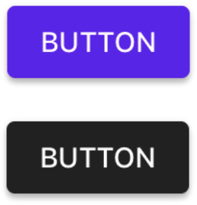

<!--docs:
title: "Color scheme"
layout: detail
section: components
excerpt: "The Material color scheme provides support for theming an app with a semantic set of colors."
iconId: themes
path: /catalog/theming/color/
api_doc_root: true
-->

<!-- This file was auto-generated using ./scripts/generate_readme schemes/Color -->

# Color scheme

The Material Design color system can be used to create a color theme that reflects your brand or
style. A _color scheme_ represents your theme's specific color values, such as its primary color and
the surface colors of views.

## Design & API documentation

<ul class="icon-list">
  <li class="icon-list-item icon-list-item--spec"><a href="https://material.io/go/design-color-theming">Material Design guidelines: Color theming</a></li>
</ul>

## Related documentation

<ul class="icon-list">
  <li class="icon-list-item icon-list-item--link"><a href="../">Theming</a></li>
</ul>

## Table of contents

- [Overview](#overview)
  - [Semantic color values](#semantic-color-values)
- [Installation](#installation)
  - [Installation with CocoaPods](#installation-with-cocoapods)
  - [Importing](#importing)
- [Usage](#usage)
  - [Typical use: customizing a color scheme](#typical-use-customizing-a-color-scheme)
- [Migration guides](#migration-guides)
  - [Migration guide: semantic color schemes](#migration-guide-semantic-color-schemes)

- - -

## Overview

An implementation of the Material Design color scheme is provided in the `MDCSemanticColorScheme`
class. By default, an instance of this class is configured with the Material defaults. While it is
possible to use these defaults out of the box, you are highly encouraged to set — at a minimum — the
primary and secondary color values. The following image shows an MDCButton themed with the default
color scheme values (top) and an MDCButton themed with custom color scheme values (bottom).



Most components support being themed with a color scheme using a `color themer` extension. You can
learn more about which extensions are available for a given component by reading the
[component documentation](../../).

### Semantic color values

A color scheme consists of the following semantic color values:

| Color name            | Use        |
|:--------------------- |:---------- |
| `primaryColor`        | The color displayed most frequently across your app’s screens and components. |
| `primaryColorVariant` | A light or dark variation of the primary color. |
| `secondaryColor`      | Provides ways to accent and distinguish your product. Floating action buttons use the secondary color. |
| `errorColor`          | The indication of errors within components such as text fields. |
| `surfaceColor`        | Typically maps to the background of components such as cards, sheets, and dialogs. |
| `backgroundColor`     | Typically found behind scrollable content. |

Each of these colors are paired with a corresponding "on-color". An on color defines the
color for text and iconography drawn on top of the associated color. Take care when picking on
colors that they meet [the accessibility guidelines for text and contrasting color](https://www.w3.org/TR/UNDERSTANDING-WCAG20/visual-audio-contrast-contrast.html).

| On color name         | Use        |
|:--------------------- |:---------- |
| `onPrimaryColor`      | Text/iconography drawn on top of `primaryColor`. |
| `onSecondaryColor`    | Text/iconography drawn on top of `secondaryColor`. |
| `onErrorColor`        | Text/iconography drawn on top of `errorColor`. |
| `onSurfaceColor`      | Text/iconography drawn on top of `surfaceColor`. |
| `onBackgroundColor`   | Text/iconography drawn on top of `backgroundColor`. |

## Installation

### Installation with CocoaPods

Add the following to your `Podfile`:

```bash
pod 'MaterialComponents/schemes/Color'
```
<!--{: .code-renderer.code-renderer--install }-->

Then, run the following command:

```bash
pod install
```

### Importing

To import the component:

<!--<div class="material-code-render" markdown="1">-->
#### Swift
```swift
import MaterialComponents.MaterialColorScheme
```

#### Objective-C

```objc
#import "MaterialColorScheme.h"
```
<!--</div>-->

## Usage

<!-- Extracted from docs/typical-use-customizing-a-scheme.md -->

### Typical use: customizing a color scheme

You'll typically want to create one default `MDCSemanticColorScheme` instance for your app where all
of the color properties are set to your desired brand or style.

<!--<div class="material-code-render" markdown="1">-->
#### Swift
```swift
let colorScheme = MDCSemanticColorScheme()
colorScheme.primaryColor = UIColor(red: CGFloat(0x21) / 255.0,
                                   green: CGFloat(0x21) / 255.0,
                                   blue: CGFloat(0x21) / 255.0,
                                   alpha: 1)
colorScheme.primaryColorVariant = UIColor(red: CGFloat(0x44) / 255.0,
                                   green: CGFloat(0x44) / 255.0,
                                   blue: CGFloat(0x44) / 255.0,
                                   alpha: 1)

// In this case we don't intend to use a secondary color, so we make it match our primary color
colorScheme.secondaryColor = colorScheme.primaryColor
```

#### Objective-C

```objc
// A helper method for creating colors from hex values.
static UIColor *ColorFromRGB(uint32_t colorValue) {
  return [[UIColor alloc] initWithRed:(CGFloat)(((colorValue >> 16) & 0xFF) / 255.0)
                                green:(CGFloat)(((colorValue >> 8) & 0xFF) / 255.0)
                                 blue:(CGFloat)((colorValue & 0xFF) / 255.0) alpha:1];
}

MDCSemanticColorScheme *colorScheme = [[MDCSemanticColorScheme alloc] initWithDefaults:MDCColorSchemeDefaultsMaterial201804];
colorScheme.primaryColor = ColorFromRGB(0x212121);
colorScheme.primaryColorVariant = ColorFromRGB(0x444444);

// In this case we don't intend to use a secondary color, so we make it match our primary color
colorScheme.secondaryColor = colorScheme.primaryColor;
```
<!--</div>-->


## Migration guides

<!-- Extracted from docs/migration-guide-semantic-color-scheme.md -->

### Migration guide: semantic color schemes

Deprecation schedule:

- October 10, 2018: Both APIs and any corresponding themer API will be deprecated.
- November 10, 2018: Both APIs and any corresponding themer API will be deleted.

The following is guidance for migrating from the legacy colors cheme APIs to the modern, Material
color system-compatible APIs.

The legacy APIs roughly map to the modern APIs like so:

| Legacy API            | Modern API               |
|:----------------------|:-------------------------|
| `MDCColorScheme`      | `MDCColorScheming`       |
| `MDCBasicColorScheme` | `MDCSemanticColorScheme` |
| `MDCTonalColorScheme` | No equivalent.           |
| `MDCTonalPalette`     | No equivalent.           |

#### A brief comparison of MDCColorScheme and MDCColorScheming

`MDCColorScheme` and `MDCColorScheming` are both protocols that define a set of semantic property
names. The key difference between these two APIs is that `MDCColorScheme` is a mostly-optional bag
of color properties, while `MDCColorScheming`'s properties are all required.

Both protocols are currently accepted by each component's color themer. The legacy themer APIs
tend to map far fewer color scheme properties to their components, while the modern themer APIs
more rigorously map the scheme's colors to their component. For example, `MDCButtonColorThemer`'s
legacy API merely sets the button's background color, while the modern API sets background
color, text color, image tint color, ink color, and more.

The modern APIs also introduce a concept of "on-" colors, which are colors that can generally
be used as the color for text or iconography placed in front of their similarly-named color. For
example, if `primaryColor` is white, `onPrimaryColor` might typically be black.

In essence: the modern APIs represent a more comprehensive take on a global theming system.

The legacy properties map to the modern properties roughly like so:

| `MDCColorScheme`      | `MDCColorScheming`    |
|:----------------------|:----------------------|
| `primaryColor`        | `primaryColor`        |
| `primaryLightColor`   | `primaryColorVariant` |
| `primaryDarkColor`    | `primaryColorVariant` |
| `secondaryColor`      | `secondaryColor`      |
| `secondaryLightColor` | No equivalent.        |
| `secondaryDarkColor`  | No equivalent.        |
| No equivalent.        | `errorColor`          |
| No equivalent.        | `surfaceColor`        |
| No equivalent.        | `backgroundColor`     |
| No equivalent.        | `onPrimaryColor`      |
| No equivalent.        | `onSecondaryColor`    |
| No equivalent.        | `onSurfaceColor`      |
| No equivalent.        | `onBackgroundColor`   |

#### A brief comparison of MDCBasicColorScheme and MDCSemanticColorScheme

`MDCBasicColorScheme` and `MDCSemanticColorScheme` are both concrete implementations of
`MDCColorScheme` and `MDCColorScheming`, respectively.

The legacy API, `MDCBasicColorScheme`, provides a variety of convenience initializers for setting
specific subsets of the color scheme.

The modern API, `MDCSemanticColorScheme`, only provides a basic initializer that initializes the
colors to the Material defaults. You are expected to fully configure the color scheme according to
your needs. A common pattern is to define a global method that returns an instance of a
pre-configured color scheme for your app to use when theming components.

<!--<div class="material-code-render" markdown="1">-->
#### Swift
```swift
// Before
let colorScheme = MDCBasicColorScheme(primaryColor: .white)

// After
let colorScheme = MDCSemanticColorScheme()
colorScheme.primaryColor = .white
colorScheme.onPrimaryColor = .black
```

#### Objective-C

```objc
// Before
MDCBasicColorScheme *colorScheme =
      [[MDCBasicColorScheme alloc] initWithPrimaryColor:UIColor.whiteColor];

// After
MDCSemanticColorScheme *colorScheme = [[MDCSemanticColorScheme alloc] initWithDefaults:MDCColorSchemeDefaultsMaterial201804];
colorScheme.primaryColor = UIColor.whiteColor;
colorScheme.onPrimaryColor = UIColor.blackColor;
```
<!--</div>-->

#### Differences in themer APIs

The color themer extensions for each component now have both a legacy and modern API for color
theming. The legacy APIs typically have the signature `applyColorScheme:toComponent:`, while the
modern APIs typically have the signature `applySemanticColorScheme:toComponent:`.

In cases where no previous legacy API existed, the modern API may use the
`applyColorScheme:toComponent:` signature but it will accept an `MDCColorScheming` instance.

Example before/after code:

<!--<div class="material-code-render" markdown="1">-->
#### Swift
```swift
// Before
MDCActivityIndicatorColorThemer.apply(colorScheme, to: activityIndicator)

// After
MDCActivityIndicatorColorThemer.applySemanticColorScheme(colorScheme, to: activityIndicator)
```

#### Objective-C

```objc
// Before
[MDCActivityIndicatorColorThemer applyColorScheme:colorScheme
                              toActivityIndicator:activityIndicator];

// After
[MDCActivityIndicatorColorThemer applySemanticColorScheme:colorScheme
                                      toActivityIndicator:activityIndicator];
```
<!--</div>-->

