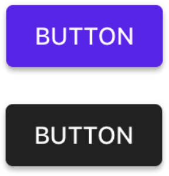

# Color scheme

The Material Design color system can be used to create a color theme that reflects your brand or
style. A _color scheme_ represents your theme's specific color values, such as its primary color and
the surface colors of views.

## Design & API documentation

* [Material Design guidelines: Color theming](https://material.io/go/design-color-theming)

## Related documentation

* [Theming](../../)

<!-- toc -->

- - -

## Overview

An implementation of the Material Design color scheme is provided in the `MDCSemanticColorScheme`
class. By default, an instance of this class is configured with the Material defaults. While it is
possible to use these defaults out of the box, you are highly encouraged to set — at a minimum — the
primary and secondary color values. The following image shows an MDCButton themed with the default
color scheme values (top) and an MDCButton themed with custom color scheme values (bottom).



Most components support being themed with a color scheme using a `color themer` extension. You can
learn more about which extensions are available for a given component by reading the
[component documentation](../../../).

### Semantic color values

A color scheme consists of the following semantic color values:

| Color name            | Use        |
|:--------------------- |:---------- |
| `primaryColor`        | The color displayed most frequently across your app’s screens and components. |
| `primaryColorVariant` | A light or dark variation of the primary color. |
| `secondaryColor`      | Provides ways to accent and distinguish your product. Floating action buttons use the secondary color. |
| `errorColor`          | The indication of errors within components such as text fields. |
| `surfaceColor`        | Typically maps to the background of components such as cards, sheets, and dialogs. |
| `backgroundColor`     | Typically found behind scrollable content. |

Each of these colors are paired with a corresponding "on-color". An on color defines the
color for text and iconography drawn on top of the associated color. Take care when picking on
colors that they meet [the accessibility guidelines for text and contrasting color](https://www.w3.org/TR/UNDERSTANDING-WCAG20/visual-audio-contrast-contrast.html).

| On color name         | Use        |
|:--------------------- |:---------- |
| `onPrimaryColor`      | Text/iconography drawn on top of `primaryColor`. |
| `onSecondaryColor`    | Text/iconography drawn on top of `secondaryColor`. |
| `onErrorColor`        | Text/iconography drawn on top of `errorColor`. |
| `onSurfaceColor`      | Text/iconography drawn on top of `surfaceColor`. |
| `onBackgroundColor`   | Text/iconography drawn on top of `backgroundColor`. |

## Installation

### Installation with CocoaPods

Add the following to your `Podfile`:

```bash
pod 'MaterialComponents/schemes/Color'
```
<!--{: .code-renderer.code-renderer--install }-->

Then, run the following command:

```bash
pod install
```

### Importing

To import the component:

<!--<div class="material-code-render" markdown="1">-->
#### Swift
```swift
import MaterialComponents.MaterialColorScheme
```

#### Objective-C

```objc
#import "MaterialColorScheme.h"
```
<!--</div>-->

## Usage

- [Typical use: customizing a color scheme](typical-use-customizing-a-scheme.md)

## Migration guides

- [Migration guide: semantic color schemes](migration-guide-semantic-color-scheme.md)
