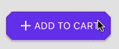

<!--docs:
title: "Shapes"
layout: landing
section: docs
path: /docs/supporting-shapes/
-->

# Shapes

The Shapes library offers a way to customize the shape of existing components, or expand your own view to have a custom shape.

Currently we offer built-in functionality for shapes within our <a href="../../components/Buttons">Buttons</a> and <a href="../../components/Cards">Cards</a> components.

### Shapes Library Preview

Our shapes library consists of different APIs and classes you can use to build a shape.

As you will see throughout the doc, we will be talking plentifully about the `shapeGenerator` object as part of our view/component. This object holds the generated shape and must conform to the `MDCShapeGenerating` protocol. `MDCShapeGenerating` consists of one method that returns the shape’s `CGPath` for the expected size.

```objc
(CGPath *)pathForSize:(CGSize)size
```

For our convenience we have a few classes under the hood that help us generate a shape. At the core we have `MDCPathGenerator` that has a few helper methods to build your own custom `CGPath` that will serve as the path for your shape.
We also have an `MDCShapedShadowLayer` class that has to be used as the base layer of your view instead of `MDCShadowLayer` to allow shapes to work well with shadows, borders, and also background color. This is needed because such attributes must follow the shape's path rather than the normal bounds of the view.

`MDCShapedView` is a base `UIView` that already incorporates `MDCShapedShadowLayer`, a `shapeGenerator` object, and elevation support to provide a minimal view that has full shape support. This can be used as a basic building block to build on top of when building new components that need shape support from the get go.

`MDCCornerTreatment` and `MDCEdgeTreatment` are both classes that provide a more modular approach for defining specifically the `CGPath` for a specific edge or corner.

The last (but not least) class is `MDCRectangleShapeGenerator`. It acts as a `shapeGenerator` on its own (meaning it implements `MDCShapeGenerating`), and generates a `CGPath` but allows good customization as part of its implementation. It allows us to set each of its corners and edges by using its `MDCCornerTreatments` and `MDCEdgeTreatments`. With this class we can theoretically build any shape we want.

### Shapes Convenience Generators

We also have at our disposal convenience classes under the ShapeLibrary/ folder that generate specific shapes:

#### Corner and Edge generators

- **MDCCurvedCornerTreatment** Generates an `MDCCornerTreatment` that is curved and receives a size to define the size of the curve.
- **MDCCutCornerTreatment** Generates an `MDCCornerTreatment` that is a cut corner and receives a cut to define by how much to cut.
- **MDCRoundedCornerTreatment** Generates an `MDCCornerTreatment` that is rounded and receives a radius to define the radius of the rounding.
- **MDCTriangleEdgeTreatment** Generates an `MDCEdgeTreatment` that consists of a triangle of a settable size and style.

#### Pre-made shape generators

- **MDCCurvedRectShapeGenerator** This generates a shape using `MDCRectangleShapeGenerator` with `MDCCurvedCornerTreatment` for its corners.


- **MDCPillShapeGenerator** This generates a shape using `MDCRectangleShapeGenerator` with `MDCRoundedCornerTreatment` for its corners.


- **MDCSlantedRectShapeGenerator** This generates a shape using `MDCRectangleShapeGenerator` and adds a slant to its corners using a simple offset to its corners.


### Adding Shapes to your components

#### Exposing the shape generator

You will need to expose the shape generator in your component’s API to be able to set the shape. You will need to add a property in your .h file that is of the type `id<MDCShapeGenerating>`. A client can use any of the convenience pre-made shape generators noted above, including the base `MDCRectangleShapeGenerator`. Alternatively the developer can build his own shape by creating an object that implements `MDCShapeGenerating` and creating a path with the help of `MDCPathGenerator`.

```objc
@property(nullable, nonatomic, strong) id<MDCShapeGenerating> shapeGenerator;
```

#### Adding proper shadow, border, and background color support

If your component needs support either for shadow, border width/color customization, or even background color, then your component will need to use `MDCShapedShadowLayer` as its `CALayer`. This is a must as a shape is different than the frame/bounds of your view, and hence these properties need to abide by the shape's path.
You will need to implement the `layerClass` in your view as follows:

```objc
+ (Class)layerClass {
  return [MDCShapedShadowLayer class];
}
```

You then must also make sure that when setting your layer’s properties you must call the corresponding `shapedBorderColor`, `shapedBorderWidth`, and `shapedBackgroundColor` rather than the default `CALayer` properties.

#### Being conscious of setting layer’s properties such as shadowPath and cornerRadius

Because shapes work with a different path than the view’s default layer, you need to be conscious of places in your code where these layer's properties are set, as that might cause unexpected behaviors or override existing behaviors to support shapes. When setting such properties, it is advised to check if `(shapeGenerator != nil)` before applying them.

#### Supporting touch events

Shapes change our view’s default layer and therefore the layer no longer imitates the bounds. Due to that, we will now have cases where there are places in the bounds where the layer isn’t drawn, or places outside the bounds where the layer is drawn. Therefore we will need a way to support proper touch that would correspond to where the shape is and isn’t and act accordingly.
To achieve this we can override the hitTest method of our UIView so we can check if the hitTest should return the view if the touch is part of our layer’s shape or not.

```objc
- (UIView *)hitTest:(CGPoint)point withEvent:(UIEvent *)event {
  if (self.layer.shapeGenerator) {
    if (CGPathContainsPoint(self.layer.shapeLayer.path, nil, point, true)) {
      return self;
    } else {
      return nil;
    }
  }
  return [super hitTest:point withEvent:event];
}
```

#### Ink Ripple Support

If the component uses ink ripples, we will need to add shapes support for it. For ink ripples there are two things we must update, firstly is the `maxRippleRadius` and secondly is the masking to bounds. The `maxRippleRadius` must be updated in cases where the shape is either smaller or bigger than the bounds. In these cases we can’t rely on the bounds because for smaller shapes the ink will ripple too fast, and for bigger shapes the ripple won’t cover the entire shape. The ink layer’s `maskToBounds` needs to also be set to NO so we can allow the ink to spread outside of the bounds when the shape goes outside of the bounds.

```objc
- (void)updateInkForShape {
  CGRect boundingBox = CGPathGetBoundingBox(self.layer.shapeLayer.path);
  self.inkView.maxRippleRadius =
      (CGFloat)(hypot(CGRectGetHeight(boundingBox), CGRectGetWidth(boundingBox)) / 2 + 10.f);
  self.inkView.layer.masksToBounds = NO;
}
```

#### Content Margins

Now that our component can come in all different sizes and shapes, you will need to set a margin for the content so that the shape won't truncate the images/text etc. For that using the built-in UIView’s `layoutMargins` is recommended.

### Using Shapes in the already shape-supported components (Buttons / Cards)

If the component already supports shapes, it then already has an accessible id<MDCShapeGenerating> shapeGenerator property.
In that case you only need to set the shapeGenerator to a shape of your choice and the component will be contained in that shape. There are available examples here: 
 * <a href="../../components/Buttons/examples/ButtonsShapesExample.m">Shaped Buttons</a>
 * <a href="../../components/Cards/examples/ShapedCardViewController.swift ">Shaped Cards</a>

### Examples

#### Diamond FAB


<!--<div class="material-code-render" markdown="1">-->
##### Swift
```swift
let floatingButton = MDCFloatingButton()
floatingButton.setImage(plusImage for:.normal)
floatingButton.sizeToFit()

let floatingShapeGenerator = MDCRectangleShapeGenerator()
floatingShapeGenerator.setCorners(MDCCutCornerTreatment(cut: floatingButton.bounds.width / 2))
floatingButton.shapeGenerator = floatingShapeGenerator
self.view.addSubview(floatingButton)
```

##### Objective-C
```objc
self.floatingButton = [[MDCFloatingButton alloc] init];
[self.floatingButton setImage:plusImage forState:UIControlStateNormal];
[self.floatingButton sizeToFit];

MDCRectangleShapeGenerator *floatingShapeGenerator = [[MDCRectangleShapeGenerator alloc] init];
[floatingShapeGenerator setCorners:
    [[MDCCutCornerTreatment alloc] initWithCut:CGRectGetWidth(self.floatingButton.bounds) / 2.f]];
self.floatingButton.shapeGenerator = floatingShapeGenerator;
[self.view addSubview:self.floatingButton];
```
<!--</div>-->

#### Cut Corners Contained Button



<!--<div class="material-code-render" markdown="1">-->
##### Swift
```swift
let containedButton = MDCButton()
containedButton.setTitle("Add To Cart" for:.normal)
containedButton.setImage(plusImage for:.normal)

let raisedShapeGenerator = MDCRectangleShapeGenerator()
raisedShapeGenerator.setCorners(MDCCutCornerTreatment(cut: 8))
containedButton.shapeGenerator = raisedShapeGenerator

containedButton.sizeToFit()
self.view.addSubview(containedButton)
```

##### Objective-C
```objc
MDCButton *containedButton = [[MDCButton alloc] init];
[containedButton setTitle:@"Add To Cart" forState:UIControlStateNormal];
[containedButton setImage:plusImage forState:UIControlStateNormal];

MDCRectangleShapeGenerator *raisedShapeGenerator =
  [[MDCRectangleShapeGenerator alloc] init];
[raisedShapeGenerator setCorners:[[MDCCutCornerTreatment alloc] initWithCut:8.f]];
containedButton.shapeGenerator = raisedShapeGenerator;

[containedButton sizeToFit];
[self.view addSubview:containedButton];
```
<!--</div>-->

#### Top Left Cut Corner Card Cell


<!--<div class="material-code-render" markdown="1">-->
##### Swift
```swift
func collectionView(_ collectionView: UICollectionView,
                    cellForItemAt indexPath: IndexPath) -> UICollectionViewCell {
  let cell = collectionView.dequeueReusableCell(withReuseIdentifier: kReusableIdentifierItem,
                                                for: indexPath) as! MDCCardCollectionCell
  let shapeGenerator = MDCRectangleShapeGenerator()
  shapeGenerator.topLeftCorner = MDCCutCornerTreatment(cut: 20)
  cell.shapeGenerator = shapeGenerator
  return cell
```

##### Objective-C
```objc
- (UICollectionViewCell *)collectionView:(UICollectionView *)collectionView
                  cellForItemAtIndexPath:(NSIndexPath *)indexPath {
  MDCCardCollectionCell *cell =
      [collectionView dequeueReusableCellWithReuseIdentifier:kReusableIdentifierItem
                                                forIndexPath:indexPath];
  MDCRectangleShapeGenerator *shapeGenerator =
      [[MDCRectangleShapeGenerator alloc] init];                             
  shapeGenerator.topLeftCorner = [[MDCCutCornerTreatment alloc] initWithCut:20];
  cell.shapeGenerator = shapeGenerator
  return cell;
}
```
<!--</div>-->

#### Card with different corners


<!--<div class="material-code-render" markdown="1">-->
##### Swift
```swift
let card = MDCCard()
let shapeGenerator = MDCRectangleShapeGenerator()
let cutCorner = MDCCutCornerTreatment(cut: 20)
let roundedCorner = MDCRoundedCornerTreatment(radius: 20)
let curvedCorner = MDCCurvedCornerTreatment(size: CGSize(width: 20, height: 60))
shapeGenerator.topLeftCorner = cutCorner
shapeGenerator.topRightCorner = roundedCorner
shapeGenerator.bottomLeftCorner = roundedCorner
shapeGenerator.bottomRightCorner = curvedCorner
card.shapeGenerator = shapeGenerator
```

##### Objective-C
```objc
MDCCard *card = [[MDCCard alloc] init];
MDCRectangleShapeGenerator *shapeGenerator =
    [[MDCRectangleShapeGenerator alloc] init];
MDCCutCornerTreatment *curCorner = [[MDCCutCornerTreatment alloc] initWithCut:20];
MDCRoundedCornerTreatment *roundedCorner = 
    [[MDCRoundedCornerTreatment alloc] initWithRadius:20];
MDCCurvedCornerTreatment *curvedCorner =
    [[MDCCurvedCornerTreatment alloc] initWithSize:CGSizeMake(20, 60)];
shapeGenerator.topLeftCorner = cutCorner;
shapeGenerator.topRightCorner = roundedCorner;
shapeGenerator.bottomLeftCorner = roundedCorner;
shapeGenerator.bottomRightCorner = curvedCorner;
card.shapeGenerator = shapeGenerator;
```
<!--</div>-->

