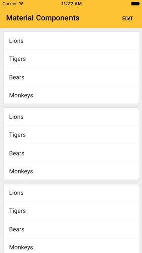

## Tutorial

Whether new or legacy, storyboard or code, Swift or Objective C, it's easy to use Material Components in your app.

This tutorial will teach you how to link Material Components to an application, use a material collection view, and add an expandable header to the top of your controller.

When you're done, you'll have an app that looks like this:

---

#### NOTE: If you've already linked the MaterialComponents CocoaPod to your project, you can skip to Step 3.

## 1.  Create a new Xcode application:
Let's make a simple app to play in.

Open Xcode. If the launch screen is present, click `Create a new Xcode project` or go to menu `File -> New -> Project…`.

In the template window, select `iOS` as the platform and `Single View Application` as the Application type. Click `Next`.

Name your project `MDC-Tutorial` and choose your preferred language. Click `Next`.

Choose a place to save your new project that you can remember. Click `Create`.

Close your new project by going to menu `File -> Close Project` or holding `option + command + w`. We’ll come back to the project in a minute.

## 2.  Setup CocoaPods:
[CocoaPods](https://cocoapods.org/) is a delightful way to add libraries and frameworks to apps. If you've used it before, this will look familiar to you.

Open `Terminal`.

If you do not already have CocoaPods installed on this system, run:

~~~
sudo gem install cocoapods
~~~

Navigate to your MDC-Tutorial project's directory and create a `Podfile` by running:

~~~
cd [directory of your project]
pod init
~~~

Open the new `Podfile` in a text editor or by running:

~~~
open -a Xcode Podfile
~~~

Add the `Material Components` pod to the `Podfile` by copying:

<!--
-->
#### Swift
~~~ swift
target 'MDC-Tutorial' do
  use_frameworks!

  # Pods for MDC-Tutorial
  pod 'MaterialComponents/AppBar', :git => 'git@github.com:material-components/material-components-ios.git'
  pod 'MaterialComponents/Buttons', :git => 'git@github.com:material-components/material-components-ios.git'
  pod 'MaterialComponents/Collections', :git => 'git@github.com:material-components/material-components-ios.git'
end
~~~

#### Objective-C
~~~ objc
target 'MDC-Tutorial' do
  #use_frameworks!

  # Pods for MDC-Tutorial
  pod 'MaterialComponents/AppBar', :git => 'git@github.com:material-components/material-components-ios.git'
  pod 'MaterialComponents/Buttons', :git => 'git@github.com:material-components/material-components-ios.git'
  pod 'MaterialComponents/Collections', :git => 'git@github.com:material-components/material-components-ios.git'
end
~~~
<!--
-->

Save the `Podfile`.

Back in `Terminal`, install your new pod and open the new workspace:

~~~
pod install
open MDC-Tutorial.xcworkspace
~~~

CocoaPods has downloaded and linked MaterialComponents to your project!

If you'd like to learn more about CocoaPods, there's a great [video](https://youtu.be/iEAjvNRdZa0) that puts it all in black and white.

## 3.  Add a Material Collection View:
In Xcode, select `ViewController.swift` (Swift) or `ViewController.h` (Objective-C).

Then import Material Collections and set `ViewController`’s superclass to `MDCCollectionViewController`:

<!--
-->
#### Swift (ViewController.swift)
~~~ swift
import UIKit
import MaterialComponents.MaterialCollections

class ViewController: MDCCollectionViewController {
  override func viewDidLoad() {
    super.viewDidLoad()
  }
}
~~~

#### Objective-C (ViewController.h)
~~~ objc
#import <UIKit/UIKit.h>
#import "MaterialCollections.h"

@interface ViewController : MDCCollectionViewController

@end
~~~
<!--
-->

Open `Main.storyboard` and delete the default view controller that came with it. Then drag a new Collection View Controller on to the storyboard, change the Custom Class of that view controller to `ViewController`, and set `Is Initial View Controller` to `true`.

<!---->

<!--
<video src="docs/assets/Xcode-Storyboard-Replace-Controller.m4v" autoplay loop></video>
-->

Select the prototype cell and set its custom class to `MDCCollectionViewTextCell`,

then set its reuse identifier to `cell`:

<!---->

<!--
<video src="docs/assets/Xcode-Storyboard-Define-Cell.m4v" autoplay loop></video>
-->

In `viewDidLoad`, configure the collection view’s appearance:

<!--
-->
#### Swift
~~~ swift
override func viewDidLoad() {
  super.viewDidLoad()
  styler.cellStyle = .card
}
~~~

#### Objective-C
~~~ objc
- (void)viewDidLoad {
  [super viewDidLoad];
  self.styler.cellStyle = MDCCollectionViewCellStyleCard;
}
~~~
<!--
-->

**NOTE:** See MaterialCollectionCells, MaterialCollectionLayoutAttributes and MaterialCollectionViewStyler for other options included for styling. Or make your own! Any part of the collection view can be completely customized to your needs.

Below `viewDidLoad`, add a mock datasource:

<!--
-->
#### Swift
~~~ swift
// MARK: UICollectionViewDataSource

override func numberOfSections(in collectionView: UICollectionView) -> Int {
  return 5
}

override func collectionView(_ collectionView: UICollectionView, numberOfItemsInSection section: Int) -> Int {
  return 4
}

override func collectionView(_ collectionView: UICollectionView, cellForItemAt indexPath: IndexPath) -> UICollectionViewCell {
  let cell = collectionView.dequeueReusableCell(withReuseIdentifier: "cell", for: indexPath)

  // Add some mock text to the cell.
  if let textCell = cell as? MDCCollectionViewTextCell {
    let animals = ["Lions", "Tigers", "Bears", "Monkeys"]
    textCell.textLabel?.text = animals[indexPath.item]
  }

  return cell
}
~~~

#### Objective-C
~~~ objc
#pragma mark - UICollectionViewDataSource

- (NSInteger)numberOfSectionsInCollectionView:(UICollectionView *)collectionView {
  return 5;
}

- (NSInteger)collectionView:(UICollectionView *)collectionView numberOfItemsInSection:(NSInteger)section {
  return 4;
}

- (UICollectionViewCell *)collectionView:(UICollectionView *)collectionView cellForItemAtIndexPath:(NSIndexPath *)indexPath {
  UICollectionViewCell *cell = [collectionView dequeueReusableCellWithReuseIdentifier:@"cell" forIndexPath:indexPath];
  MDCCollectionViewTextCell *textCell = (MDCCollectionViewTextCell *)cell;
  NSArray<NSString *> *animals = @[@"Lions", @"Tigers", @"Bears", @"Monkeys"];
  textCell.textLabel.text = animals[indexPath.row];
  return textCell;
}
~~~
<!--
-->

Build and run your app. It should display a scrollable, touchable collection view:

## 4.  Add an app bar to your ViewController:
Add the app bar property declaration to the top of the class:

<!--
-->
#### Swift
~~~ swift
import UIKit
import MaterialComponents.MaterialAppBar
import MaterialComponents.MaterialCollections

class ViewController: MDCCollectionViewController {
  let appBar = MDCAppBar()
...
~~~

#### Objective-C
~~~ objc
#import "ViewController.h"
#import "MaterialAppBar.h"
#import "MaterialCollections.h"

@interface ViewController ()
@property MDCAppBar *appBar;
@end

...
~~~
<!--
-->

Configure the app bar in `viewDidLoad`:

<!--
-->
#### Swift
~~~ swift
override func viewDidLoad() {
  super.viewDidLoad()
  styler.cellStyle = .card

  addChildViewController(appBar.headerViewController)
  appBar.headerViewController.headerView.backgroundColor = UIColor(red: 1.0, green: 0.76, blue: 0.03, alpha: 1.0)
  appBar.headerViewController.headerView.trackingScrollView = self.collectionView
  appBar.navigationBar.tintColor = UIColor.black
  appBar.addSubviewsToParent()

  title = "Material Components"
}
~~~

#### Objective-C
~~~ objc
- (void)viewDidLoad {
  [super viewDidLoad];
  self.styler.cellStyle = MDCCollectionViewCellStyleCard;

  self.appBar = [[MDCAppBar alloc] init];
  [self addChildViewController:self.appBar.headerViewController];
  self.appBar.headerViewController.headerView.backgroundColor = [UIColor colorWithRed:1.0 green:0.76 blue:0.03 alpha:1.0];
  self.appBar.headerViewController.headerView.trackingScrollView = self.collectionView;
  self.appBar.navigationBar.tintColor = [UIColor blackColor];
  [self.appBar addSubviewsToParent];

  self.title = @"Material Components";
}
~~~
<!--
-->

Build and run your app. It should display a yellow rectangle above the collection view:

But if you pull down, it doesn’t expand at all. It's not flexible.

## 5.  Make the app bar flexible by forwarding scroll view delegate methods:
Implement the UIScrollViewDelegate methods in your ViewController:

<!--
-->
#### Swift
~~~ swift
// MARK: UIScrollViewDelegate

override func scrollViewDidScroll(_ scrollView: UIScrollView) {
  if scrollView == appBar.headerViewController.headerView.trackingScrollView {
    appBar.headerViewController.headerView.trackingScrollDidScroll()
  }
}

override func scrollViewDidEndDecelerating(_ scrollView: UIScrollView) {
  if scrollView == appBar.headerViewController.headerView.trackingScrollView {
    appBar.headerViewController.headerView.trackingScrollDidEndDecelerating()
  }
}

override func scrollViewDidEndDragging(_ scrollView: UIScrollView, willDecelerate decelerate: Bool) {
  if scrollView == appBar.headerViewController.headerView.trackingScrollView {
    let headerView = appBar.headerViewController.headerView
    headerView.trackingScrollDidEndDraggingWillDecelerate(decelerate)
  }
}

override func scrollViewWillEndDragging(_ scrollView: UIScrollView, withVelocity velocity: CGPoint, targetContentOffset: UnsafeMutablePointer<CGPoint>) {
  if scrollView == appBar.headerViewController.headerView.trackingScrollView {
    let headerView = appBar.headerViewController.headerView
    headerView.trackingScrollWillEndDragging(withVelocity: velocity, targetContentOffset: targetContentOffset)
  }
}
~~~

#### Objective-C
~~~ objc
#pragma mark - UIScrollViewDelegate

- (void)scrollViewDidScroll:(UIScrollView *)scrollView {
  if (scrollView == self.appBar.headerViewController.headerView.trackingScrollView) {
    [self.appBar.headerViewController.headerView trackingScrollViewDidScroll];
  }
}

- (void)scrollViewDidEndDecelerating:(UIScrollView *)scrollView {
  if (scrollView == self.appBar.headerViewController.headerView.trackingScrollView) {
    [self.appBar.headerViewController.headerView trackingScrollViewDidEndDecelerating];
  }
}

- (void)scrollViewDidEndDragging:(UIScrollView *)scrollView willDecelerate:(BOOL)decelerate {
  if (scrollView == self.appBar.headerViewController.headerView.trackingScrollView) {
    [self.appBar.headerViewController.headerView trackingScrollViewDidEndDraggingWillDecelerate:decelerate];
  }
}

- (void)scrollViewWillEndDragging:(UIScrollView *)scrollView withVelocity:(CGPoint)velocity targetContentOffset:(inout CGPoint *)targetContentOffset {
  if (scrollView == self.appBar.headerViewController.headerView.trackingScrollView) {
    [self.appBar.headerViewController.headerView trackingScrollViewWillEndDraggingWithVelocity:velocity
                                                                           targetContentOffset:targetContentOffset];
  }
}
~~~
<!--
-->

Build and run your app. The app bar should now flex when the collection view is scrolled too far:

## 6.  Add a button to the app bar:
MDC's collections component has a beautiful, out-of-the-box animation when you toggle isEditing. Let's put a button in the app bar that does just that.

First, add a function to ViewController that will be called when the button is tapped:

<!--
-->
#### Swift
~~~ swift
func barButtonDidTap(sender: UIBarButtonItem) {
  editor.isEditing = !editor.isEditing

  let buttonTitle =  editor.isEditing ? "Cancel" : "Edit"
  navigationItem.rightBarButtonItem = UIBarButtonItem(title: buttonTitle,
                                                      style: .plain,
                                                      target: self,
                                                      action: #selector(ViewController.barButtonDidTap(_:)))
}
~~~

#### Objective-C
~~~ objc
- (void)barButtonDidTap:(id)sender {
  self.editor.editing = !self.editor.editing;
  NSString *buttonTitle = self.editor.editing ? @"Cancel" : @"Edit";
  self.navigationItem.rightBarButtonItem = [[UIBarButtonItem alloc] initWithTitle:buttonTitle
                                                                            style:UIBarButtonItemStylePlain
                                                                           target:self
                                                                           action:@selector(barButtonDidTap:)];
}
~~~
<!--
-->

This function will toggle editing mode on the collectionView and toggle the title.

Now let's add a bar button to the right side of the app bar by modifying ViewController's `viewDidLoad`:

<!--
-->
#### Swift
~~~ swift
override func viewDidLoad() {
  ...
  navigationItem.rightBarButtonItem = UIBarButtonItem(title: "Edit",
                                                      style: .plain,
                                                      target: self,
                                                      action: #selector(ViewController.barButtonDidTap(_:)))
}
~~~

#### Objective-C
~~~ objc
- (void)viewDidLoad {
  ...
  self.navigationItem.rightBarButtonItem = [[UIBarButtonItem alloc] initWithTitle:@"Edit"
                                                                            style:UIBarButtonItemStylePlain
                                                                           target:self
                                                                           action:@selector(barButtonDidTap:)];
}
~~~
<!--
-->

**NOTE:** Notice that we added the right bar button to the app bar the same way you would for a UINavigationBar. That's because inside the app bar is an MDCNavigationBar. Navigation bars react to changes in the navigationItem, like adding buttons and changing title, by updating their button bar.

Build and run your app:

Tap on the EDIT button and the cards separate. Tap on CANCEL and they meld back together.

## 7. Add a floating action button:

When you really want to call attention to an important action, consider using floating action buttons ("fabs"). They are circular buttons floating above the UI and have built-in motion behaviors that include morphing and launching.

Add a property for the fab and make a new function that will toggle the selected state of the fab when tapped:

<!--
-->
#### Swift
~~~ swift
import UIKit
import MaterialComponents.MaterialAppBar
import MaterialComponents.MaterialButtons
import MaterialComponents.MaterialCollections

class ViewController: MDCCollectionViewController {
  let appBar = MDCAppBar()
  let fab = MDCFloatingButton()

  ...

  func fabDidTap(sender: UIButton) {
    sender.isSelected = !sender.isSelected
  }
~~~

#### Objective-C
~~~ objc
#import "ViewController.h"
#import "MaterialAppBar.h"
#import "MaterialButtons.h"
#import "MaterialCollections.h"

@interface ViewController ()
@property MDCAppBar *appBar;
@property MDCFloatingButton *fab;
@end

...

- (void)fabDidTap:(id)sender {
  MDCFloatingButton *button = (MDCFloatingButton *)sender;
  button.selected = !button.isSelected;
}
~~~
<!--
-->

We want the fab to float above the bottom right corner, so we'll add it as a subview and then set some constraints:

<!--
-->
#### Swift
~~~ swift
override func viewDidLoad() {
  super.viewDidLoad()

  ...

  view.addSubview(fab)
  fab.translatesAutoresizingMaskIntoConstraints = false
  fab.trailingAnchor.constraint(equalTo: view.trailingAnchor, constant: -16.0).isActive = true
  fab.bottomAnchor.constraint(equalTo: view.bottomAnchor, constant: -16.0).isActive = true
}
~~~

#### Objective-C
~~~ objc
- (void)viewDidLoad {
  [super viewDidLoad];

  ...

  self.fab = [[MDCFloatingButton alloc] initWithFrame:CGRectZero];
  [self.view addSubview:self.fab];

  self.fab.translatesAutoresizingMaskIntoConstraints = NO;
  [self.fab.trailingAnchor constraintEqualToAnchor:self.view.trailingAnchor constant:-16.0].active = YES;
  [self.fab.trailingAnchor constraintEqualToAnchor:self.view.trailingAnchor constant: -16.0].active = YES;
  [self.fab.bottomAnchor constraintEqualToAnchor:self.view.bottomAnchor constant: -16.0].active = YES;
}
~~~
<!--
-->

**NOTE:** We used margins of 16 points to match the guidelines found in the [material design spec](https://material.google.com/components/buttons-floating-action-button.html#buttons-floating-action-button-floating-action-button). Lots of suggestions for padding, sizing and alignment choices can be found [there](https://material.google.com/layout/metrics-keylines.html#metrics-keylines-baseline-grids).

Build and run your app. The fab shows up but it doesn't do anything yet.

Add target / action for the button and titles for selected and unselected states:

<!--
-->
#### Swift
~~~ swift
override func viewDidLoad() {
  super.viewDidLoad()

  ...

  fab.setTitle("+", for: .normal)
  fab.setTitle("-", for: .selected)
  fab.addTarget(self, action: #selector(ViewController.fabDidTap(_:)), for: .touchUpInside)
}
~~~

#### Objective-C
~~~ objc
- (void)viewDidLoad {
  [super viewDidLoad];

  ...

  [self.fab setTitle:@"+" forState:UIControlStateNormal];
  [self.fab setTitle:@"-" forState:UIControlStateSelected];
  [self.fab addTarget:self action:@selector(fabDidTap:) forControlEvents:UIControlEventTouchUpInside];
}
~~~
<!--
-->

Build and run your app. The floating action button responds to your taps:

**NOTE:** While we're using text for the + and - inside the fab, to get proper sizing, you should use icons. The material design website has a great [library](https://design.google.com/icons/) of icons that can be exported bundled and sized specifically for iOS.

## Full source

If you've been following along with the above steps, your ViewController implementation should look roughly like:

<!--
-->
#### Swift
~~~ swift
import UIKit
import MaterialComponents.MaterialAppBar
import MaterialComponents.MaterialButtons
import MaterialComponents.MaterialCollections

class ViewController: MDCCollectionViewController {
  let appBar = MDCAppBar()
  let fab = MDCFloatingButton()

  override func viewDidLoad() {
    super.viewDidLoad()
    styler.cellStyle = .card

    addChildViewController(appBar.headerViewController)
    appBar.headerViewController.headerView.backgroundColor = UIColor(red: 1.0, green: 0.76, blue: 0.03, alpha: 1.0)

    appBar.headerViewController.headerView.trackingScrollView = self.collectionView
    appBar.addSubviewsToParent()

    title = "Material Components"

    navigationItem.rightBarButtonItem = UIBarButtonItem(title: "Edit", style: .plain, target: self, action: #selector(ViewController.barButtonDidTap(_:)))

    appBar.navigationBar.tintColor = UIColor.black

    view.addSubview(fab)
    fab.translatesAutoresizingMaskIntoConstraints = false
    fab.trailingAnchor.constraint(equalTo: view.trailingAnchor, constant: -16.0).isActive = true
    fab.bottomAnchor.constraint(equalTo: view.bottomAnchor, constant: -16.0).isActive = true

    fab.setTitle("+", for: .normal)
    fab.setTitle("-", for: .selected)
    fab.addTarget(self, action: #selector(ViewController.fabDidTap(_:)), for: .touchUpInside)
  }

  func barButtonDidTap(sender: UIBarButtonItem) {
    editor.isEditing = !editor.isEditing

    navigationItem.rightBarButtonItem = UIBarButtonItem(title: editor.isEditing ? "Cancel" : "Edit", style: .plain, target: self, action: #selector(ViewController.barButtonDidTap(_:)))
  }

  func fabDidTap(sender: UIButton) {
    sender.isSelected = !sender.isSelected
  }

  // MARK: UICollectionViewDataSource

  override func numberOfSections(in collectionView: UICollectionView) -> Int {
    return 5
  }

  override func collectionView(_ collectionView: UICollectionView, numberOfItemsInSection section: Int) -> Int {
    return 4
  }

  override func collectionView(_ collectionView: UICollectionView, cellForItemAt indexPath: IndexPath) -> UICollectionViewCell {
    let cell = collectionView.dequeueReusableCell(withReuseIdentifier: "cell", for: indexPath)

    if let textCell = cell as? MDCCollectionViewTextCell {

      // Add some mock text to the cell.
      let animals = ["Lions", "Tigers", "Bears", "Monkeys"]
      textCell.textLabel?.text = animals[indexPath.item]
    }

    return cell
  }

  // MARK: UIScrollViewDelegate

  override func scrollViewDidScroll(_ scrollView: UIScrollView) {
    if scrollView == appBar.headerViewController.headerView.trackingScrollView {
      appBar.headerViewController.headerView.trackingScrollDidScroll()
    }
  }

  override func scrollViewDidEndDecelerating(_ scrollView: UIScrollView) {
    if scrollView == appBar.headerViewController.headerView.trackingScrollView {
      appBar.headerViewController.headerView.trackingScrollDidEndDecelerating()
    }
  }

  override func scrollViewDidEndDragging(_ scrollView: UIScrollView, willDecelerate decelerate: Bool) {
    if scrollView == appBar.headerViewController.headerView.trackingScrollView {
      let headerView = appBar.headerViewController.headerView
      headerView.trackingScrollDidEndDraggingWillDecelerate(decelerate)
    }
  }

  override func scrollViewWillEndDragging(_ scrollView: UIScrollView, withVelocity velocity: CGPoint, targetContentOffset: UnsafeMutablePointer<CGPoint>) {
    if scrollView == appBar.headerViewController.headerView.trackingScrollView {
      let headerView = appBar.headerViewController.headerView
      headerView.trackingScrollWillEndDragging(withVelocity: velocity, targetContentOffset: targetContentOffset)
    }
  }
}
~~~

#### Objective-C
~~~ objc
#import "ViewController.h"
#import "MaterialAppBar.h"
#import "MaterialButtons.h"
#import "MaterialCollections.h"

@interface ViewController ()
@property MDCAppBar *appBar;
@property MDCFloatingButton *fab;
@end

@implementation ViewController

- (void)viewDidLoad {
  [super viewDidLoad];
  self.styler.cellStyle = MDCCollectionViewCellStyleCard;

  self.appBar = [[MDCAppBar alloc] init];
  [self addChildViewController:self.appBar.headerViewController];

  self.appBar.headerViewController.headerView.backgroundColor = [UIColor colorWithRed:1.0 green:0.76 blue:0.03 alpha:1.0];
  self.appBar.headerViewController.headerView.trackingScrollView = self.collectionView;
  self.appBar.navigationBar.tintColor = [UIColor blackColor];
  [self.appBar addSubviewsToParent];

  self.title = @"Material Components";

  self.navigationItem.rightBarButtonItem = [[UIBarButtonItem alloc] initWithTitle:@"Edit"
                                                                            style:UIBarButtonItemStylePlain
                                                                           target:self
                                                                           action:@selector(barButtonDidTap:)];

  self.fab = [[MDCFloatingButton alloc] initWithFrame:CGRectZero];
  [self.view addSubview:self.fab];

  self.fab.translatesAutoresizingMaskIntoConstraints = NO;
  [self.fab.trailingAnchor constraintEqualToAnchor:self.view.trailingAnchor constant:-16.0].active = YES;
  [self.fab.trailingAnchor constraintEqualToAnchor:self.view.trailingAnchor constant: -16.0].active = YES;
  [self.fab.bottomAnchor constraintEqualToAnchor:self.view.bottomAnchor constant: -16.0].active = YES;

  [self.fab setTitle:@"+" forState:UIControlStateNormal];
  [self.fab setTitle:@"-" forState:UIControlStateSelected];
  [self.fab addTarget:self action:@selector(fabDidTap:) forControlEvents:UIControlEventTouchUpInside];
}

#pragma mark - UICollectionViewDataSource

- (NSInteger)numberOfSectionsInCollectionView:(UICollectionView *)collectionView {
  return 5;
}

- (NSInteger)collectionView:(UICollectionView *)collectionView numberOfItemsInSection:(NSInteger)section {
  return 4;
}

- (UICollectionViewCell *)collectionView:(UICollectionView *)collectionView cellForItemAtIndexPath:(NSIndexPath *)indexPath {
  UICollectionViewCell *cell = [collectionView dequeueReusableCellWithReuseIdentifier:@"cell" forIndexPath:indexPath];
  MDCCollectionViewTextCell *textCell = (MDCCollectionViewTextCell *)cell;
  NSArray<NSString *> *animals = @[@"Lions", @"Tigers", @"Bears", @"Monkeys"];
  textCell.textLabel.text = animals[indexPath.row];
  return textCell;
}

- (void)barButtonDidTap:(id)sender {
  self.editor.editing = !self.editor.editing;
  NSString *buttonTitle = self.editor.editing ? @"Cancel" : @"Edit";
  self.navigationItem.rightBarButtonItem = [[UIBarButtonItem alloc] initWithTitle:buttonTitle
                                                                            style:UIBarButtonItemStylePlain
                                                                           target:self
                                                                           action:@selector(barButtonDidTap:)];
}

- (void)fabDidTap:(id)sender {
  MDCFloatingButton *button = (MDCFloatingButton *)sender;
  button.selected = !button.isSelected;
}

#pragma mark - UIScrollViewDelegate

- (void)scrollViewDidScroll:(UIScrollView *)scrollView {
  if (scrollView == self.appBar.headerViewController.headerView.trackingScrollView) {
    [self.appBar.headerViewController.headerView trackingScrollViewDidScroll];
  }
}

- (void)scrollViewDidEndDecelerating:(UIScrollView *)scrollView {
  if (scrollView == self.appBar.headerViewController.headerView.trackingScrollView) {
    [self.appBar.headerViewController.headerView trackingScrollViewDidEndDecelerating];
  }
}

- (void)scrollViewDidEndDragging:(UIScrollView *)scrollView willDecelerate:(BOOL)decelerate {
  if (scrollView == self.appBar.headerViewController.headerView.trackingScrollView) {
    [self.appBar.headerViewController.headerView trackingScrollViewDidEndDraggingWillDecelerate:decelerate];
  }
}

- (void)scrollViewWillEndDragging:(UIScrollView *)scrollView withVelocity:(CGPoint)velocity targetContentOffset:(inout CGPoint *)targetContentOffset {
  if (scrollView == self.appBar.headerViewController.headerView.trackingScrollView) {
    [self.appBar.headerViewController.headerView trackingScrollViewWillEndDraggingWithVelocity:velocity
                                                                           targetContentOffset:targetContentOffset];
  }
}

@end
~~~
<!--
-->

---

## **Next steps**

This tutorial gives a glimpse of what MDC can do. But there are a lot more components for you to discover.

Use our examples and catalog apps to try out other components and other ways to integrate them into apps.

### Sample Code

*   [Pesto: A simple recipe app, incorporating a flexible header, floating action button, and collections.](https://github.com/material-components/material-components-ios/tree/master/demos/Pesto)

*   [Shrine: A demo shopping app, incorporating a flexible header, custom typography, and collections.](https://github.com/material-components/material-components-ios/tree/master/demos/Shrine)

<!---->

<!--

 -->

---

### For more information:

*   [Read the Component Documentation](https://github.com/material-components/material-components-ios/blob/develop/howto/tutorial/%7B%7B%20site.folder%20%7D%7D/components)
*   [Stack Overflow "material-components-ios"](http://stackoverflow.com/questions/tagged/material-components-ios)
