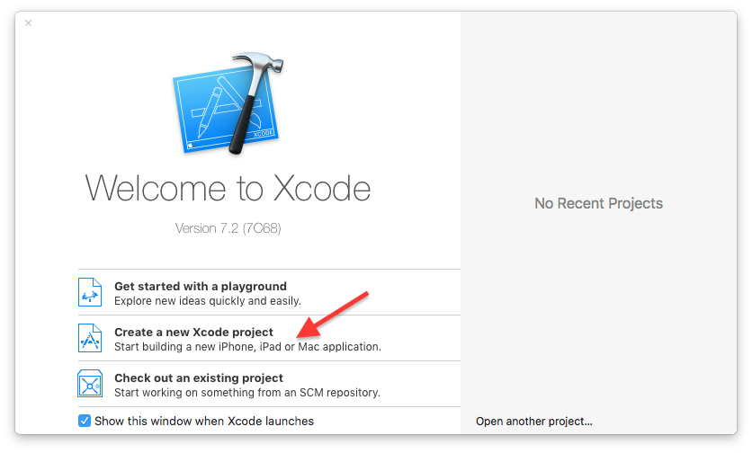
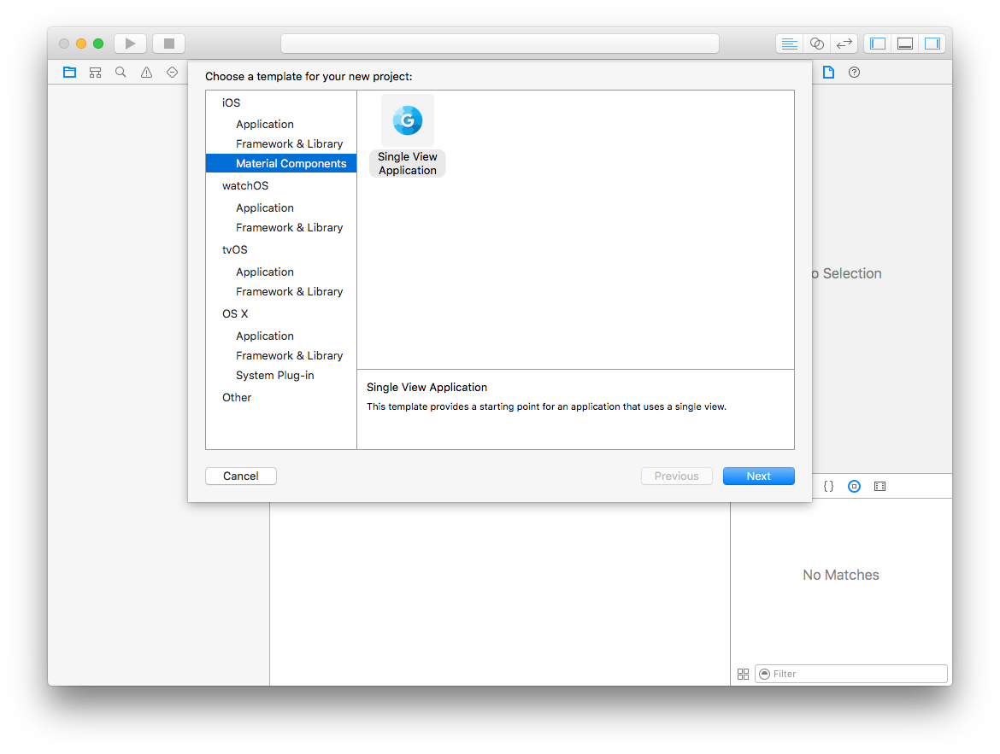
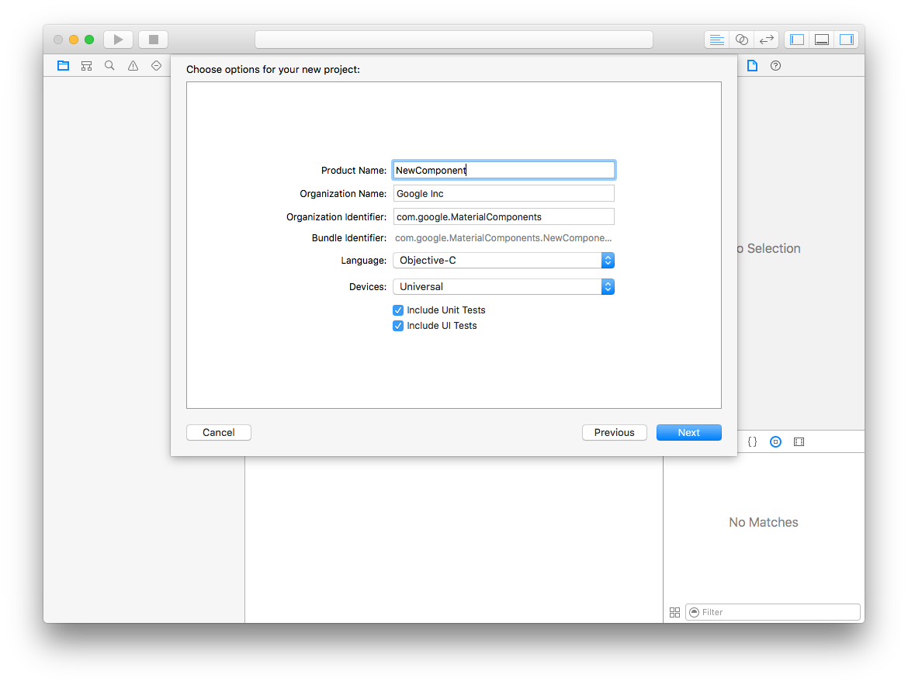

# Xcode Project Template

**Important!** This is a work in progress and subject to change.

## Installation

Install the templates by running the following command from the root of the
project_templates folder:

```
sh install.sh
```

This script will copy the entire template contents to the following location:

```
~/Library/Developer/Xcode/Templates/Project Templates
```

## Using the template

Once installed, a new Material Components template option will be available when creating a
new project.

#### Step 1: Create a new Xcode project ####



#### Step 2: Choose a Material Component template ####



#### Step 3: Provide component name ####



#### Step 4: Add your new component ####

You should now have a complete project skeleton ready to run. Some src files have geen generated
for you to add your Material Component to.
